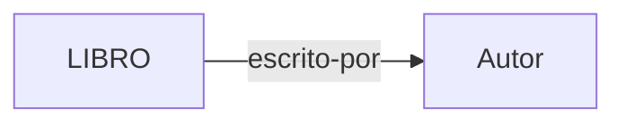
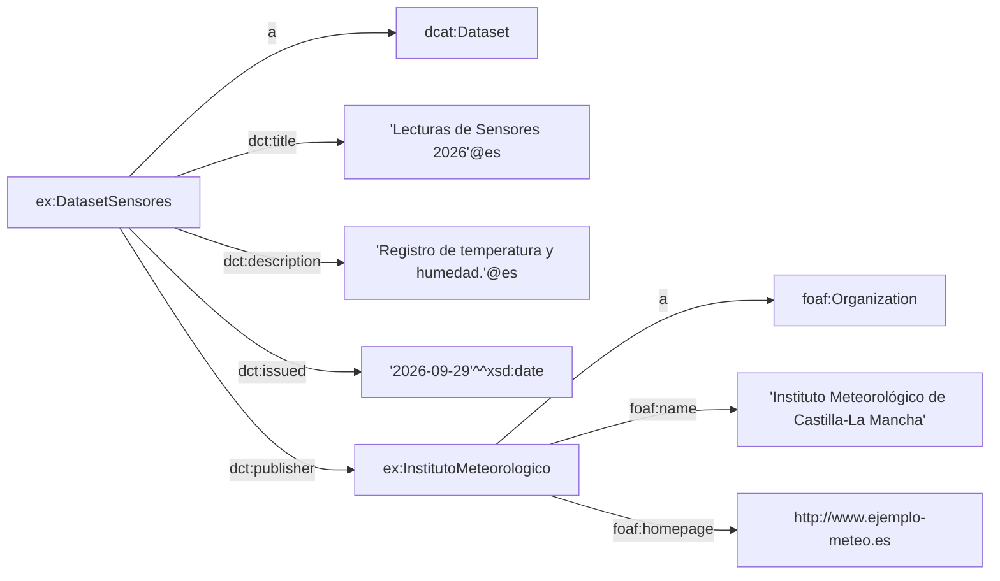

# 🕸️ 01 · RDF — Resource Description Framework

> Guía práctica para entender, escribir y consultar datos en RDF, paso a paso.


---

## 📑 Contenido

1. [¿Qué es RDF?](#1--qué-es-rdf)
2. [La terna: la unidad básica](#2--la-terna-la-unidad-básica)
3. [Elementos clave](#3--elementos-clave)
4. [Formatos de serialización](#4--formatos-de-serialización)
5. [Ejemplo práctico en Turtle](#5--ejemplo-práctico-en-turtle)
6. [Consultas con SPARQL](#6--consultas-con-sparql)
7. [Errores frecuentes](#7--errores-frecuentes)
8. [Casos de uso](#8--casos-de-uso)
10. [Recursos y siguiente paso](#9--recursos-y-siguiente-paso)

---

## 1 · ¿Qué es RDF?

**RDF** es un estándar del **W3C** para modelar e intercambiar información en la Web.

A diferencia de las bases de datos relacionales (tablas) o de los documentos jerárquicos (JSON/XML puro), RDF modela los datos como un **grafo dirigido etiquetado**: los *nodos* son cosas y las *aristas* son las relaciones entre ellas.

| Modelo | Unidad básica | Estructura |
|:-------|:--------------|:-----------|
| Relacional | Fila | Tablas con esquema fijo |
| JSON / XML | Documento | Árbol jerárquico |
| **RDF** | **Terna** | **Grafo de afirmaciones** |

**¿Por qué importa?** 

Porque la información resulta **procesable por máquinas** y facilita la **interoperabilidad** entre sistemas distribuidos: dos organizaciones pueden describir sus datos con los mismos identificadores globales sin ponerse de acuerdo sobre un esquema de base de datos.

---

## 2 · La terna: la unidad básica

Toda afirmación en RDF se descompone en **tres partes** (*triple*):

```text
   Sujeto   ──── Predicado ────▶   Objeto
 (de quién)     (qué relación)     (qué valor)
```

| Parte | Qué es | Puede ser |
|:------|:-------|:----------|
| **Sujeto** *(subject)* | El recurso del que se habla | URI o nodo en blanco |
| **Predicado** *(predicate)* | La propiedad o relación | Siempre una URI |
| **Objeto** *(object)* | El valor de la propiedad | URI, nodo en blanco o literal |

Ejemplo en lenguaje natural: *"El libro fue escrito por un autor'"*.



Un conjunto de ternas forma un **grafo**.

---

## 3 · Elementos clave

### 🔗 URIs / IRIs
Identificadores **únicos y globales** que evitan colisiones de nombres.
Ejemplo: `http://schema.org/Person`.

### 🔤 Literales
Valores de datos primitivos. Pueden llevar **tipo de dato** o **etiqueta de idioma**:

#### 1. Tipos de literales RDF

| Categoría | Tipo / forma | Ejemplo RDF/Turtle | Valor |
|---|---|---|---|
| **Cadena** | `xsd:string` | `"Gonzalo"` | Texto |
| **Idioma** | `rdf:langString` | `"Hola"@es` | Texto + idioma |
| **Booleano** | `xsd:boolean` | `true` / `false` | Verdadero/falso |
| **Entero** | `xsd:integer` | `42` | Número entero |
| **Decimal** | `xsd:decimal` | `3.14` | Número decimal |
| **Float** | `xsd:float` | `3.14e0` | Coma flotante |
| **Double** | `xsd:double` | `3.14E0` | Doble precisión |
| **Fecha** | `xsd:date` | `"2026-09-29"^^xsd:date` | Fecha |
| **Fecha y hora** | `xsd:dateTime` | `"2026-09-29T20:00:00"^^xsd:dateTime` | Fecha + hora |
| **Hora** | `xsd:time` | `"20:00:00"^^xsd:time` | Hora |
| **Año** | `xsd:gYear` | `"2026"^^xsd:gYear` | Año |
| **Año-mes** | `xsd:gYearMonth` | `"2026-09"^^xsd:gYearMonth` | Año + mes |
| **Duración** | `xsd:duration` | `"P1Y2M"^^xsd:duration` | Duración |
| **URI** | `xsd:anyURI` | `"https://example.org"` | URI |
| **Binario Base64** | `xsd:base64Binary` | `"SGVsbG8="^^xsd:base64Binary` | Datos binarios |
| **Binario hexadecimal** | `xsd:hexBinary` | `"48656C6C6F"^^xsd:hexBinary` | Datos binarios |

#### 2. Subtipos numéricos de `xsd:integer`

| Tipo | Ejemplo | Significado |
|---|---:|---|
| `xsd:long` | `100` | Entero de 64 bits |
| `xsd:int` | `100` | Entero de 32 bits |
| `xsd:short` | `100` | Entero de 16 bits |
| `xsd:byte` | `100` | Entero de 8 bits |
| `xsd:positiveInteger` | `5` | Entero positivo |
| `xsd:negativeInteger` | `-5` | Entero negativo |
| `xsd:nonNegativeInteger` | `0` | ≥ 0 |
| `xsd:nonPositiveInteger` | `0` | ≤ 0 |
| `xsd:unsignedLong` | `100` | Entero sin signo |
| `xsd:unsignedInt` | `100` | Entero sin signo |
| `xsd:unsignedShort` | `100` | Entero sin signo |
| `xsd:unsignedByte` | `100` | Entero sin signo |

### 📚 Vocabularios y ontologías
Conjuntos de URIs predefinidas para describir dominios concretos y **reutilizar** significado en lugar de inventarlo:

| Vocabulario | Prefijo | Sirve para |
|:------------|:-------:|:-----------|
| FOAF | `foaf:` | Personas y organizaciones |
| DCAT | `dcat:` | Catálogos y datasets |
| Dublin Core | `dct:` | Metadatos generales |

---

## 4 · Formatos de serialización

RDF es un **modelo abstracto**. Para guardarlo en ficheros o enviarlo por red se usan distintas sintaxis. Aquí, **la misma afirmación** en los cuatro formatos:

<details open>
<summary><b>Turtle</b> (<code>.ttl</code>) — compacto y legible</summary>

```turtle
@prefix ex:  <http://example.org/datos/> .
@prefix dct: <http://purl.org/dc/terms/> .

ex:DatasetSensores dct:title "Lecturas de Sensores 2026"@es .
```
</details>

<details>
<summary><b>N-Triples</b> (<code>.nt</code>) — una terna por línea</summary>

```text
<http://example.org/datos/DatasetSensores> <http://purl.org/dc/terms/title> "Lecturas de Sensores 2026"@es .
```
</details>

<details>
<summary><b>JSON-LD</b> (<code>.jsonld</code>) — RDF en sintaxis JSON</summary>

```json
{
  "@context": { "dct": "http://purl.org/dc/terms/" },
  "@id": "http://example.org/datos/DatasetSensores",
  "dct:title": { "@value": "Lecturas de Sensores 2026", "@language": "es" }
}
```
</details>

<details>
<summary><b>RDF/XML</b> (<code>.rdf</code>) — el formato original</summary>

```xml
<rdf:RDF xmlns:rdf="http://www.w3.org/1999/02/22-rdf-syntax-ns#"
         xmlns:dct="http://purl.org/dc/terms/">
  <rdf:Description rdf:about="http://example.org/datos/DatasetSensores">
    <dct:title xml:lang="es">Lecturas de Sensores 2026</dct:title>
  </rdf:Description>
</rdf:RDF>
```
</details>

| Formato | Legibilidad | Uso típico |
|:--------|:-----------:|:-----------|
| **Turtle** | ⭐⭐⭐ | Estándar de facto en repositorios y documentación |
| **JSON-LD** | ⭐⭐ | Desarrollo web y consumo de APIs |
| **N-Triples** | ⭐ | Procesamiento masivo y volcados de bases de datos |
| **RDF/XML** | ⭐ | Sistemas heredados; muy verboso para escribir a mano |

> 💡 **Los cuatro son equivalentes**: representan exactamente el mismo grafo.

---

## 5 · Ejemplo práctico en Turtle

Definimos un **catálogo de datos** y la **organización** que lo publica, usando DCAT, Dublin Core y FOAF.

```turtle
@prefix dcat: <http://www.w3.org/ns/dcat#> .
@prefix dct:  <http://purl.org/dc/terms/> .
@prefix foaf: <http://xmlns.com/foaf/0.1/> .
@prefix xsd:  <http://www.w3.org/2001/XMLSchema#> .
@prefix ex:   <http://example.org/datos/> .

# Sujeto: el conjunto de datos
ex:DatasetSensores a dcat:Dataset ;
    dct:title       "Lecturas de Sensores 2026"@es ;
    dct:description "Registro de temperatura y humedad."@es ;
    dct:issued      "2026-09-29"^^xsd:date ;
    dct:publisher   ex:InstitutoMeteorologico .

# Sujeto: la organización publicadora
ex:InstitutoMeteorologico a foaf:Organization ;
    foaf:name     "Instituto Meteorológico de Castilla-La Mancha" ;
    foaf:homepage <http://www.ejemplo-meteo.es> .
```

### 🧠 Cómo leerlo

- `@prefix` define **atajos** para no repetir URIs largas (`dct:title` = `http://purl.org/dc/terms/title`).
- `a` es la abreviatura de `rdf:type` ("es una instancia de").
- `;` encadena varias propiedades **sobre el mismo sujeto**.
- `,` (no usada aquí) encadena varios **objetos** para el mismo predicado.
- `dct:publisher ex:InstitutoMeteorologico` es lo que **conecta** los dos recursos: así se forma el grafo.

### 🗺️ El grafo resultante



---

## 6 · Consultas con SPARQL

*Estudiaremos en profundidad este apartado en la sección [`04-SPARQL`](../04-SPARQL/)*

---

## 7 · Errores frecuentes

| ❌ Error | ✅ Solución |
|:--------|:-----------|
| Olvidar el `.` al final de una terna | Cada sentencia Turtle termina en `.` |
| Usar `;` al final del último predicado | El último predicado de un sujeto cierra con `.` |
| Escribir la URI sin `<>` cuando no hay prefijo | Las URIs completas van entre `<...>` |
| Usar un literal como sujeto o predicado | Los literales solo pueden ser **objeto** |
| Olvidar declarar un `@prefix` | Toda abreviatura `xx:` necesita su prefijo |
| Confundir `"texto"` con `<uri>` | Comillas = literal · Ángulos = recurso |

---

## 8 · Casos de uso

- 🏛️ **Espacios de Datos (*Data Spaces*):** intercambio de metadatos estandarizados entre organizaciones respetando la soberanía de los datos.
- 🧠 **Grafos de conocimiento (*Knowledge Graphs*):** integración de bases de datos heterogéneas para inferir nueva información (p. ej. Wikidata).
- 🔗 **Linked Data:** enlazar conjuntos de datos abiertos a través de la web para enriquecer aplicaciones.

---

## 9 · Recursos y siguiente paso

**Referencias oficiales**

- [RDF 1.1 Primer (W3C)](https://www.w3.org/TR/rdf11-primer/)
- [RDF 1.1 Concepts (W3C)](https://www.w3.org/TR/rdf11-concepts/)
- [Turtle (W3C)](https://www.w3.org/TR/turtle/)
- [SPARQL 1.1 Query (W3C)](https://www.w3.org/TR/sparql11-query/)
- [Documentación de rdflib](https://rdflib.readthedocs.io/)

**Siguiente paso**


## RDF te permite *afirmar* cosas, pero no dice qué tipos de cosas existen ni cómo se relacionan. 

Eso lo aporta el siguiente nivel ➡️ [RDF Schema](../02-RDFS/)


