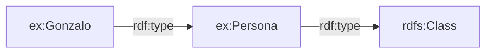
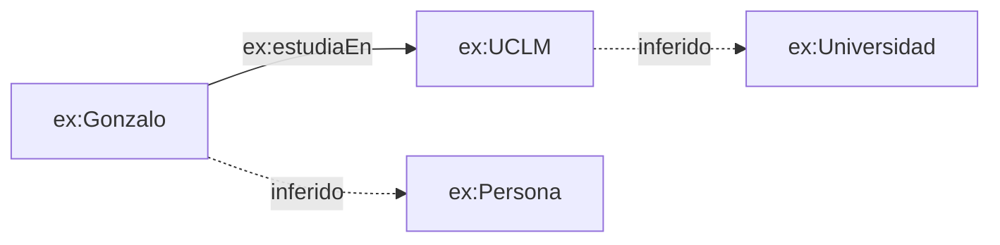
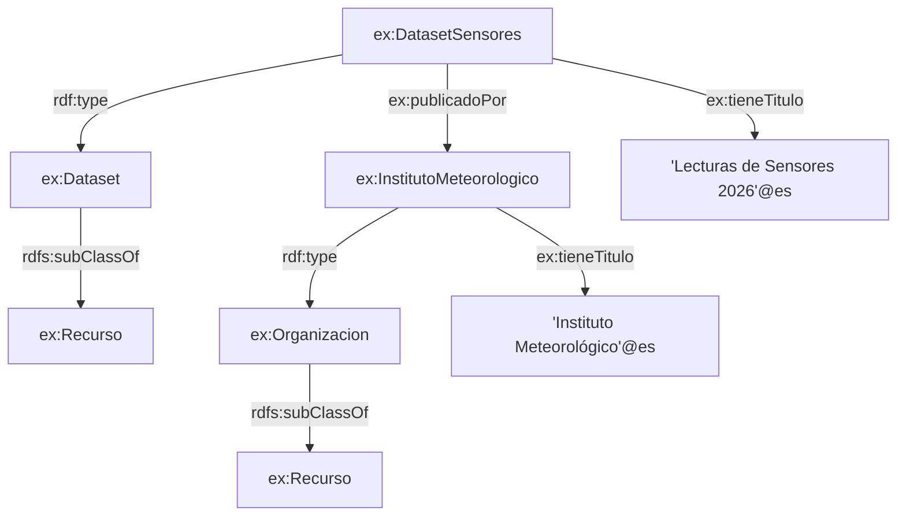

# 🕸️ 02 · RDFS — RDF Schema

> Guía práctica para entender, definir y utilizar vocabularios sobre datos RDF.


---

## 📑 Contenido

1. [¿Qué es RDFS?](#1--qué-es-rdfs)
2. [RDF vs RDFS](#2--rdf-vs-rdfs)
3. [El vocabulario de RDFS](#3--el-vocabulario-de-rdfs)
4. [Clases y recursos](#4--clases-y-recursos)
5. [Propiedades](#5--propiedades)
6. [Jerarquías de clases y propiedades](#6--jerarquías-de-clases-y-propiedades)
7. [Domain y range](#7--domain-y-range)
8. [Etiquetas y documentación](#8--etiquetas-y-documentación)
9. [Inferencia en RDFS](#9--inferencia-en-rdfs)
10. [Ejemplo práctico completo](#10--ejemplo-práctico-completo)
11. [RDFS no es validación](#11--rdfs-no-es-validación)
12. [RDFS vs OWL](#12--rdfs-vs-owl)
13. [Errores frecuentes](#13--errores-frecuentes)
14. [Casos de uso](#14--casos-de-uso)
15. [Resumen rápido](#15--resumen-rápido)
16. [Recursos y siguiente paso](#16--recursos-y-siguiente-paso)

---

## 1 · ¿Qué es RDFS?

**RDFS (RDF Schema)** es una extensión semántica de **RDF** que proporciona un vocabulario para describir recursos RDF, especialmente **clases, propiedades y relaciones entre ellas**.

RDF nos permite afirmar cosas:

```turtle
ex:Gonzalo ex:estudiaEn ex:UCLM .
```

Pero RDF, por sí solo, no nos dice qué representan `ex:Gonzalo`, `ex:estudiaEn` o `ex:UCLM`.

RDFS permite describir ese vocabulario:

```turtle
ex:Persona a rdfs:Class .
ex:Universidad a rdfs:Class .

ex:estudiaEn a rdf:Property ;
    rdfs:domain ex:Persona ;
    rdfs:range ex:Universidad .
```

Ahora tenemos información adicional sobre **qué son** esos recursos y **cómo se relacionan**.

> 💡 **Idea clave:** RDF describe datos; RDFS permite describir el vocabulario y parte de la semántica utilizada para expresar esos datos.

### RDF y RDFS en una frase

```text
RDF  → "Gonzalo estudia en la UCLM"
RDFS → "Persona y Universidad son clases,
        y estudiaEn es una propiedad entre ellas"
```

RDFS no sustituye a RDF. **Se construye sobre RDF**: las clases, propiedades y relaciones de RDFS se expresan mediante las mismas ternas RDF.

---

## 2 · RDF vs RDFS

La diferencia fundamental está en el nivel de descripción.

| Tecnología | Qué permite expresar | Ejemplo |
|:-----------|:---------------------|:--------|
| **RDF** | Datos y relaciones | `ex:Gonzalo ex:estudiaEn ex:UCLM` |
| **RDFS** | Clases, propiedades y jerarquías | `ex:Persona rdfs:subClassOf ex:Agente` |
| **OWL** | Semántica ontológica más expresiva | Restricciones, cardinalidades, equivalencias, etc. |

Podemos visualizarlo así:

```text
                    Web Semántica
                         │
                    ┌────▼────┐
                    │   OWL   │
                    └────┬────┘
                         │
                    ┌────▼────┐
                    │  RDFS   │
                    └────┬────┘
                         │
                    ┌────▼────┐
                    │   RDF   │
                    └─────────┘
```

Esto no significa que siempre haya que utilizar las tres tecnologías. Un grafo puede utilizar RDF sin RDFS, RDFS sin OWL, o combinar diferentes vocabularios y tecnologías según las necesidades.

### Un ejemplo progresivo

**Nivel RDF:**

```turtle
ex:Gonzalo ex:estudiaEn ex:UCLM .
```

**Añadimos RDFS:**

```turtle
ex:Persona a rdfs:Class .
ex:Universidad a rdfs:Class .

ex:estudiaEn a rdf:Property ;
    rdfs:domain ex:Persona ;
    rdfs:range ex:Universidad .
```

**Y podemos declarar la instancia:**

```turtle
ex:Gonzalo a ex:Persona .
ex:UCLM a ex:Universidad .
```

El resultado es un grafo en el que no solo tenemos datos, sino también información sobre el vocabulario utilizado para describirlos.

---

## 3 · El vocabulario de RDFS

RDFS define un conjunto de recursos y propiedades que podemos utilizar para describir nuestros propios vocabularios.

Los más importantes para empezar son:

| Recurso / propiedad | Para qué sirve |
|:--------------------|:---------------|
| `rdfs:Resource` | Clase de todos los recursos RDF |
| `rdfs:Class` | Clase cuyos miembros son clases RDF |
| `rdf:Property` | Clase de las propiedades RDF |
| `rdf:type` | Indica que un recurso es instancia de una clase |
| `rdfs:subClassOf` | Define una relación de subclase |
| `rdfs:subPropertyOf` | Define una relación entre propiedades |
| `rdfs:domain` | Indica la clase de los sujetos de una propiedad |
| `rdfs:range` | Indica la clase de los objetos de una propiedad |
| `rdfs:label` | Proporciona un nombre legible para un recurso |
| `rdfs:comment` | Proporciona una descripción de un recurso |
| `rdfs:Literal` | Clase de los valores literales |
| `rdfs:Datatype` | Clase de los tipos de datos RDF |

Los espacios de nombres utilizados habitualmente son:

```turtle
@prefix rdf:  <http://www.w3.org/1999/02/22-rdf-syntax-ns#> .
@prefix rdfs: <http://www.w3.org/2000/01/rdf-schema#> .
```

> 💡 `rdf:` y `rdfs:` son vocabularios distintos, aunque están estrechamente relacionados.

---

## 4 · Clases y recursos

### 🌐 `rdfs:Resource`

En RDFS, todo lo que puede ser descrito mediante RDF es un **recurso**.

`rdfs:Resource` representa la clase de todos los recursos.

```turtle
ex:Gonzalo a rdfs:Resource .
```

En realidad, bajo la semántica de RDFS, los recursos RDF pertenecen a `rdfs:Resource`, por lo que esta afirmación no suele ser necesario escribirla explícitamente.

---

### 📦 `rdfs:Class`

`rdfs:Class` representa la clase de los recursos que son **clases RDF**.

Por ejemplo:

```turtle
ex:Persona a rdfs:Class .
ex:Universidad a rdfs:Class .
```

Estamos diciendo:

```text
ex:Persona       → es una clase
ex:Universidad   → es una clase
```

Una clase puede tener instancias:

```turtle
ex:Gonzalo a ex:Persona .
ex:UCLM a ex:Universidad .
```

Podemos visualizarlo:



---

### 🔖 `rdf:type`

`rdf:type` se utiliza para indicar que un recurso es una instancia de una clase.

```turtle
ex:Gonzalo rdf:type ex:Persona .
```

La forma abreviada en Turtle es:

```turtle
ex:Gonzalo a ex:Persona .
```

Ambas afirmaciones son equivalentes.

```text
ex:Gonzalo ──rdf:type──▶ ex:Persona
```

Es importante distinguir:

```turtle
ex:Persona a rdfs:Class .
ex:Gonzalo a ex:Persona .
```

La primera afirmación describe **la clase**.

La segunda describe **una instancia de esa clase**.

---

### 🧩 La relación entre clases e instancias

```text
                rdfs:Class
                    ▲
                    │ rdf:type
                    │
               ex:Persona
                    ▲
                    │ rdf:type
                    │
               ex:Gonzalo
```

Una de las ideas fundamentales de RDFS es que las propias clases y propiedades también son recursos RDF que pueden ser descritos.

---

## 5 · Propiedades

### 🔗 `rdf:Property`

En RDF, una propiedad es el predicado que conecta un sujeto con un objeto.

Por ejemplo:

```turtle
ex:Gonzalo ex:estudiaEn ex:UCLM .
```

Podemos describir `ex:estudiaEn` como una propiedad:

```turtle
ex:estudiaEn a rdf:Property .
```

Así:

```text
ex:Gonzalo ──ex:estudiaEn──▶ ex:UCLM
                         ▲
                         │
                    rdf:Property
```

---

### 🏷️ `rdfs:label`

Podemos proporcionar un nombre legible para una clase, propiedad o recurso:

```turtle
ex:Persona
    rdfs:label "Persona"@es .

ex:estudiaEn
    rdfs:label "estudia en"@es .
```

`rdfs:label` está pensado para proporcionar una representación legible por humanos del nombre de un recurso.

---

### 📝 `rdfs:comment`

`rdfs:comment` permite añadir una descripción textual:

```turtle
ex:Persona
    rdfs:label "Persona"@es ;
    rdfs:comment "Individuo que pertenece al dominio de personas."@es .
```

Una combinación habitual es:

```turtle
ex:Persona
    a rdfs:Class ;
    rdfs:label "Persona"@es ;
    rdfs:comment "Clase que representa personas."@es .
```

Esto resulta especialmente útil cuando estamos creando vocabularios que otras personas tendrán que comprender o reutilizar.

---

## 6 · Jerarquías de clases y propiedades

Una de las capacidades más importantes de RDFS es poder establecer **jerarquías**.

### 🌳 `rdfs:subClassOf`

`rdfs:subClassOf` indica que una clase es subclase de otra.

```turtle
ex:Estudiante rdfs:subClassOf ex:Persona .
```

Significa:

> Todo `Estudiante` es también una `Persona`.

Podemos construir una jerarquía:

```turtle
ex:Estudiante rdfs:subClassOf ex:Persona .
ex:Persona rdfs:subClassOf ex:Agente .
```

Visualmente:

```text
ex:Agente
    ▲
    │
ex:Persona
    ▲
    │
ex:Estudiante
```

Si tenemos:

```turtle
ex:Gonzalo a ex:Estudiante .
```

La semántica de RDFS permite inferir:

```turtle
ex:Gonzalo a ex:Persona .
ex:Gonzalo a ex:Agente .
```

La propiedad `rdfs:subClassOf` es **transitiva**: si `A` es subclase de `B` y `B` es subclase de `C`, entonces `A` es subclase de `C`.

---

### 🔗 `rdfs:subPropertyOf`

También podemos crear jerarquías entre propiedades.

```turtle
ex:estudiaEnUniversidad
    rdfs:subPropertyOf ex:estudiaEn .
```

Esto significa:

> Todo recurso relacionado mediante `ex:estudiaEnUniversidad` también está relacionado mediante `ex:estudiaEn`.

Por ejemplo:

```turtle
ex:Gonzalo ex:estudiaEnUniversidad ex:UCLM .
```

Permite inferir:

```turtle
ex:Gonzalo ex:estudiaEn ex:UCLM .
```

También puede haber cadenas:

```turtle
ex:estudiaEnUniversidad
    rdfs:subPropertyOf ex:estudiaEn .

ex:estudiaEn
    rdfs:subPropertyOf ex:participaEn .
```

Por transitividad:

```text
estudiaEnUniversidad
        │
        ▼
    estudiaEn
        │
        ▼
    participaEn
```

Por tanto, una relación expresada mediante `ex:estudiaEnUniversidad` también implica las relaciones de sus superpropiedades.

---

## 7 · Domain y range

`rdfs:domain` y `rdfs:range` son probablemente dos de los conceptos más importantes de RDFS.

### 👤 `rdfs:domain`

`rdfs:domain` indica la clase a la que pertenecen los **sujetos** de una propiedad.

Por ejemplo:

```turtle
ex:estudiaEn
    rdfs:domain ex:Persona .
```

Si encontramos:

```turtle
ex:Gonzalo ex:estudiaEn ex:UCLM .
```

podemos inferir:

```turtle
ex:Gonzalo a ex:Persona .
```

Visualmente:

```text
ex:Gonzalo ──ex:estudiaEn──▶ ex:UCLM
    │
    │ domain
    ▼
ex:Persona
```

> ⚠️ **Importante:** `rdfs:domain` no funciona como una restricción que impida utilizar la propiedad con otros recursos. Su semántica permite **inferir** que el sujeto pertenece a la clase indicada.

---

### 🎯 `rdfs:range`

`rdfs:range` indica la clase a la que pertenecen los **objetos** de una propiedad.

```turtle
ex:estudiaEn
    rdfs:range ex:Universidad .
```

Si tenemos:

```turtle
ex:Gonzalo ex:estudiaEn ex:UCLM .
```

podemos inferir:

```turtle
ex:UCLM a ex:Universidad .
```

Visualmente:

```text
ex:Gonzalo ──ex:estudiaEn──▶ ex:UCLM
                              │
                              │ range
                              ▼
                        ex:Universidad
```

---

### 🧠 Domain + range juntos

Podemos definir:

```turtle
ex:estudiaEn
    a rdf:Property ;
    rdfs:domain ex:Persona ;
    rdfs:range ex:Universidad .
```

Y después:

```turtle
ex:Gonzalo ex:estudiaEn ex:UCLM .
```

RDFS permite obtener:

```turtle
ex:Gonzalo a ex:Persona .
ex:UCLM a ex:Universidad .
```

El grafo conceptual sería:



---

### ⚠️ Un error muy frecuente

No debemos interpretar:

```turtle
ex:estudiaEn rdfs:domain ex:Persona .
```

como:

> "`ex:estudiaEn` solo puede utilizarse con personas."

La interpretación semántica es:

> "Si un recurso aparece como sujeto de `ex:estudiaEn`, entonces ese recurso es una instancia de `ex:Persona`."

Esta diferencia es fundamental para entender RDFS.

---

### 📌 Varias domains o ranges

Una propiedad puede tener más de un `rdfs:domain` o `rdfs:range`.

Por ejemplo:

```turtle
ex:participaEn
    rdfs:domain ex:Persona ;
    rdfs:domain ex:Organizacion .
```

En este caso, un sujeto que utilice esa propiedad queda relacionado semánticamente con **ambas clases**.

No significa "Persona **o** Organización", sino que ambas afirmaciones forman parte de la semántica del vocabulario.

---

## 8 · Etiquetas y documentación

RDFS también proporciona propiedades destinadas a hacer los vocabularios más comprensibles.

### 🏷️ `rdfs:label`

```turtle
ex:Dataset
    a rdfs:Class ;
    rdfs:label "Conjunto de datos"@es .
```

### 📝 `rdfs:comment`

```turtle
ex:Dataset
    rdfs:comment "Conjunto estructurado de datos disponible para su consumo."@es .
```

Podemos documentar una propiedad de la misma forma:

```turtle
ex:tieneTitulo
    a rdf:Property ;
    rdfs:label "tiene título"@es ;
    rdfs:comment "Indica el título asociado a un recurso."@es .
```

Esto permite que herramientas y personas puedan obtener información básica sobre un vocabulario directamente desde el propio grafo.

---

### 🔎 `rdfs:seeAlso`

`rdfs:seeAlso` permite indicar que existe otro recurso que puede proporcionar información adicional.

```turtle
ex:Dataset
    rdfs:seeAlso <https://example.org/documentacion/dataset> .
```

No define una equivalencia ni una relación jerárquica. Simplemente señala información relacionada.

---

### 📖 `rdfs:isDefinedBy`

`rdfs:isDefinedBy` permite indicar el recurso que proporciona la definición de otro recurso.

```turtle
ex:Dataset
    rdfs:isDefinedBy ex:Vocabulary .
```

Puede utilizarse para enlazar una clase o propiedad con el vocabulario en el que está definida.

---

## 9 · Inferencia en RDFS

La **inferencia** es una de las partes más importantes para entender qué aporta RDFS.

Un grafo puede contener unas afirmaciones explícitas y, aplicando la semántica de RDFS, podemos obtener otras afirmaciones que se derivan de ellas.

### Antes de inferir

Tenemos:

```turtle
ex:Estudiante rdfs:subClassOf ex:Persona .

ex:Gonzalo a ex:Estudiante .
```

### Después de aplicar la semántica de RDFS

Podemos inferir:

```turtle
ex:Gonzalo a ex:Persona .
```

No hemos escrito explícitamente la segunda afirmación, pero se deriva de las dos primeras.

---

### Ejemplo con domain y range

Definimos:

```turtle
ex:estudiaEn
    rdfs:domain ex:Persona ;
    rdfs:range ex:Universidad .
```

Y tenemos:

```turtle
ex:Gonzalo ex:estudiaEn ex:UCLM .
```

Podemos inferir:

```turtle
ex:Gonzalo a ex:Persona .
ex:UCLM a ex:Universidad .
```

---

### Ejemplo con subClassOf

```turtle
ex:Estudiante rdfs:subClassOf ex:Persona .
ex:Persona rdfs:subClassOf ex:Agente .

ex:Gonzalo a ex:Estudiante .
```

Inferimos:

```turtle
ex:Gonzalo a ex:Persona .
ex:Gonzalo a ex:Agente .
```

---

### Ejemplo con subPropertyOf

```turtle
ex:estudiaEnUniversidad
    rdfs:subPropertyOf ex:estudiaEn .

ex:Gonzalo ex:estudiaEnUniversidad ex:UCLM .
```

Inferimos:

```turtle
ex:Gonzalo ex:estudiaEn ex:UCLM .
```

---

### 🧠 La idea general

Podemos resumir varias de estas inferencias así:

```text
SUBCLASS

A subClassOf B
x type A
    ↓
x type B


DOMAIN

P domain A
x P y
    ↓
x type A


RANGE

P range B
x P y
    ↓
y type B


SUBPROPERTY

P1 subPropertyOf P2
x P1 y
    ↓
x P2 y
```

Estas reglas conceptuales son una buena forma de recordar el comportamiento básico de RDFS.

> 💡 Un **reasoner** o motor de inferencia puede utilizar estas relaciones semánticas para obtener triples derivados del grafo original.

---

## 10 · Ejemplo práctico completo

Vamos a construir un pequeño vocabulario para describir un **catálogo de datos**.

### 10.1 Definimos los prefijos

```turtle
@prefix rdf:  <http://www.w3.org/1999/02/22-rdf-syntax-ns#> .
@prefix rdfs: <http://www.w3.org/2000/01/rdf-schema#> .
@prefix dct:  <http://purl.org/dc/terms/> .
@prefix ex:   <http://example.org/datos/> .
```

---

### 10.2 Definimos las clases

```turtle
ex:Recurso
    a rdfs:Class ;
    rdfs:label "Recurso"@es ;
    rdfs:comment "Recurso que puede ser descrito dentro del catálogo."@es .

ex:Dataset
    a rdfs:Class ;
    rdfs:subClassOf ex:Recurso ;
    rdfs:label "Conjunto de datos"@es ;
    rdfs:comment "Conjunto de datos publicado dentro del catálogo."@es .

ex:Organizacion
    a rdfs:Class ;
    rdfs:subClassOf ex:Recurso ;
    rdfs:label "Organización"@es ;
    rdfs:comment "Organización responsable de un recurso."@es .
```

Tenemos:

```text
          ex:Recurso
          ▲       ▲
          │       │
          │       │
     ex:Dataset  ex:Organizacion
```

---

### 10.3 Definimos las propiedades

```turtle
ex:tieneTitulo
    a rdf:Property ;
    rdfs:domain ex:Recurso ;
    rdfs:range rdfs:Literal ;
    rdfs:label "tiene título"@es ;
    rdfs:comment "Título asociado a un recurso."@es .

ex:publicadoPor
    a rdf:Property ;
    rdfs:domain ex:Dataset ;
    rdfs:range ex:Organizacion ;
    rdfs:label "publicado por"@es ;
    rdfs:comment "Organización que publica un conjunto de datos."@es .
```

---

### 10.4 Utilizamos el vocabulario

```turtle
ex:DatasetSensores
    a ex:Dataset ;
    ex:tieneTitulo "Lecturas de Sensores 2026"@es ;
    ex:publicadoPor ex:InstitutoMeteorologico .

ex:InstitutoMeteorologico
    a ex:Organizacion ;
    ex:tieneTitulo "Instituto Meteorológico"@es .
```

---

### 🧠 ¿Qué sabemos explícitamente?

Tenemos:

```text
DatasetSensores
    ├── rdf:type → Dataset
    ├── tieneTitulo → "Lecturas de Sensores 2026"
    └── publicadoPor → InstitutoMeteorologico

InstitutoMeteorologico
    ├── rdf:type → Organizacion
    └── tieneTitulo → "Instituto Meteorológico"
```

---

### 🔮 ¿Qué podemos inferir?

Como:

```turtle
ex:Dataset rdfs:subClassOf ex:Recurso .
```

y:

```turtle
ex:DatasetSensores a ex:Dataset .
```

podemos inferir:

```turtle
ex:DatasetSensores a ex:Recurso .
```

Además:

```turtle
ex:publicadoPor
    rdfs:domain ex:Dataset ;
    rdfs:range ex:Organizacion .
```

Por tanto, el uso de:

```turtle
ex:DatasetSensores ex:publicadoPor ex:InstitutoMeteorologico .
```

es coherente con:

```turtle
ex:DatasetSensores a ex:Dataset .
ex:InstitutoMeteorologico a ex:Organizacion .
```

Y, como `ex:Organizacion` es subclase de `ex:Recurso`, también podemos inferir:

```turtle
ex:InstitutoMeteorologico a ex:Recurso .
```

---

### 🗺️ Grafo resultante



Las relaciones de tipo `rdfs:subClassOf`, `rdfs:domain` y `rdfs:range` permiten obtener información adicional sin tener que escribir manualmente todos los triples derivados.

---

## 11 · RDFS no es validación

Este punto es especialmente importante.

Supongamos:

```turtle
ex:publicadoPor
    rdfs:domain ex:Dataset ;
    rdfs:range ex:Organizacion .
```

Y aparece:

```turtle
ex:Numero42 ex:publicadoPor "hola" .
```

RDFS no funciona como un sistema de validación que simplemente diga:

```text
❌ El dato es inválido
```

La semántica de RDFS permite inferir tipos a partir del uso de la propiedad:

```turtle
ex:Numero42 a ex:Dataset .
"hola" a ex:Organizacion .
```

El segundo caso muestra además por qué hay que entender bien la semántica de `domain` y `range`: **no son restricciones de validación**.

Si nuestro objetivo es comprobar que los datos cumplen unas condiciones concretas, existen tecnologías diseñadas para validación, como **SHACL**.

```text
RDFS
  │
  ├── Describe vocabularios
  ├── Define clases y propiedades
  ├── Define jerarquías
  └── Permite inferencia semántica

SHACL
  │
  └── Valida grafos frente a shapes y restricciones
```

> 💡 No conviene utilizar `rdfs:domain` y `rdfs:range` como sustitutos de las restricciones de validación.

---

## 12 · RDFS vs OWL

RDFS proporciona una base semántica útil, pero no intenta expresar toda la lógica que puede necesitar una ontología.

| Capacidad | RDF | RDFS | OWL |
|:----------|:---:|:----:|:---:|
| Triples | ✅ | ✅ | ✅ |
| Clases | — | ✅ | ✅ |
| Propiedades | — | ✅ | ✅ |
| `domain` / `range` | — | ✅ | ✅ |
| `subClassOf` | — | ✅ | ✅ |
| `subPropertyOf` | — | ✅ | ✅ |
| Etiquetas y comentarios | — | ✅ | ✅ |
| Cardinalidades | — | — | ✅ |
| Propiedades funcionales | — | — | ✅ |
| Equivalencia de clases | — | — | ✅ |
| Disjunción de clases | — | — | ✅ |
| Restricciones complejas | — | — | ✅ |

Una forma sencilla de recordarlo:

```text
RDF
    ↓
"Quiero expresar datos"

RDFS
    ↓
"Quiero describir las clases y propiedades
que utilizo y establecer relaciones entre ellas"

OWL
    ↓
"Necesito expresar una semántica ontológica
más rica y restricciones más complejas"
```

No significa que OWL sustituya conceptualmente a RDFS: OWL utiliza RDF/RDFS y añade un nivel de expresividad ontológica mayor.

---

## 13 · Errores frecuentes

| ❌ Error | ✅ Forma correcta |
|:--------|:------------------|
| Confundir una clase con una instancia | `ex:Persona a rdfs:Class` define la clase; `ex:Gonzalo a ex:Persona` define una instancia |
| Pensar que `domain` valida sujetos | `domain` permite inferir el tipo del sujeto |
| Pensar que `range` valida objetos | `range` permite inferir el tipo del objeto |
| Confundir `subClassOf` con `subPropertyOf` | `subClassOf` se utiliza con clases; `subPropertyOf` con propiedades |
| Pensar que `rdfs:label` define una clase | `rdfs:label` solo proporciona una etiqueta legible |
| Pensar que `rdfs:comment` añade restricciones | `rdfs:comment` proporciona documentación textual |
| Confundir `rdf:type` con `rdfs:Class` | `rdf:type` es una propiedad; `rdfs:Class` es una clase |
| Pensar que RDFS solo sirve para documentación | RDFS también aporta semántica e inferencia |
| Utilizar `domain`/`range` como SHACL | RDFS no sustituye un lenguaje de validación |
| Confundir `subClassOf` con equivalencia | Una subclase no implica que ambas clases sean equivalentes |

---

## 14 · Casos de uso

### 🧠 Vocabularios y ontologías

RDFS permite definir vocabularios reutilizables mediante clases, propiedades, jerarquías y documentación.

### 🏛️ Espacios de Datos (*Data Spaces*)

Puede utilizarse para describir semánticamente recursos y metadatos compartidos entre participantes de un espacio de datos.

### 🔗 Linked Data

Las relaciones entre clases y propiedades facilitan que diferentes conjuntos de datos puedan utilizar vocabularios comunes y enlazarse semánticamente.

### 🕸️ Knowledge Graphs

RDFS proporciona una capa básica de semántica sobre grafos RDF y permite obtener conocimiento derivado mediante inferencia.

### 📚 Catálogos y metadatos

Vocabularios como DCAT pueden utilizarse junto con RDF y RDFS para describir datasets, catálogos y recursos de datos.

---

## 15 · Resumen rápido

### 🧩 Conceptos fundamentales

| Elemento | Significado |
|:---------|:------------|
| `rdfs:Resource` | Clase de todos los recursos RDF |
| `rdfs:Class` | Clase de las clases RDF |
| `rdf:Property` | Clase de las propiedades RDF |
| `rdf:type` | Indica que un recurso es instancia de una clase |
| `rdfs:subClassOf` | Indica que una clase es subclase de otra |
| `rdfs:subPropertyOf` | Indica que una propiedad es subpropiedad de otra |
| `rdfs:domain` | Indica la clase inferida para los sujetos de una propiedad |
| `rdfs:range` | Indica la clase inferida para los objetos de una propiedad |
| `rdfs:label` | Nombre o etiqueta legible de un recurso |
| `rdfs:comment` | Descripción textual de un recurso |
| `rdfs:seeAlso` | Enlace a información relacionada |
| `rdfs:isDefinedBy` | Indica dónde está definida una entidad |

### 🧠 Las cuatro inferencias que debes recordar

```text
A rdfs:subClassOf B
x a A
    ↓
x a B


P rdfs:domain A
x P y
    ↓
x a A


P rdfs:range B
x P y
    ↓
y a B


P1 rdfs:subPropertyOf P2
x P1 y
    ↓
x P2 y
```

### 📝 Ejemplo mínimo

```turtle
@prefix rdf:  <http://www.w3.org/1999/02/22-rdf-syntax-ns#> .
@prefix rdfs: <http://www.w3.org/2000/01/rdf-schema#> .
@prefix ex:   <http://example.org/> .

ex:Persona
    a rdfs:Class .

ex:Estudiante
    a rdfs:Class ;
    rdfs:subClassOf ex:Persona .

ex:estudiaEn
    a rdf:Property ;
    rdfs:domain ex:Estudiante ;
    rdfs:range ex:Universidad .

ex:Gonzalo
    a ex:Estudiante ;
    ex:estudiaEn ex:UCLM .
```

A partir de esto, la semántica de RDFS permite inferir, entre otras:

```turtle
ex:Gonzalo a ex:Persona .
ex:UCLM a ex:Universidad .
```

---

## 16 · Recursos y siguiente paso

**Referencias oficiales**

- [RDF Schema 1.1 (W3C)](https://www.w3.org/TR/rdf-schema/)
- [RDF 1.1 Semantics (W3C)](https://www.w3.org/TR/rdf11-mt/)
- [RDF 1.1 Primer (W3C)](https://www.w3.org/TR/rdf11-primer/)
- [RDF 1.1 Concepts (W3C)](https://www.w3.org/TR/rdf11-concepts/)
- [RDF 1.1 Turtle (W3C)](https://www.w3.org/TR/turtle/)

---

### 🧭 ¿Qué hemos aprendido?

En RDF aprendimos a representar información mediante **sujeto → predicado → objeto**.

En RDFS hemos añadido una capa de significado:

```text
RDF
 │
 ├── Recursos
 ├── Propiedades
 └── Triples
       │
       ▼
RDFS
 │
 ├── Clases
 ├── Jerarquías
 ├── Domain / Range
 ├── Documentación
 └── Inferencia
```

RDF nos permite **afirmar información**.

RDFS nos permite **describir el vocabulario utilizado para expresarla y establecer parte de su semántica**.

El siguiente paso será profundizar en cómo representar **ontologías y conocimiento más expresivo** ➡️
