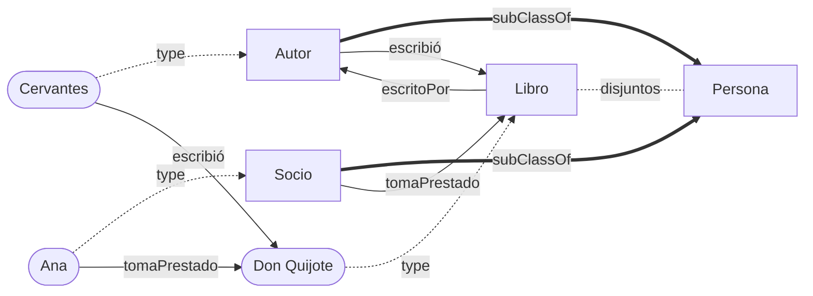
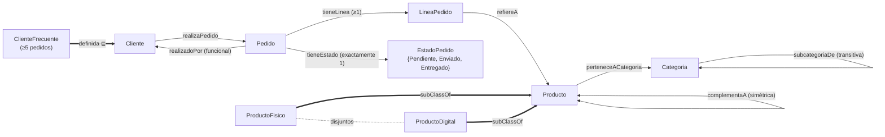
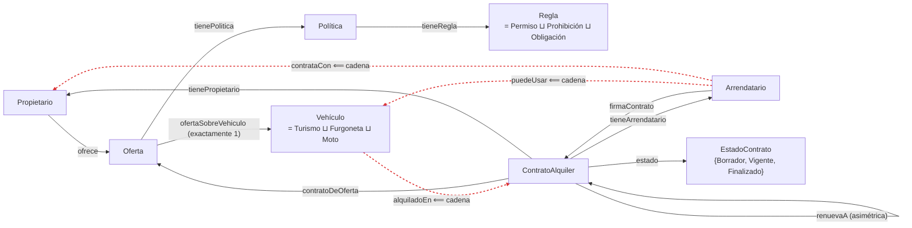

# 🧠 Tres ontologías OWL, tres niveles

Cada ontología usa un modelo de la vida real que ya conoces, para que lo difícil sea OWL y no el dominio.

| Nivel | Fichero | Analogía | Qué se aprende |
|---|---|---|---|
| 🟢 Básico | [`01-biblioteca-basico.ttl`](01-biblioteca-basico.ttl) | Biblioteca del barrio | Clases, subclases, propiedades, domain/range, inversas |
| 🟡 Intermedio | [`02-tienda-intermedio.ttl`](02-tienda-intermedio.ttl) | Pedido de una tienda online | Restricciones, cardinalidad, transitiva, simétrica, clases definidas |
| 🔴 Avanzado | [`03-alquiler-avanzado.ttl`](03-alquiler-avanzado.ttl) | Alquiler de coches ≈ Espacio de Datos | Cadenas de propiedades, cardinalidad cualificada, unión disjunta, complemento |

> Leyenda de los grafos: caja = clase · óvalo = individuo · flecha continua = propiedad · flecha discontinua = `rdf:type` · flecha gruesa = `subClassOf`.

---

## 🟢 Básico · Biblioteca

Un autor escribe libros y un socio los toma prestados. Es el "hola mundo" de OWL.

---

## 🟡 Intermedio · Tienda online

Un pedido es como un ticket: tiene un cliente, un estado y líneas que apuntan a productos. Las categorías se anidan como las secciones de unos grandes almacenes.

---

## 🔴 Avanzado · Alquiler de coches ≈ Espacio de Datos

Propietario ≈ *Data Provider* · Arrendatario ≈ *Data Consumer* · Vehículo ≈ *Data Asset* · Oferta ≈ oferta del catálogo · Política ≈ ODRL · Contrato ≈ *Contract Agreement*.

Las líneas rojas son propiedades **inferidas** por cadenas: el razonador deduce quién puede usar qué sin que nadie lo escriba.

---

💡 **Cómo probarlas:** abre los `.ttl` en [Protégé](https://protege.stanford.edu/), activa un razonador (HermiT) y mira los axiomas inferidos. Los comentarios `# Inferencia:` al final de cada fichero te dicen qué debería aparecer.
