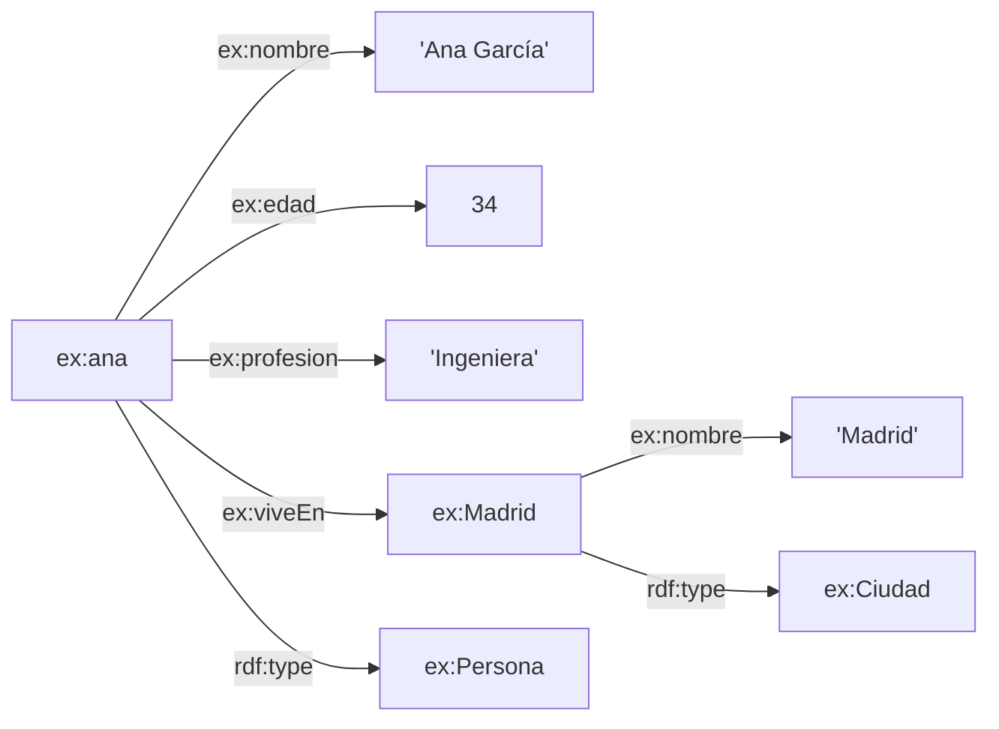

# 🧪 Zona de práctica — SPARQL Básico

Esta carpeta contiene todo lo necesario para **jugar** con los conceptos del [README](README.md).

```text
Basico/
├── README.md              ← teoría
├── PRACTICA.md            ← este archivo
├── ejecutar.py            ← lanza consultas sobre el grafo
├── datos/
│   └── personas.ttl       ← grafo de ejemplo (10 personas, 5 ciudades)
├── consultas/             
└── ejercicios/
    ├── EJERCICIOS.md      ← 9 ejercicios
    └── soluciones/        ← una solución por ejercicio
```

---

## 🗺️ El grafo



Todas las personas siguen la misma forma que `ex:ana`.

---

## ▶️ Cómo ejecutar las consultas

### Opción 1 — Python + rdflib (la más rápida)

```bash
pip install rdflib
python ejecutar.py                                  # todas las consultas
python ejecutar.py consultas/03-filter-numerico.rq  # una concreta
```

### Opción 2 — Apache Jena (línea de comandos)

```bash
arq --data datos/personas.ttl --query consultas/03-filter-numerico.rq
```

### Opción 3 — Apache Jena Fuseki (interfaz web)

1. Arranca Fuseki y crea un dataset en memoria.
2. Sube `datos/personas.ttl` desde la pestaña *upload*.
3. Copia y pega cualquier consulta en la pestaña *query*.

---

## 📖 Ruta sugerida

| Orden | Archivo | Concepto |
|-------|---------|----------|
| 1 | `01-todas-las-personas.rq` | `SELECT`, `WHERE`, patrón de triple |
| 2 | `02-nombres.rq` | Varias variables, patrones enlazados |
| 3 | `03-filter-numerico.rq` | `FILTER` numérico |
| 4 | `04-filter-logico.rq` | `&&`, `\|\|`, `!` |
| 5 | `05-filter-texto.rq` | `CONTAINS`, `LCASE` |
| 6 | `06-order-by.rq` | `ORDER BY`, `ASC`, `DESC` |
| 7 | `07-limit.rq` | `LIMIT` |
| 8 | `08-offset-paginacion.rq` | `OFFSET` |
| 9–10 | `09-sin-distinct.rq` / `10-distinct.rq` | `DISTINCT` |
| 11 | `11-todo-junto.rq` | Todo combinado |
| — | `ejercicios/EJERCICIOS.md` | Practica por tu cuenta |

---

## 🎮 Cosas que probar

* Cambia `>= 18` por `> 18` en la consulta 03 y compara.
* Quita el `ORDER BY` de la consulta 07. ¿Sigue devolviendo las mismas personas?
* Cambia `ex:nombre` por `ex:nmbre` (error de tipografía). ¿Qué devuelve SPARQL? *(Spoiler: no da error, solo 0 resultados.)*
* Añade una persona nueva a `personas.ttl` y vuelve a ejecutar las consultas.
* Pide `SELECT *` en lugar de listar variables.

---

## ⚠️ Errores frecuentes

| Error | Causa |
|-------|-------|
| `0 resultados` inesperados | Prefijo mal escrito o propiedad inexistente |
| Falta el `.` al final de un patrón | Cada patrón termina en `.` (o `;` si repites sujeto) |
| `FILTER` fuera de `WHERE` | Debe ir **dentro** de las llaves |
| `LIMIT` sin `ORDER BY` | Orden no determinista |
| Comparar `?edad = "34"` | Es un `xsd:integer`, no un texto: usa `34` |

---

➡️ **Siguiente nivel:** `../Intermedio` (`OPTIONAL`, `UNION`, agregaciones…)
