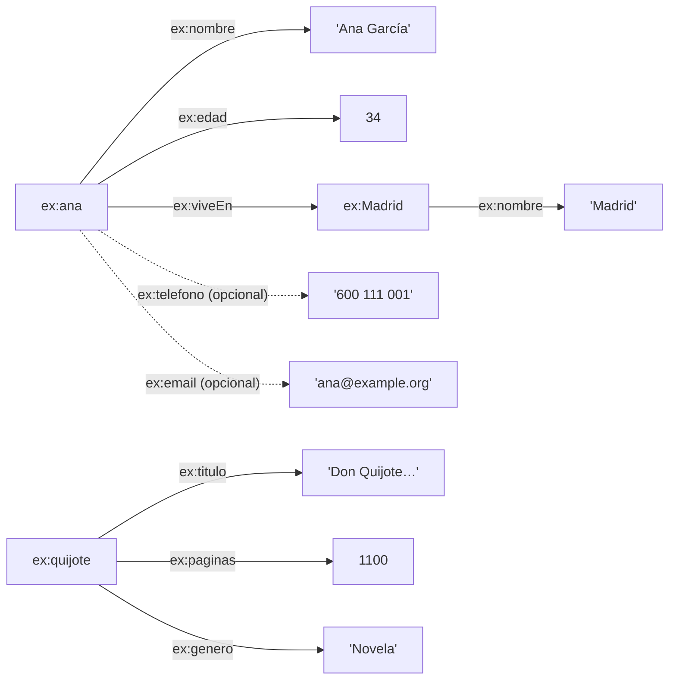

# 🧪 Zona de práctica — SPARQL Intermedio

Todo lo necesario para **jugar** con los conceptos del [README](README.md).

```text
Intermedio/
├── README.md                  ← teoría
├── PRACTICA.md                ← este archivo
├── ejecutar.py                ← lanza consultas sobre el grafo
├── datos/
│   └── personas-libros.ttl    ← 16 personas, 5 ciudades, 6 libros
├── consultas/                 ← 20 consultas de ejemplo, comentadas
└── ejercicios/
    ├── EJERCICIOS.md          ← 12 ejercicios
    └── soluciones/            ← una solución por ejercicio
```

---

## 🗺️ El grafo



El grafo está pensado para que cada herramienta tenga algo que aportar:

| Herramienta | Qué ofrece el grafo |
|-------------|---------------------|
| `OPTIONAL` | Teléfono (7 personas) y email (6) son opcionales |
| `UNION` | Personas y ciudades usan `ex:nombre`; los libros usan `ex:titulo` |
| `VALUES` / `BIND` | Recursos con identificadores claros (`ex:ana`, `ex:Madrid`…) y edades numéricas |
| `GROUP BY` / `HAVING` | Ciudades con 2, 3 y 5 personas; géneros con 1 y 4 libros |

---

## ▶️ Cómo ejecutar las consultas

### Opción 1 — Python + rdflib

```bash
pip install rdflib
python ejecutar.py                                   # todas las consultas
python ejecutar.py consultas/16-having-count.rq      # una concreta
```

### Opción 2 — Apache Jena

```bash
arq --data datos/personas-libros.ttl --query consultas/16-having-count.rq
```

### Opción 3 — Apache Jena Fuseki

Crea un dataset en memoria, sube `datos/personas-libros.ttl` y pega las consultas en la pestaña *query*.

---

## 📖 Ruta sugerida

| Archivos | Concepto |
|----------|----------|
| `01` | Múltiples patrones, variables compartidas |
| `02`–`04` | `OPTIONAL`, varios `OPTIONAL`, `!BOUND` |
| `05`–`06` | `UNION` |
| `07`–`08` | `VALUES` |
| `09`–`11` | `BIND`, `IF`, `COALESCE` |
| `12`–`13` | `COUNT`, `MIN`, `MAX`, `AVG`, `SUM` |
| `14`–`15` | `GROUP BY` |
| `16`–`18` | `HAVING` y su diferencia con `FILTER` |
| `19` | Agregaciones sobre otro tipo de recurso |
| `20` | Todo combinado |
| `ejercicios/` | Practica por tu cuenta |

---

## 🎮 Cosas que probar

* En `02`, mueve el patrón de `ex:telefono` fuera del `OPTIONAL`. ¿Cuántas filas quedan?
* En `16`, cambia `> 2` por `> 3` y por `> 5`.
* En `18`, mueve la condición de `FILTER` a `HAVING`. ¿Por qué cambia el resultado?
* En `13`, añade `(SAMPLE(?nombre) AS ?ejemplo)` (necesitarás el patrón de `ex:nombre`).
* En `05`, añade un tercer bloque `UNION` para otro predicado.
* Añade una persona **sin** `ex:edad` y mira qué pasa con `AVG` y `COUNT`.
* Quita el `GROUP BY` de `14` y lee el error.

---

## ⚠️ Errores frecuentes

| Error | Causa |
|-------|-------|
| Aparecen ciudades o libros en consultas de personas | Falta `a ex:Persona`: otros recursos también usan `ex:nombre` |
| Un `OPTIONAL` "no funciona" | El patrón está fuera de las llaves del `OPTIONAL` |
| Error en `SELECT` con agregación | Variable del `SELECT` ausente en `GROUP BY` |
| `FILTER(COUNT(...) > n)` | Para filtrar grupos hay que usar `HAVING` |
| `BIND` no devuelve nada | `BIND` debe ir **después** de los patrones que usan sus variables |
| `AVG` sale con muchos decimales | Usa `ROUND(AVG(?x))` o `xsd:decimal` |

---

⬅️ **Nivel anterior:** `../Basico` · ➡️ **Siguiente nivel:** `../Avanzado`
