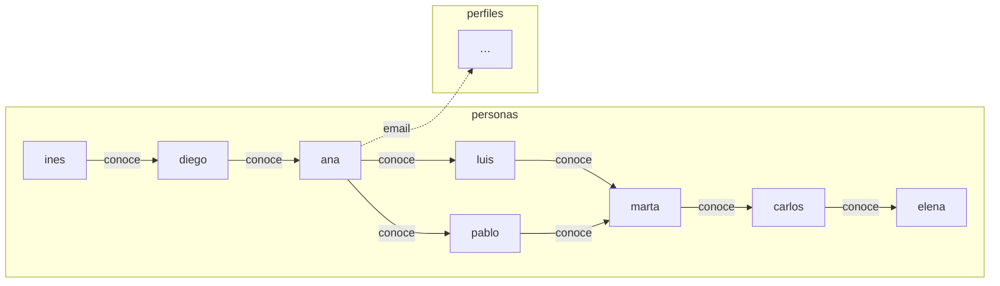

# 🧪 Zona de práctica — SPARQL Avanzado

```text
Avanzado/
├── README.md · PRACTICA.md
├── ejecutar.py          ← SELECT, ASK, CONSTRUCT, DESCRIBE y UPDATE
├── datos/red.trig       ← dataset con 2 grafos nombrados
├── consultas/           ← 14 ejemplos
└── ejercicios/          ← EJERCICIOS.md + soluciones/
```

## 🗺️ Los datos



## ▶️ Ejecutar

```bash
pip install rdflib
python ejecutar.py                                # todas (salvo SERVICE)
python ejecutar.py consultas/01-path-repeticion.rq
```

Con Jena: `arq --data datos/red.trig --query consultas/06-graph-join.rq`
(para `UPDATE` usa `update --data=... --update=...`).

> Los `INSERT`/`DELETE` se aplican sobre una copia en memoria: `red.trig` nunca cambia.

## 📖 Ruta

| Archivos | Concepto |
|----------|----------|
| `01`–`03` | Property paths: `+`, `\|`, `^`, `/` |
| `04` | Subconsulta |
| `05`–`06` | `GRAPH` |
| `07` | `CONSTRUCT` |
| `08` | `DESCRIBE` |
| `09`–`10` | `ASK` |
| `11`–`13` | `INSERT DATA`, `DELETE DATA`, `DELETE/INSERT WHERE` |
| `14` | `SERVICE` (requiere Internet; no probada aquí) |

## 🎮 Probar

* En `01`, cambia `+` por `*` y compara.
* En `05`, quita el `GROUP BY` y la agregación: ¿qué ves?
* Ejecuta `06` sin `GRAPH`: con `default_union=True` también funciona.
* Cambia el `CONSTRUCT` de `07` por `ex:conoce` → `ex:conocidoPor` invertido.

## ⚠️ Errores frecuentes

| Error | Causa |
|-------|-------|
| `0 resultados` en `GRAPH` | Nombre de grafo mal escrito o dato en otro grafo |
| `DELETE/INSERT` no hace nada | Falta `WITH`/`GRAPH`: el patrón busca en otro grafo |
| `DESCRIBE` devuelve cosas distintas según el motor | Está definido por la implementación |
| `SERVICE` falla | Sin conexión, o el endpoint limita/bloquea la consulta |

⬅️ `../Intermedio` · ➡️ `../Aplicaciones`
