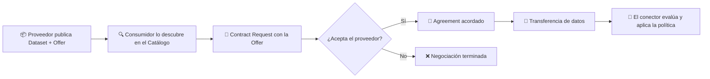
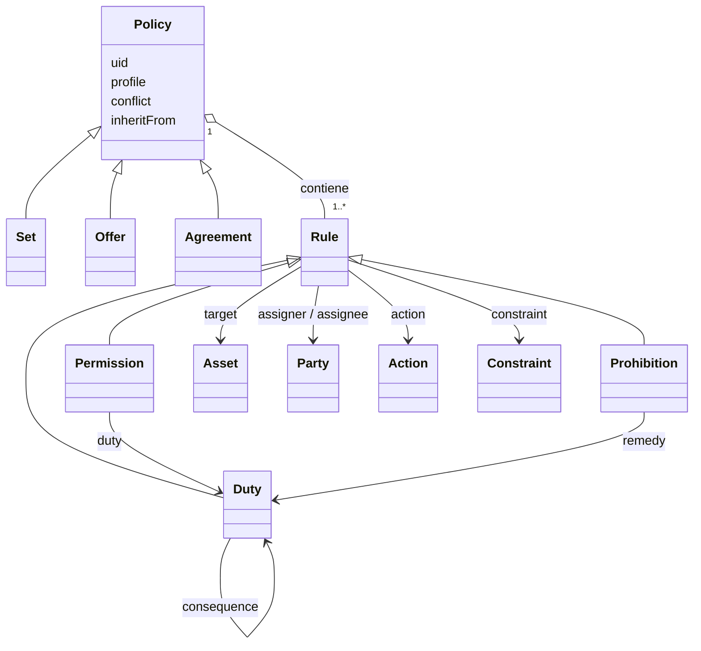
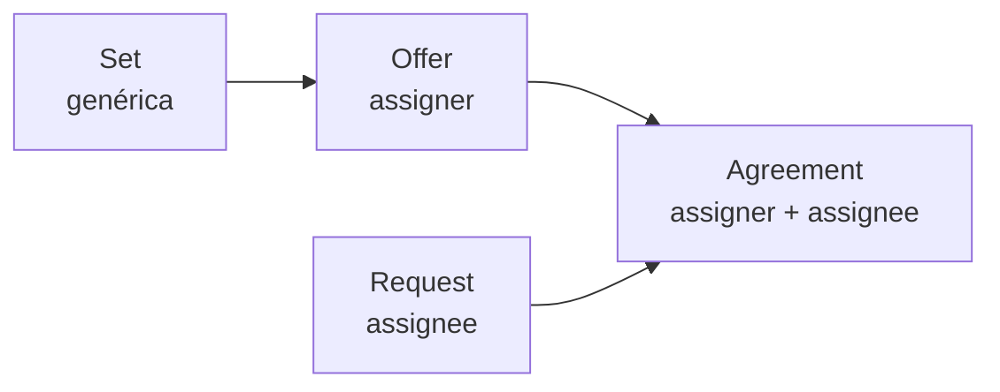
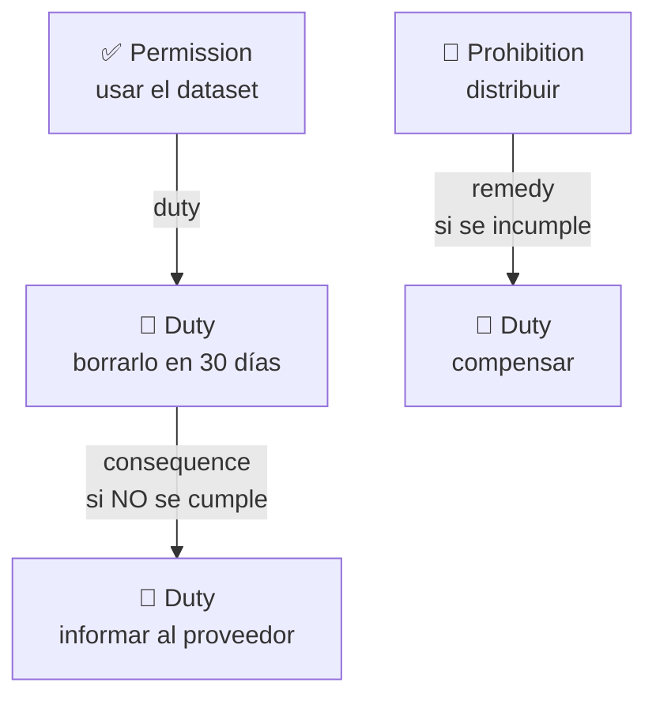
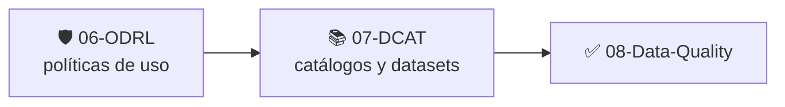

# 🛡️ 06 · ODRL — Open Digital Rights Language

**Cómo expresar, de forma que una máquina lo entienda, *qué se puede, qué no se puede y qué hay que hacer* con los datos.**


> *Learning by building: primero entendemos el modelo, luego escribimos políticas, luego las conectamos con un Espacio de Datos.*

---

## 📑 Índice

1. [🧭 Cómo usar esta guía](#-cómo-usar-esta-guía)
2. [📖 ¿Qué es ODRL?](#-qué-es-odrl)
3. [🏛️ Por qué importa en Espacios de Datos](#️-por-qué-importa-en-espacios-de-datos)
4. [🧱 El modelo de información](#-el-modelo-de-información)
5. [🗂️ Tipos de política](#️-tipos-de-política)
6. [⚖️ Reglas: Permission, Prohibition y Duty](#️-reglas-permission-prohibition-y-duty)
7. [🎯 Constraints (restricciones)](#-constraints-restricciones)
8. [🎬 Actions (acciones)](#-actions-acciones)
9. [🔀 Conflictos, herencia y perfiles](#-conflictos-herencia-y-perfiles)
10. [🧪 Ejemplos: básico, intermedio y avanzado](#-ejemplos-básico-intermedio-y-avanzado)
11. [🔌 ODRL en la práctica: DSP y EDC](#-odrl-en-la-práctica-dsp-y-edc)
12. [✅ ODRL + SHACL: validar las políticas](#-odrl--shacl-validar-las-políticas)
13. [⚠️ Errores frecuentes](#️-errores-frecuentes)
14. [🧰 Casos de uso](#-casos-de-uso)
15. [🧠 Chuleta de repaso](#-chuleta-de-repaso)
16. [🏋️ Ejercicios](#️-ejercicios)
17. [📚 Recursos](#-recursos)
18. [➡️ Siguiente paso](#️-siguiente-paso)

---

## 🧭 Cómo usar esta guía

Esta guía está pensada para dos tipos de lector:

| Si eres… | Ruta recomendada |
| --- | --- |
| 🆕 **Nuevo en ODRL** | Lee en orden: secciones 2 → 10. Cada concepto se apoya en el anterior. Después haz los [ejercicios](#️-ejercicios). |
| 🔁 **Vienes a repasar** | Ve directo a la [🧠 Chuleta de repaso](#-chuleta-de-repaso), mira el [diagrama del modelo](#-el-modelo-de-información) y los [ejemplos](#-ejemplos-básico-intermedio-y-avanzado). Usa [⚠️ Errores frecuentes](#️-errores-frecuentes) como lista de comprobación. |

> 💡 **Requisitos previos:** si sabes qué es un grafo RDF y has visto Turtle y JSON-LD (carpetas `01-RDF` a `05-SHACL`), tienes todo lo necesario.

---

## 📖 ¿Qué es ODRL?

**ODRL (Open Digital Rights Language)** es un estándar del **W3C** para describir **políticas**: declaraciones sobre qué **acciones** están **permitidas**, **prohibidas** u **obligadas** sobre un **activo** (un dato, un servicio, un documento…), por parte de qué **partes** y bajo qué **condiciones**.

Se compone de tres especificaciones del W3C:

| Especificación | Qué define |
| --- | --- |
| **ODRL Information Model 2.2** | El modelo conceptual: Policy, Rule, Asset, Party, Action, Constraint… |
| **ODRL Vocabulary & Expression 2.2** | El vocabulario RDF (`odrl:`) y sus serializaciones (JSON-LD, Turtle, etc.). |
| **ODRL Profiles** (buenas prácticas) | Cómo adaptar ODRL a un dominio concreto (por ejemplo, Espacios de Datos). |

### 🎯 La idea en una frase

> ODRL **describe** reglas de uso; **no las hace cumplir**.

Esta es la confusión más habitual, así que conviene fijarla desde el principio:

| ODRL **sí** hace | ODRL **no** hace |
| --- | --- |
| Expresar permisos, prohibiciones y obligaciones de forma estructurada | Bloquear accesos (eso es *enforcement*) |
| Ser legible por máquinas y por personas | Decidir por sí solo si una acción concreta se cumple |
| Vivir como un grafo RDF enlazable con otros vocabularios | Definir cómo se evalúa cada restricción (lo decide quien implementa) |

Por eso, en un Espacio de Datos, ODRL es el **lenguaje del contrato**, y el **conector** (por ejemplo, EDC) es quien **evalúa y aplica** esas políticas.

---

## 🏛️ Por qué importa en Espacios de Datos

El principio rector de un Espacio de Datos es la **soberanía del dato**: quien lo posee decide **quién lo usa y en qué condiciones**. ODRL es el vehículo para expresar esas condiciones.



Las políticas ODRL aparecen en **tres momentos** del ciclo de vida:

1. **Catálogo** → cada `Dataset` lleva una o varias **Offers** (`odrl:hasPolicy`).
2. **Negociación** → se intercambian Offers y se cierra un **Agreement**.
3. **Transferencia** → el conector evalúa la política antes (y a veces durante) el acceso al dato.

---

## 🧱 El modelo de información

Este es el **mapa mental** que hay que llevarse. Todo lo demás son variaciones sobre este esquema:



### 🧩 Las piezas, una a una

| Pieza | Propiedad ODRL | Pregunta que responde | Ejemplo |
| --- | --- | --- | --- |
| **Policy** | `odrl:Policy` (`Set`, `Offer`, `Agreement`…) | ¿Qué conjunto de reglas es? | `ex:politica-001` |
| **Rule** | `odrl:permission`, `odrl:prohibition`, `odrl:duty` / `odrl:obligation` | ¿Se permite, se prohíbe o se obliga? | un permiso de lectura |
| **Asset** | `odrl:target` | ¿Sobre **qué**? | `ex:dataset-calidad-aire` |
| **Action** | `odrl:action` | ¿Qué **se hace**? | `odrl:use`, `odrl:distribute` |
| **Party** | `odrl:assigner`, `odrl:assignee` | ¿Quién concede y quién recibe? | `ex:ayuntamiento`, `ex:universidad` |
| **Constraint** | `odrl:constraint` | ¿**Bajo qué condiciones** aplica? | solo hasta 2027, solo para investigación |
| **Duty** | `odrl:duty`, `odrl:remedy`, `odrl:consequence` | ¿Qué hay que **cumplir a cambio**? | borrar el dato en 30 días |

> 🧠 **Truco para recordarlo:** una regla se lee como una frase.
> *«[assigner] permite a [assignee] realizar [action] sobre [target] **si** [constraint] **y a cambio de** [duty]».*

---

## 🗂️ Tipos de política

Todas son subclases de `odrl:Policy`. Las tres importantes en Espacios de Datos son **Set**, **Offer** y **Agreement**:

| Tipo | Para qué sirve | ¿Requiere partes? | ¿Dónde aparece? |
| --- | --- | --- | --- |
| `odrl:Set` | Política genérica, sin compromiso entre partes. Es el tipo por defecto. | No | Plantillas, pruebas, políticas internas |
| `odrl:Offer` | Una **oferta** de un proveedor, aún **sin consumidor concreto**. | Requiere `assigner` | Catálogo, mensajes de oferta |
| `odrl:Agreement` | Un **acuerdo cerrado** entre dos partes concretas. | Requiere `assigner` **y** `assignee` | Final de la negociación |
| `odrl:Request` | Una **solicitud** de permisos por parte de un consumidor. | Requiere `assignee` | Peticiones de acceso |
| `odrl:Privacy` | Política sobre **datos personales**. | — | Consentimientos, RGPD |
| `odrl:Ticket`, `odrl:Assertion` | Derechos que posee quien presenta el "ticket" / afirmaciones sobre lo que se tiene. | — | Uso menos frecuente |



> 📌 En una negociación de contrato, la **Offer** del proveedor se convierte, tras el acuerdo, en un **Agreement** que es una copia de esa oferta con las partes y el `target` ya fijados.

---

## ⚖️ Reglas: Permission, Prohibition y Duty

Una política contiene **una o más reglas**. Hay tres tipos:

| Regla | Significado | Propiedad |
| --- | --- | --- |
| ✅ **Permission** | Se **permite** realizar la acción. | `odrl:permission` |
| 🚫 **Prohibition** | Se **prohíbe** realizar la acción. | `odrl:prohibition` |
| 📌 **Duty** | Se **debe** realizar la acción (obligación). | `odrl:duty` (dentro de un permiso) u `odrl:obligation` (a nivel de política) |

### 🔗 Duties: tres formas de usarlas



- **`duty`** en un *Permission*: condición **previa o simultánea**; el permiso solo es efectivo si el duty se cumple.
- **`consequence`** en un *Duty*: qué ocurre si **no** se cumple ese duty.
- **`remedy`** en una *Prohibition*: qué hay que hacer si **se viola** la prohibición.

---

## 🎯 Constraints (restricciones)

Una **constraint** acota **cuándo** aplica una regla. Es una tripleta:

```
leftOperand   operator   rightOperand
 ¿qué mido?   ¿cómo?      ¿contra qué?
   dateTime      lt       "2027-12-31"
```

### 🧮 Constraint atómica

```turtle
odrl:constraint [
    odrl:leftOperand  odrl:dateTime ;
    odrl:operator     odrl:lt ;
    odrl:rightOperand "2027-12-31"^^xsd:date
] ;
```

### 🔤 Operadores habituales

| Familia | Operadores |
| --- | --- |
| Comparación | `odrl:eq`, `odrl:neq`, `odrl:gt`, `odrl:gteq`, `odrl:lt`, `odrl:lteq` |
| Pertenencia | `odrl:isA`, `odrl:hasPart`, `odrl:isPartOf` |
| Conjuntos | `odrl:isAnyOf`, `odrl:isAllOf`, `odrl:isNoneOf` |

### 📐 Operandos izquierdos habituales

| `leftOperand` | Qué restringe |
| --- | --- |
| `odrl:dateTime` | Una fecha u hora |
| `odrl:elapsedTime` | Tiempo transcurrido |
| `odrl:spatial` | Ubicación geográfica |
| `odrl:purpose` | Finalidad del uso |
| `odrl:count` | Número de veces |
| `odrl:payAmount` | Importe de pago |
| `odrl:recipient` | Destinatario |
| `odrl:industry`, `odrl:sector`… | Sector del consumidor |

> 🧩 El conjunto de operandos de ODRL es **abierto**: puedes definir los tuyos en un perfil (por ejemplo, `ex:nivelDeCertificacion`). La contrapartida es que **el conector debe saber evaluarlo**.

### 🔗 Combinar constraints (lógica)

| Cómo se escribe | Significado |
| --- | --- |
| Varias constraints en la misma regla | **AND** implícito |
| `odrl:and ( … )` | Todas deben cumplirse |
| `odrl:or ( … )` | Al menos una |
| `odrl:xone ( … )` | Exactamente una |
| `odrl:andSequence ( … )` | Todas, y en orden |

---

## 🎬 Actions (acciones)

Una **action** es lo que se hace con el activo. ODRL define un vocabulario **jerárquico**: `odrl:use` es la acción raíz y engloba a muchas otras.

| Acción | Ejemplo de significado |
| --- | --- |
| `odrl:use` | Cualquier uso del activo (la más general) |
| `odrl:read` | Leer o consultar |
| `odrl:reproduce` | Hacer copias |
| `odrl:distribute` | Compartir con terceros |
| `odrl:derive` | Crear una obra derivada |
| `odrl:modify` | Cambiar el activo |
| `odrl:aggregate` | Combinar con otros datos |
| `odrl:anonymize` | Anonimizar |
| `odrl:delete` | Eliminar |
| `odrl:archive` | Archivar |
| `odrl:inform` | Informar a una parte |
| `odrl:attribute` | Dar atribución |
| `odrl:compensate` | Compensar (pago o similar) |

> ⚠️ **Conviene ser específico:** permitir `odrl:use` es muy amplio. Si quieres permitir solo leer, usa `odrl:read`. Ante la duda, prohíbe de forma explícita lo que no quieres (por ejemplo, `odrl:distribute`).

---

## 🔀 Conflictos, herencia y perfiles

### ⚔️ Conflictos entre reglas

Si una política permite y prohíbe lo mismo, hay un **conflicto**. La propiedad `odrl:conflict` define cómo resolverlo:

| Valor | Efecto |
| --- | --- |
| `odrl:perm` | Gana el permiso |
| `odrl:prohibit` | Gana la prohibición |
| `odrl:invalid` | La política con conflicto se considera inválida (el valor por defecto en ODRL 2.2, según el modelo; compruébalo en la especificación si lo necesitas con precisión) |

### 🧬 Herencia

`odrl:inheritFrom` permite que una política **herede** reglas de otra, útil para plantillas corporativas.

### 🧩 Perfiles (*profiles*)

Un **perfil** ODRL es una **adaptación** del estándar a un dominio: fija qué tipos de política, acciones y operandos se usan y con qué restricciones. En Espacios de Datos, el **Dataspace Protocol (DSP)** define su propio perfil de ODRL. Se declara con `odrl:profile`.

> 🏷️ Un perfil **no cambia ODRL**: lo **restringe y lo completa** para que dos implementaciones se entiendan.

---

## 🧪 Ejemplos: básico, intermedio y avanzado

Prefijos comunes a todos los ejemplos:

```turtle
@prefix odrl: <http://www.w3.org/ns/odrl/2/> .
@prefix ex:   <http://example.org/> .
@prefix xsd:  <http://www.w3.org/2001/XMLSchema#> .
```

### 🟢 Nivel básico — un permiso simple

*«Se permite leer el dataset de temperaturas.»*

```turtle
ex:politica-basica
    a odrl:Set ;
    odrl:uid ex:politica-basica ;
    odrl:permission [
        odrl:target ex:dataset-temperaturas ;
        odrl:action odrl:read
    ] .
```

**Qué observar:**
- `odrl:Set` no necesita partes: es una política genérica.
- La regla tiene lo mínimo: un `target` y una `action`.

---

### 🟡 Nivel intermedio — una oferta con restricciones y una obligación

*«El Ayuntamiento ofrece el dataset de calidad del aire para uso de investigación, hasta fin de 2027, y exige borrarlo al terminar.»*

```turtle
ex:oferta-calidad-aire
    a odrl:Offer ;
    odrl:uid ex:oferta-calidad-aire ;
    odrl:assigner ex:ayuntamiento ;
    odrl:permission [
        odrl:target ex:dataset-calidad-aire ;
        odrl:action odrl:use ;

        # Dos constraints seguidas = AND implícito
        odrl:constraint [
            odrl:leftOperand  odrl:purpose ;
            odrl:operator     odrl:eq ;
            odrl:rightOperand "research"
        ] , [
            odrl:leftOperand  odrl:dateTime ;
            odrl:operator     odrl:lt ;
            odrl:rightOperand "2028-01-01"^^xsd:date
        ] ;

        # Obligación a cambio del permiso
        odrl:duty [
            odrl:action odrl:delete
        ]
    ] .
```

**Qué observar:**
- Es una `Offer`: tiene `assigner` pero **todavía no `assignee`**.
- La finalidad (`purpose`) se expresa aquí con un literal; en proyectos reales es mejor usar **IRIs de un vocabulario controlado** (por ejemplo, DPV) para evitar ambigüedades.
- El `duty` añade un compromiso que el consumidor debe cumplir.

---

### 🔴 Nivel avanzado — un acuerdo con lógica, prohibición y consecuencia

*«Acuerdo entre un proveedor y un consumidor: uso para investigación dentro de la UE (o en Suiza), prohibida la redistribución, y si no se borra el dato a tiempo hay que informar al proveedor.»*

```turtle
ex:acuerdo-001
    a odrl:Agreement ;
    odrl:uid ex:acuerdo-001 ;
    odrl:assigner ex:proveedor ;
    odrl:assignee ex:consumidor ;
    odrl:conflict odrl:prohibit ;

    # ✅ Permiso con constraints lógicas anidadas
    odrl:permission [
        odrl:target ex:dataset-movilidad ;
        odrl:action odrl:use ;
        odrl:constraint [
            odrl:and (
                [ odrl:leftOperand  odrl:purpose ;
                  odrl:operator     odrl:eq ;
                  odrl:rightOperand "research" ]

                [ odrl:or (
                    [ odrl:leftOperand  odrl:spatial ;
                      odrl:operator     odrl:isPartOf ;
                      odrl:rightOperand <http://www.wikidata.org/entity/Q458> ]  # Unión Europea
                    [ odrl:leftOperand  odrl:spatial ;
                      odrl:operator     odrl:eq ;
                      odrl:rightOperand ex:Suiza ]
                  ) ]
            )
        ] ;

        # 📌 Duty con consecuencia si no se cumple
        odrl:duty [
            odrl:action odrl:delete ;
            odrl:constraint [
                odrl:leftOperand  odrl:dateTime ;
                odrl:operator     odrl:lteq ;
                odrl:rightOperand "2028-01-31"^^xsd:date
            ] ;
            odrl:consequence [
                odrl:action odrl:inform ;
                odrl:informedParty ex:proveedor
            ]
        ]
    ] ;

    # 🚫 Prohibición explícita
    odrl:prohibition [
        odrl:target ex:dataset-movilidad ;
        odrl:action odrl:distribute
    ] .
```

**Qué observar:**
- Es un `Agreement`: ya tiene `assigner` **y** `assignee`.
- `odrl:and` y `odrl:or` se anidan con **listas RDF** `( … )`.
- `odrl:conflict odrl:prohibit` deja claro que, si algo choca, **gana la prohibición**.
- `odrl:consequence` cuelga del **duty**: se activa si el duty no se cumple.

> 📝 **Nota sobre el `target`:** aquí está repetido dentro de cada regla para que el ejemplo sea autocontenido. En el perfil del Dataspace Protocol, el `target` se declara a nivel de **política** (y las reglas no lo llevan). Mira la sección siguiente.

---

## 🔌 ODRL en la práctica: DSP y EDC

### 📡 Dataspace Protocol (DSP)

El **Dataspace Protocol** perfila ODRL con reglas adicionales. Algunas de las más importantes (comprueba siempre la versión vigente de la especificación):

| Regla del perfil | Detalle |
| --- | --- |
| 🆔 **Identificador único** | Toda Offer y todo Agreement debe tener un `uid` (URI único). |
| 🎯 **`target` en la política** | Una Offer dentro de un mensaje de contrato y un Agreement deben llevar `odrl:target` en la política. Sus reglas **no** deben repetirlo, para evitar inconsistencias con las reglas de inferencia de las políticas compactas. |
| 👥 **Partes en el Agreement** | Un Agreement debe incluir `assigner` y `assignee`. |
| 🕒 **Marca de tiempo** | Un Agreement debe incluir un `timestamp` de tipo `xsd:dateTime`. |

Por eso las políticas "de espacio de datos" suelen tener esta forma (ten en cuenta el `target` a nivel de política):

```turtle
@prefix dspace: <https://w3id.org/dspace/2025/1/> .   # ajusta a la versión de DSP que uses

ex:acuerdo-dsp
    a odrl:Agreement ;
    odrl:uid ex:acuerdo-dsp ;
    odrl:target ex:dataset-movilidad ;
    odrl:assigner ex:proveedor ;
    odrl:assignee ex:consumidor ;
    dspace:timestamp "2026-10-05T10:00:00Z"^^xsd:dateTime ;
    odrl:permission [
        odrl:action odrl:use ;
        odrl:constraint [
            odrl:leftOperand  odrl:purpose ;
            odrl:operator     odrl:eq ;
            odrl:rightOperand "research"
        ]
    ] .
```

### 🧾 La misma idea en JSON-LD

JSON-LD es la serialización que usan los conectores. El contexto oficial de ODRL permite escribir las propiedades sin prefijo, y `uid` se mapea a `@id`:

```json
{
  "@context": "http://www.w3.org/ns/odrl.jsonld",
  "@type": "Offer",
  "uid": "http://example.org/oferta-calidad-aire",
  "permission": [
    {
      "action": "use",
      "constraint": [
        {
          "leftOperand": "purpose",
          "operator": "eq",
          "rightOperand": "research"
        }
      ]
    }
  ],
  "prohibition": [
    { "action": "distribute" }
  ]
}
```

### ⚙️ Eclipse Dataspace Components (EDC)

En un conector EDC, las políticas ODRL se usan en dos sitios:

- **Policy definitions** → se crean en el *management API* y luego se asocian a activos mediante **contract definitions** (política de acceso y política de contrato).
- **Policy engine** → evalúa las políticas. **Cada `leftOperand` que uses debe tener una función de evaluación registrada**; si no, el conector no sabrá interpretarlo.

> 🔭 Todo esto se verá con ejemplos reales en `11-Eclipse-EDC`. Los endpoints y el formato exacto dependen de la versión de EDC, así que conviene consultar su documentación oficial.

---

## ✅ ODRL + SHACL: validar las políticas

ODRL **expresa** políticas; **SHACL** (carpeta `05-SHACL`) puede **comprobar que están bien formadas**. Por ejemplo, para exigir que un Agreement tenga todo lo que pide el perfil de DSP:

```turtle
@prefix sh:     <http://www.w3.org/ns/shacl#> .
@prefix dspace: <https://w3id.org/dspace/2025/1/> .   # ajusta a la versión de DSP que uses

ex:AgreementShape
    a sh:NodeShape ;
    sh:targetClass odrl:Agreement ;
    sh:property [
        sh:path odrl:assigner ;
        sh:minCount 1 ; sh:maxCount 1 ;
    ] ;
    sh:property [
        sh:path odrl:assignee ;
        sh:minCount 1 ; sh:maxCount 1 ;
    ] ;
    sh:property [
        sh:path odrl:target ;
        sh:minCount 1 ;
    ] ;
    sh:property [
        sh:path dspace:timestamp ;
        sh:minCount 1 ;
        sh:datatype xsd:dateTime ;
    ] .
```

> 🔗 **Idea clave:** SHACL valida la **forma** de la política (¿tiene partes? ¿tiene `target`?), pero **no** decide si el consumidor *cumple* la política. Son dos preguntas distintas:
>
> | Pregunta | Herramienta |
> | --- | --- |
> | ¿Está bien escrita la política? | SHACL |
> | ¿Qué dice la política? | ODRL |
> | ¿Se está cumpliendo la política? | El motor de evaluación del conector |

---

## ⚠️ Errores frecuentes

| ❌ Error | ✅ Cómo evitarlo |
| --- | --- |
| Pensar que ODRL **bloquea** accesos | ODRL solo **describe**. El *enforcement* lo hace el conector. |
| Usar `odrl:use` para todo | Es muy amplio. Sé específico (`read`, `reproduce`…) y prohíbe explícitamente lo que no quieras. |
| Confundir `Offer` con `Agreement` | La `Offer` no tiene `assignee`; el `Agreement` sí, y además un `target` concreto. |
| Olvidar `odrl:uid` | Sin identificador único, la política no es referenciable (y en DSP es obligatorio). |
| Repetir `odrl:target` en las reglas cuando el perfil lo pide a nivel de política | Respeta el perfil: `target` en la política, no en cada regla. |
| Usar un `leftOperand` propio que el conector no sabe evaluar | Registra la función de evaluación o usa operandos estándar. |
| Escribir `rightOperand` ambiguos (`"research"` vs `"Research"`) | Usa IRIs de un vocabulario controlado. |
| Mezclar permisos y prohibiciones contradictorios sin `conflict` | Define `odrl:conflict` o evita el solapamiento. |
| Olvidar el `@context` en JSON-LD | Sin el contexto de ODRL, `permission`, `action`… no son términos ODRL. |
| Confundir `duty` (dentro de un permiso) con `obligation` (a nivel de política) | Recuerda: `duty` → depende de un permiso; `obligation` → obligación global. |

---

## 🧰 Casos de uso

| Caso | Política típica |
| --- | --- |
| 🏙️ **Datos abiertos con atribución** | `permission use` + `duty attribute` |
| 🔬 **Datos para investigación** | `permission use` con `purpose = research` |
| 🏥 **Datos sensibles (salud)** | `permission read` + `constraint spatial` + `prohibition distribute` |
| 🏭 **Datos industriales entre empresas** | `permission use` + `constraint dateTime` + `duty delete` |
| 💶 **Datos de pago** | `permission use` + `duty compensate` (con `payAmount`) |
| 🗓️ **Acceso temporal** | `permission` + `constraint dateTime lt …` |
| 📈 **Cuotas de uso** | `permission` + `constraint count lteq …` |

---

## 🧠 Chuleta de repaso

```
POLICY  →  contiene REGLAS
   Set / Offer / Agreement / Request / Privacy / Ticket

REGLA   →  Permission  |  Prohibition  |  Duty
   action  → qué se hace            (odrl:use, read, distribute…)
   target  → sobre qué activo
   assigner → quién concede
   assignee → quién recibe
   constraint → bajo qué condiciones (left · operator · right)
   duty → qué hay que cumplir a cambio
   consequence → si no se cumple el duty
   remedy → si se viola una prohibición

CONSTRAINT  →  atómica  |  lógica (and, or, xone, andSequence)

EN UN ESPACIO DE DATOS
   Catálogo   →  Dataset + Offer
   Negociación →  Offer → Agreement
   Transferencia → el conector evalúa la política
   ODRL describe  ≠  ODRL aplica
```

### ✔️ Lista de comprobación antes de dar una política por buena

- [ ] ¿Tiene `@type` y `uid`?
- [ ] ¿Es el tipo correcto (`Set` / `Offer` / `Agreement`)?
- [ ] ¿Están `assigner` / `assignee` / `target` donde corresponde según el perfil?
- [ ] ¿Las acciones son lo más específicas posible?
- [ ] ¿Los operandos de las constraints están definidos y se pueden evaluar?
- [ ] ¿Hay conflictos entre permisos y prohibiciones? ¿Está definido `conflict`?
- [ ] ¿La política valida con las *shapes* de SHACL?

---

## 🏋️ Ejercicios

> *Learning by building:* la mejor forma de fijar ODRL es escribir políticas.

1. 🟢 **Básico.** Escribe un `odrl:Set` que permita a cualquiera **leer** un dataset de horarios de autobús.
2. 🟢 **Básico.** Añade una prohibición de **distribuir** ese mismo dataset.
3. 🟡 **Intermedio.** Convierte la política anterior en una `Offer` que solo permita el uso hasta una fecha concreta.
4. 🟡 **Intermedio.** Añade un `duty` de **atribución** (`odrl:attribute`).
5. 🔴 **Avanzado.** Escribe un `Agreement` con `odrl:or` en una constraint espacial y un `consequence` si no se cumple un `duty`.
6. 🔴 **Avanzado.** Escribe una *shape* de SHACL que compruebe que **todo `Agreement`** tiene `assigner`, `assignee` y `target`, y valídala con `pySHACL` contra tus políticas (¡incluida una mal formada a propósito!).
7. 🧪 **Reto.** Representa en JSON-LD la política del ejercicio 5 y compárala con la versión en Turtle.

---

## 📚 Recursos

| Recurso | Enlace |
| --- | --- |
| 📘 ODRL Information Model 2.2 (W3C) | <https://www.w3.org/TR/odrl-model/> |
| 📗 ODRL Vocabulary & Expression 2.2 (W3C) | <https://www.w3.org/TR/odrl-vocab/> |
| 🛠️ ODRL Implementation Best Practices | <https://w3c.github.io/odrl/bp/> |
| 🧩 ODRL Profile Best Practices | <https://w3c.github.io/odrl/profile-bp/> |
| 🌐 Dataspace Protocol (IDSA) | <https://docs.internationaldataspaces.org/ids-knowledgebase/dataspace-protocol> |
| ⚙️ Eclipse EDC (documentación) | <https://eclipse-edc.github.io/docs/> |
| 🧾 JSON-LD context de ODRL | <http://www.w3.org/ns/odrl.jsonld> |

---

## ➡️ Siguiente paso

Ya sabes **cómo se expresan las condiciones de uso**. Ahora falta aprender **cómo se describen y se publican los datos** a los que esas políticas se aplican:

👉 **`07-DCAT`** — *Data Catalog Vocabulary*: catálogos, datasets y distribuciones. Allí verás cómo un `dcat:Dataset` se conecta con una política ODRL mediante `odrl:hasPolicy`, que es justo lo que ocurre en el catálogo de un Espacio de Datos.


