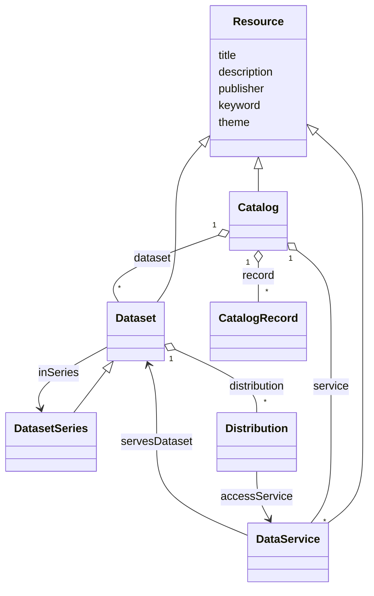
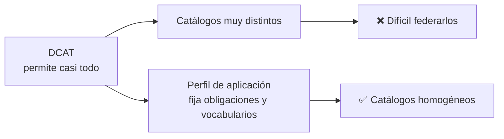

# 🟢 01 · DCAT — El vocabulario base

**El punto de partida: cómo describe el W3C un catálogo de datos, sin añadir obligaciones de ningún perfil.**


---

## 📑 Índice

1. [🎯 Objetivo de este nivel](#-objetivo-de-este-nivel)
2. [🧱 Las clases núcleo](#-las-clases-núcleo)
3. [🧩 Dataset vs Distribution vs DataService](#-dataset-vs-distribution-vs-dataservice)
4. [🏷️ Propiedades clave por clase](#️-propiedades-clave-por-clase)
5. [🆕 Qué aportan DCAT 2 y DCAT 3](#-qué-aportan-dcat-2-y-dcat-3)
6. [🧪 Ejemplo](#-ejemplo)
7. [🤔 ¿Por qué hacen falta perfiles?](#-por-qué-hacen-falta-perfiles)
8. [⚠️ Errores frecuentes](#️-errores-frecuentes)
9. [🏋️ Ejercicios](#️-ejercicios)
10. [➡️ Siguiente paso](#️-siguiente-paso)

---

## 🎯 Objetivo de este nivel

Entender el **modelo base** de DCAT y escribir un catálogo mínimo correcto. Aquí **casi todo es opcional**: DCAT te da las clases y las propiedades, pero no te obliga a usar ninguna. Eso es lo que cambia en los dos niveles siguientes.

---

## 🧱 Las clases núcleo



| Clase | Qué representa |
| --- | --- |
| `dcat:Catalog` | Una colección de descripciones de recursos (datasets y servicios). |
| `dcat:Dataset` | Un conjunto de datos, en abstracto. |
| `dcat:Distribution` | Una forma concreta de acceder al dataset (fichero, descarga, API). |
| `dcat:DataService` | Un servicio que da acceso programático a datos (API REST, WMS, SPARQL endpoint…). |
| `dcat:DatasetSeries` | Una colección de datasets relacionados (por ejemplo, un dataset por año). |
| `dcat:CatalogRecord` | El *registro* de un recurso en un catálogo: cuándo se añadió, quién lo hizo. |

> 💡 **Nota:** `dcat:Resource` es la superclase común de catálogos, datasets y servicios. Por eso comparten propiedades como `dct:title` o `dct:description`.

---

## 🧩 Dataset vs Distribution vs DataService

Es la confusión número uno. Un ejemplo con nuestro dataset de calidad del aire:

| Concepto | Ejemplo | Clase |
| --- | --- | --- |
| *"Los datos de calidad del aire de la ciudad"* | La idea | `dcat:Dataset` |
| *El fichero `calidad-aire.csv`* | Una representación concreta | `dcat:Distribution` |
| *La API `/api/calidad-aire`* | Un servicio que sirve esos datos | `dcat:DataService` |

Un mismo dataset puede tener **varias distribuciones** (CSV, JSON, GeoJSON) y ser servido por **uno o varios servicios**.

### 🔗 `accessURL` vs `downloadURL`

| Propiedad | Para qué sirve |
| --- | --- |
| `dcat:accessURL` | Una URL que **da acceso** a la distribución (puede ser una página, una API, un formulario). |
| `dcat:downloadURL` | Una URL de **descarga directa** del fichero. |

---

## 🏷️ Propiedades clave por clase

| Clase | Propiedades habituales |
| --- | --- |
| **Catalog** | `dct:title`, `dct:description`, `dct:publisher`, `dcat:dataset`, `dcat:service`, `dct:issued`, `dct:modified`, `dct:language`, `foaf:homepage` |
| **Dataset** | `dct:title`, `dct:description`, `dct:publisher`, `dcat:keyword`, `dcat:theme`, `dct:spatial`, `dct:temporal`, `dcat:contactPoint`, `dct:accrualPeriodicity`, `dcat:distribution`, `dcat:landingPage` |
| **Distribution** | `dcat:accessURL`, `dcat:downloadURL`, `dct:format`, `dcat:mediaType`, `dcat:byteSize`, `dct:license`, `dct:title`, `dct:description` |
| **DataService** | `dct:title`, `dcat:endpointURL`, `dcat:endpointDescription`, `dcat:servesDataset` |

---

## 🆕 Qué aportan DCAT 2 y DCAT 3

| Versión | Novedades principales |
| --- | --- |
| **DCAT 2** (2020) | Aparece `dcat:DataService` para describir APIs y servicios; relaciones cualificadas entre recursos (`dcat:qualifiedRelation`); resoluciones espacial y temporal. |
| **DCAT 3** (2024) | Aparece `dcat:DatasetSeries` (colecciones de datasets) y se amplía el soporte de **versionado** (`dcat:version`, `dct:isVersionOf`, `dct:hasVersion`…). |

> 🔎 Conviene saberlo porque **DCAT-AP-ES se alinea con una versión de DCAT-AP anterior a DCAT-AP 3.0**, así que algunas novedades de DCAT 3 no aparecen en el perfil español. Lo verás en `03-DCAT-AP-ES`.

---

## 🧪 Ejemplo

📄 [`ejemplo-dcat.ttl`](./ejemplo-dcat.ttl) — un catálogo con un dataset, una distribución y un servicio.

```turtle
ex:dataset-calidad-aire
    a dcat:Dataset ;
    dct:title "Calidad del aire"@es ;
    dct:description "Mediciones horarias de contaminantes atmosféricos."@es ;
    dct:publisher ex:ayuntamiento ;
    dcat:keyword "aire"@es , "contaminación"@es ;
    dcat:distribution ex:distribucion-calidad-aire-csv .
```

**Qué observar:**
- No hay vocabularios controlados: los idiomas, formatos o temas se pueden escribir de forma libre.
- No hay propiedades obligatorias: el catálogo es válido incluso con muy poca información.
- Ese es precisamente el problema que resuelven los perfiles.

---

## 🤔 ¿Por qué hacen falta perfiles?

Si DCAT lo permite casi todo, dos catálogos pueden ser DCAT "válidos" y aun así **incompatibles**: uno escribe el idioma como `"es"`, otro como `"Español"`, otro con una URI. Un portal que los federe no puede entenderlos por igual.



---

## ⚠️ Errores frecuentes

| ❌ Error | ✅ Cómo evitarlo |
| --- | --- |
| Meter la URL de descarga en el dataset | `dcat:downloadURL` va en la `Distribution`. |
| Un dataset sin distribución ni servicio | Un dataset sin forma de acceso no es reutilizable. |
| Usar `dc:` en vez de `dct:` | Usa Dublin Core **Terms** (`dct:`). |
| Mezclar el recurso con su descripción | Un `dcat:Dataset` describe los datos; no *es* los datos. |
| Olvidar el tipo (`a dcat:Dataset`) | Sin `rdf:type`, las herramientas no reconocen la entidad. |

---

## 🏋️ Ejercicios

1. 🟢 Describe en Turtle un dataset de **horarios de autobús** con una distribución en CSV.
2. 🟢 Añade una segunda distribución en JSON.
3. 🟡 Añade un `dcat:DataService` que sirva ese dataset y enlázalo con `dcat:servesDataset` y `dcat:accessService`.
4. 🟡 Escribe una consulta SPARQL que liste los datasets con más de una distribución.
5. 🔴 Modela una `dcat:DatasetSeries` con un dataset por año y enlázalos con `dcat:inSeries`.

---

## ➡️ Siguiente paso

Ya sabes describir un catálogo con el vocabulario base. Ahora veremos cómo **Europa lo acota** para que los catálogos de todos los países puedan federarse:

👉 **[`02-DCAT-AP`](../02-DCAT-AP/)** — el perfil europeo: propiedades obligatorias, recomendadas y vocabularios controlados.
