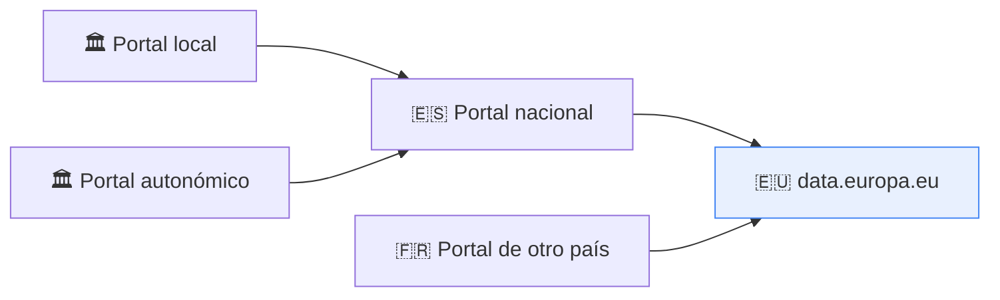
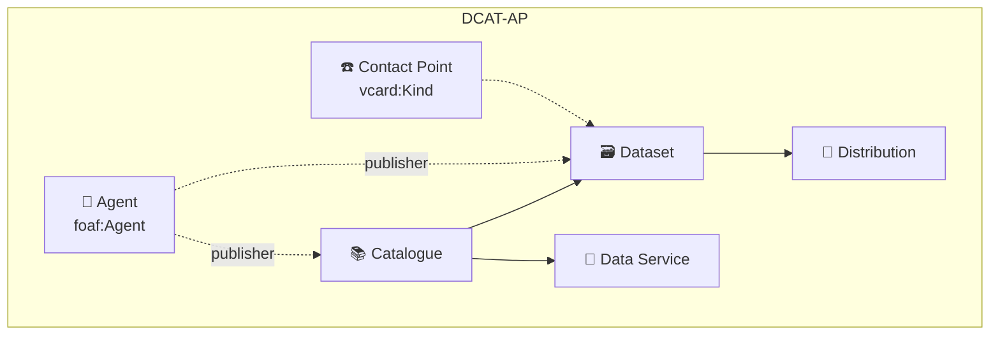

# 🟡 02 · DCAT-AP — El perfil europeo

**Cómo Europa acota DCAT para que los catálogos de todos los países puedan federarse sin transformaciones.**


---

## 📑 Índice

1. [🎯 Objetivo de este nivel](#-objetivo-de-este-nivel)
2. [📖 Qué es un perfil de aplicación](#-qué-es-un-perfil-de-aplicación)
3. [🧱 Qué añade DCAT-AP a DCAT](#-qué-añade-dcat-ap-a-dcat)
4. [📏 Obligatorio, recomendado y opcional](#-obligatorio-recomendado-y-opcional)
5. [🔑 Vocabularios controlados](#-vocabularios-controlados)
6. [🧩 Extensiones](#-extensiones)
7. [🧪 Ejemplo](#-ejemplo)
8. [✅ Validación con SHACL](#-validación-con-shacl)
9. [⚠️ Errores frecuentes](#️-errores-frecuentes)
10. [🏋️ Ejercicios](#️-ejercicios)
11. [➡️ Siguiente paso](#️-siguiente-paso)

---

## 🎯 Objetivo de este nivel

Pasar de "describir un dataset como quiera" a describirlo **cumpliendo un perfil**: qué propiedades **debe** tener, qué vocabularios **debe** usar y cómo se comprueba automáticamente.

---

## 📖 Qué es un perfil de aplicación

Un **perfil de aplicación** (*application profile*) toma un vocabulario general (DCAT) y lo **concreta** para un contexto:

| Un perfil puede… | Ejemplo en DCAT-AP |
| --- | --- |
| **Exigir** propiedades | Todo dataset debe tener título y descripción |
| **Restringir** cardinalidades | Una distribución tiene como máximo una licencia |
| **Fijar** vocabularios controlados | Los idiomas deben ser URIs de la lista oficial europea |
| **Añadir** propiedades o clases | Propiedades propias del perfil, como `dcatap:applicableLegislation` |

> 🏷️ Un perfil **no cambia DCAT**: lo hace más estricto y más completo para un caso de uso.

**DCAT-AP** (*DCAT Application Profile for data portals in Europe*) es el perfil que usan los portales de datos abiertos europeos. Es lo que permite que **data.europa.eu** recopile (*harvest*) los catálogos de los distintos países de forma homogénea.



> 📌 **Versión:** al preparar esta guía, la versión de DCAT-AP más reciente que pude comprobar fue la **3.0.1**. Ten en cuenta que **DCAT-AP-ES está alineado con DCAT-AP 2.1.1** (lo verás en el nivel 03), así que las dos versiones conviven. Comprueba siempre la versión que exige el portal al que vayas a federar.

---

## 🧱 Qué añade DCAT-AP a DCAT

Las clases núcleo son las mismas: **Catalogue**, **Dataset**, **Distribution** y **Data Service**. Lo que cambia es el nivel de exigencia y los vocabularios:



Además se formalizan clases de apoyo: `foaf:Agent` (quien publica), `vcard:Kind` (punto de contacto), `dct:PeriodOfTime` (cobertura temporal), `spdx:Checksum` (integridad del fichero) y otras.

---

## 📏 Obligatorio, recomendado y opcional

DCAT-AP clasifica cada propiedad de cada clase en tres niveles:

| Nivel | Significado |
| --- | --- |
| 🔴 **Obligatoria** (*Mandatory*) | Debe estar siempre. Sin ella, el recurso no es conforme. |
| 🟡 **Recomendada** (*Recommended*) | Debería estar. Mejora mucho la utilidad. |
| ⚪ **Opcional** (*Optional*) | Puede estar si aporta valor. |

### 🔴 Propiedades obligatorias (las que conviene tener siempre presentes)

| Clase | Obligatorias |
| --- | --- |
| **Catalogue** | `dct:title`, `dct:description`, `dct:publisher` |
| **Dataset** | `dct:title`, `dct:description` |
| **Distribution** | `dcat:accessURL` |
| **Agent** | `foaf:name` |

### 🟡 Recomendadas en el Dataset (las más importantes)

`dcat:contactPoint`, `dcat:distribution`, `dcat:keyword`, `dct:publisher`, `dct:spatial`, `dct:temporal`, `dcat:theme`.

### 🟡 Recomendadas en la Distribution

`dct:description`, `dct:format`, `dct:license`.

> ⚠️ **Importante:** esta lista es un resumen de las propiedades más habituales y depende de la versión del perfil. La **fuente de verdad** es la especificación y sus shapes SHACL. Cuando tengas dudas, consúltalas directamente.

> 🧠 **Para recordarlo:** DCAT-AP exige muy poco en un dataset (título y descripción) y casi nada más en una distribución (una URL de acceso). La parte exigente está en **qué valores** se usan, no en cuántas propiedades.

---

## 🔑 Vocabularios controlados

Es el cambio más importante respecto a DCAT. En DCAT-AP, algunas propiedades **deben** tomar sus valores de listas oficiales:

| Propiedad | Vocabulario obligatorio |
| --- | --- |
| `dct:language` | Lista europea de idiomas (*EU Vocabularies, Languages NAL*) |
| `dcat:theme` | Lista europea de temas de datos (*data-theme NAL*) |
| `dcat:mediaType` | Tipos MIME de IANA |

Y otros vocabularios que se usan de forma habitual:

| Propiedad | Vocabulario habitual |
| --- | --- |
| `dct:format` | Lista europea de tipos de fichero (*file-type*) |
| `dct:license` | Lista europea de licencias (*licence*) |
| `dct:accrualPeriodicity` | Lista europea de frecuencias (*frequency*) |
| `dct:spatial` | Países, lugares, geonames… |

```turtle
# ❌ DCAT básico: texto libre
dct:language "es" ;
dcat:theme   "medio ambiente" ;

# ✅ DCAT-AP: URIs de las listas oficiales
dct:language <http://publications.europa.eu/resource/authority/language/SPA> ;
dcat:theme   <http://publications.europa.eu/resource/authority/data-theme/ENVI> ;
```

---

## 🧩 Extensiones

DCAT-AP es la base de varias **extensiones** para dominios concretos:

| Extensión | Para qué sirve |
| --- | --- |
| **GeoDCAT-AP** | Datasets y servicios **geoespaciales** (INSPIRE). |
| **StatDCAT-AP** | Datasets **estadísticos**. |
| **DCAT-AP HVD** | **Conjuntos de datos de alto valor** (obligaciones del Reglamento europeo de HVD): legislación aplicable, categoría HVD, punto de contacto… |
| **BRegDCAT-AP** | Registros base (*base registries*). |

> 🔭 La extensión **HVD** es especialmente importante para `03-DCAT-AP-ES`, que la incorpora.

---

## 🧪 Ejemplo

📄 [`ejemplo-dcat-ap.ttl`](./ejemplo-dcat-ap.ttl) — el mismo dataset del nivel anterior, ahora cumpliendo el perfil.

Compara las tres líneas del idioma, el tema y el formato con el nivel anterior:

| Aspecto | 🟢 DCAT | 🟡 DCAT-AP |
| --- | --- | --- |
| Descripción | Un idioma | En español **y** en inglés |
| Tema | `"aire"` como keyword | `dcat:theme` con URI de `data-theme` |
| Idioma | — | URI de la lista europea |
| Formato | `"CSV"` (texto libre) | URI de `file-type` + `dcat:mediaType` de IANA |
| Licencia | — | URI de la lista europea de licencias |
| Cobertura | — | `dct:spatial` y `dct:temporal` |
| Contacto | — | `dcat:contactPoint` (vCard) |
| Publicador | `foaf:Agent` suelto | `foaf:Agent` **con `foaf:name`** (obligatorio) |

---

## ✅ Validación con SHACL

DCAT-AP se publica con **shapes SHACL** oficiales que comprueban tres cosas distintas:

| Shapes | Qué comprueban |
| --- | --- |
| Estructura general | **Cardinalidades** (mínimos y máximos) y **rangos** de las propiedades. |
| Clases obligatorias | Que el catálogo incluye las **clases** que el perfil exige. |
| Vocabularios | Que los valores proceden de los **vocabularios controlados** obligatorios. |

Es exactamente lo que viste en `05-SHACL`, aplicado a un caso real.

```bash
# Ejemplo con pySHACL (ajusta las rutas a las shapes oficiales que descargues)
pip install pyshacl
pyshacl -s dcat-ap.shapes.ttl -df turtle ejemplo-dcat-ap.ttl
```

> 💡 Prueba a **romper a propósito** el ejemplo (quita el `dct:title` del dataset o cambia el idioma a un literal) y comprueba que el validador lo detecta.

---

## ⚠️ Errores frecuentes

| ❌ Error | ✅ Cómo evitarlo |
| --- | --- |
| Idiomas, temas o formatos como texto libre | Usa las URIs de las listas oficiales. |
| Catálogo sin `dct:publisher` | Es obligatorio en el catálogo. |
| Agente sin `foaf:name` | El nombre es obligatorio en el agente. |
| Distribución sin `dcat:accessURL` | Es la única propiedad obligatoria de la distribución. |
| Más de una licencia por distribución | Máximo una. |
| `dcat:mediaType` con texto libre (`"text/csv"`) | Debe ser una URI de IANA. |
| Dar por válido un catálogo sin ejecutar SHACL | Valida siempre antes de publicar o federar. |
| Asumir que "DCAT-AP" es una única versión | Hay varias (2.1.1, 3.0.x…). Comprueba cuál exige tu destino. |

---

## 🏋️ Ejercicios

1. 🟢 Toma tu ejercicio del nivel 01 (horarios de autobús) y conviértelo a DCAT-AP: añade `foaf:name`, URIs de idioma y tema, y una licencia.
2. 🟢 Descarga las shapes oficiales y **valida** tu catálogo con `pySHACL`.
3. 🟡 Rompe el ejemplo de tres formas distintas y anota qué mensaje de error da el validador en cada caso.
4. 🟡 Escribe una consulta SPARQL que liste los datasets cuyo `dcat:theme` sea `ENVI`.
5. 🔴 Escribe una shape SHACL propia que exija que **todo dataset tenga `dcat:contactPoint`** (aunque el perfil solo lo recomiende).

---

## ➡️ Siguiente paso

DCAT-AP cubre Europa. Pero España tiene su propia historia de metadatos (la **NTI-RISP**), taxonomías propias y obligaciones adicionales:

👉 **[`03-DCAT-AP-ES`](../03-DCAT-AP-ES/)** — el perfil español: taxonomías nacionales, servicios de datos, punto de contacto, datos de alto valor y migración desde la NTI-RISP de 2013.
