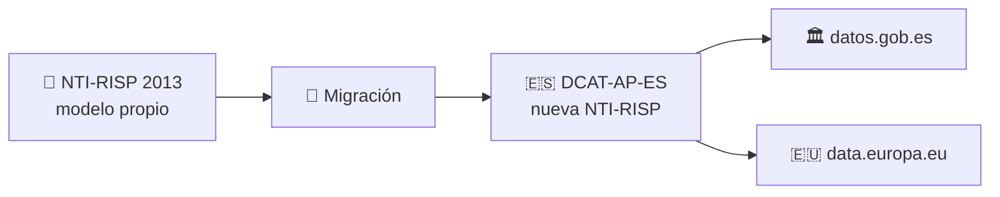
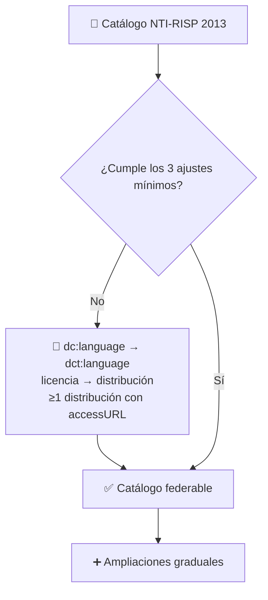
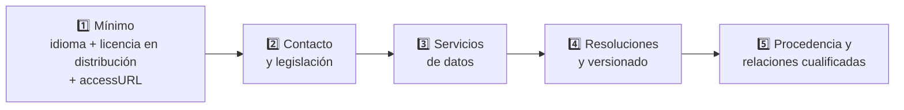
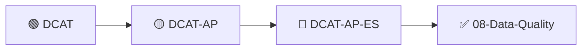

# 🔴 03 · DCAT-AP-ES — El perfil español

**El perfil nacional de metadatos para datos abiertos en España: la evolución de la NTI-RISP, alineada con Europa.**


---

## 📑 Índice

1. [🎯 Objetivo de este nivel](#-objetivo-de-este-nivel)
2. [🏛️ La NTI-RISP y por qué cambia](#️-la-nti-risp-y-por-qué-cambia)
3. [🇪🇸 Qué es DCAT-AP-ES](#-qué-es-dcat-ap-es)
4. [🗺️ Taxonomías y identificadores españoles](#️-taxonomías-y-identificadores-españoles)
5. [🔄 Migrar desde la NTI-RISP 2013](#-migrar-desde-la-nti-risp-2013)
6. [📊 Qué ha cambiado, entidad por entidad](#-qué-ha-cambiado-entidad-por-entidad)
7. [🧩 Las tres ampliaciones clave](#-las-tres-ampliaciones-clave)
8. [🪜 Ruta de adopción gradual](#-ruta-de-adopción-gradual)
9. [🛡️ Conexión con ODRL](#️-conexión-con-odrl)
10. [🧪 Ejemplos: antes y después](#-ejemplos-antes-y-después)
11. [✅ Validación](#-validación)
12. [⚠️ Errores frecuentes](#️-errores-frecuentes)
13. [🏋️ Ejercicios](#️-ejercicios)
14. [📚 Recursos](#-recursos)
15. [➡️ Siguiente paso](#️-siguiente-paso)

---

## 🎯 Objetivo de este nivel

Entender **cómo se describe un catálogo en España** y, sobre todo, **cómo se llega ahí desde donde se estaba**: la NTI-RISP de 2013. Es el nivel más práctico de la carpeta, porque la realidad de muchos portales es una migración, no un catálogo nuevo.

---

## 🏛️ La NTI-RISP y por qué cambia

La **NTI-RISP** (Norma Técnica de Interoperabilidad de Reutilización de Recursos de Información del Sector Público) se publicó en **2013** (Resolución de 19 de febrero de 2013, BOE-A-2013-2380) y se enmarca en el **Esquema Nacional de Interoperabilidad (ENI)**.

Su contenido tiene **tres bloques**:

| Bloque | Qué cubre |
| --- | --- |
| 1️⃣ **Principios y metodología** | Cómo identificar, seleccionar, describir y licenciar información reutilizable. |
| 2️⃣ **Catálogo** | Pautas para definir y operar un catálogo de información pública reutilizable. |
| 3️⃣ **Identificadores** | Recomendaciones para crear identificadores y referencias persistentes. |

Dentro de la norma está el **modelo de metadatos NTI-RISP (2013)**: un perfil básico, **anterior a DCAT-AP**, que usa taxonomías nacionales (sectores primarios, territorios) y un conjunto mínimo de propiedades para catálogos, datasets y distribuciones.

### ¿Por qué se actualiza?

| Motivo | Detalle |
| --- | --- |
| 🇪🇺 **Alinearse con Europa** | El modelo de 2013 es previo a DCAT-AP; hoy los catálogos deben federarse con data.europa.eu. |
| ⚖️ **Nuevas obligaciones legales** | La Directiva (UE) 2019/1024 y el Reglamento de datos de alto valor (HVD). |
| 🔌 **Servicios de datos** | El modelo antiguo no contempla bien las APIs. |
| 🔍 **Calidad de los metadatos** | Más contexto: contacto, versiones, procedencia, resolución… |

### 📅 ¿En qué punto está?

> ⚠️ **Estado de la norma:** en las fuentes oficiales consultadas (otoño de 2025), la nueva versión de la NTI-RISP —que incorpora DCAT-AP-ES como modelo de referencia— estaba **en tramitación administrativa**. Se indicaba que DCAT-AP-ES entrará en vigor **el día siguiente a la publicación de la nueva norma en el BOE**, y que los publicadores dispondrán de un **periodo de adaptación**. Mientras tanto, el perfil ya está disponible y es compatible con el federador de datos.gob.es.
>
> 🔎 **Comprueba el estado actual** antes de documentarlo como obligatorio.



---

## 🇪🇸 Qué es DCAT-AP-ES

**DCAT-AP-ES** es el **perfil español de DCAT-AP**. Adapta el perfil europeo a las necesidades, taxonomías y normativa del sector público español, y añade requisitos para **datos de alto valor (HVD)** y **servicios de datos**.

| Característica | Detalle |
| --- | --- |
| 🧬 **Base europea** | Alineado con **DCAT-AP 2.1.1** y su extensión **HVD 2.2.0**. |
| 📦 **Recursos oficiales** | Guía técnica de implementación y modelo, ejemplos en Turtle y RDF/XML, **shapes SHACL** de validación y "convenciones" (reglas prácticas complementarias). |
| 🔗 **Federación** | Un catálogo conforme se federa en **datos.gob.es** y en **data.europa.eu** sin transformaciones adicionales. |
| 🏛️ **Ámbito** | Estatal, autonómico y local. |

### 📌 Las "convenciones"

Mientras que DCAT-AP-ES define el **modelo base**, las **convenciones** son reglas prácticas que resuelven casos concretos sin modificar la especificación (por ejemplo, sobre identificadores, taxonomías o modelado de servicios). Se documentan en el repositorio oficial.

---

## 🗺️ Taxonomías y identificadores españoles

Una de las diferencias más visibles con DCAT-AP es el uso de **vocabularios nacionales**:

| Qué | Patrón de URI | Ejemplo |
| --- | --- | --- |
| 🏷️ **Sectores** (temas) | `http://datos.gob.es/kos/sector-publico/sector/...` | `.../sector/medio-ambiente` |
| 🗺️ **Territorios** (cobertura) | `http://datos.gob.es/recurso/sector-publico/territorio/...` | `.../territorio/Pais/España` |
| 🏢 **Organismos** (publicador) | `http://datos.gob.es/recurso/sector-publico/org/Organismo/...` | `.../Organismo/{código DIR3}` |

> 💡 El publicador **no es un `foaf:Agent` creado a mano**, sino una URI del **catálogo de organismos (DIR3)**. Por eso en el ejemplo aparece un código `E0DAT0001`: es el **código de ejemplo** que usa la guía oficial. En un catálogo real tienes que usar el **código DIR3 de tu organismo**.

Junto a ellas se siguen usando los vocabularios europeos (idiomas, formatos, licencias, frecuencias, disponibilidad…).

---

## 🔄 Migrar desde la NTI-RISP 2013

La buena noticia: **si tu catálogo ya cumplía NTI-RISP (2013), el mínimo para migrar es muy pequeño.**

### ✅ Los tres ajustes mínimos

| # | Ajuste | Antes (NTI-RISP 2013) | Después (DCAT-AP-ES) |
| --- | --- | --- | --- |
| 1️⃣ | **Idioma** | `dc:language "es"` (literal, Dublin Core Elements) | `dct:language <.../language/SPA>` (URI, Dublin Core Terms) |
| 2️⃣ | **Licencia** | `dct:license` en el **dataset** | `dct:license` en la **distribución** |
| 3️⃣ | **Distribución** | — | Mantener **al menos una distribución** con `dcat:accessURL` y **conservar identificadores estables** |

Con estos ajustes, el catálogo cumple los requisitos esenciales y puede federarse en datos.gob.es y en data.europa.eu.



### 🧰 Cómo prepararse antes de tocar nada

1. **Copia de seguridad** del catálogo RDF y de los scripts que lo generan (idealmente en Git).
2. **Trabaja sobre un duplicado** o en un entorno de pruebas.
3. **Valida que el catálogo es RDF correcto** antes de migrar.
4. **Usa Turtle** (`.ttl`), que es lo más legible para revisar (RDF/XML también está soportado).
5. Ten a mano la **guía técnica**, los **vocabularios** y los **ejemplos de transición**.

---

## 📊 Qué ha cambiado, entidad por entidad

La idea central: **DCAT-AP-ES amplía y ordena** el modelo anterior para que sea más interoperable, más preciso legalmente y más útil para el mantenimiento.

### 📚 Catalog

| Propiedad | Novedad |
| --- | --- |
| `dct:creator` | Quién creó el catálogo (no solo quién lo publica). |
| `dcat:catalog`, `dct:hasPart` / `dct:isPartOf` | Enlazar catálogos entre sí. |
| `dcat:record` | Registros del catálogo (`dcat:CatalogRecord`), con trazabilidad editorial. |
| `dct:rights` | Declaración de derechos adicional a la licencia. |
| `dct:language` | **Sustituye a `dc:language`**, con URIs. |

### 🗃️ Dataset

| Bloque | Propiedades nuevas o ampliadas |
| --- | --- |
| ⚖️ **Normativa** | `dcatap:hvdCategory`, `dcatap:applicableLegislation` |
| ☎️ **Contacto y web** | `dcat:contactPoint`, `dcat:landingPage`, `foaf:page` |
| 🧬 **Procedencia** | `dct:provenance`, `dct:source`, `prov:wasGeneratedBy`, `prov:qualifiedAttribution`, `dcat:qualifiedRelation` |
| 🔢 **Versiones** | `dcat:version`, `dct:hasVersion`, `dct:isVersionOf`, `adms:versionNotes` |
| 📐 **Resolución** | `dcat:spatialResolutionInMeters`, `dcat:temporalResolution` |
| 🔐 **Acceso** | `dct:accessRights` |
| 🏷️ **Otros** | `adms:identifier`, `adms:sample`, `dct:type`, `dct:language` (con URIs) |

Y desaparece: `dct:valid` (la antigua "vigencia") y `dct:references` (sustituidos por propiedades más claras).

### 📄 Distribution

Pasa de ser "un enlace y un formato" a un bloque descriptivo mucho más robusto:

| Bloque | Propiedades nuevas o ampliadas |
| --- | --- |
| 🔗 **Acceso** | `dcat:accessURL`, `dcat:downloadURL` (separada), `dcat:accessService` |
| 📄 **Formato** | `dct:format` (declarado) y `dcat:mediaType` (MIME), `dcat:compressFormat`, `dcat:packageFormat` |
| ⚖️ **Licencia y derechos** | `dct:license` (**aquí vive la licencia**), `dct:rights`, `dcatap:applicableLegislation` |
| 🛡️ **Políticas de uso** | `odrl:hasPolicy` (ver [conexión con ODRL](#️-conexión-con-odrl)) |
| 🔒 **Integridad** | `spdx:checksum` |
| 📅 **Ciclo de vida** | `dcatap:availability`, `adms:status`, `dct:issued`, `dct:modified` |
| 🧾 **Contexto** | `dct:description`, `dct:conformsTo`, `foaf:page`, `dct:language` |

---

## 🧩 Las tres ampliaciones clave

### 1️⃣ Servicios de datos (`dcat:DataService`)

Una API, un endpoint OGC (WMS, WFS…) o cualquier servicio web que permita consultar o descargar datos **se modela como `dcat:DataService`**, no como una "distribución rara".

| Propiedad | Para qué |
| --- | --- |
| `dct:title` | 🔴 Nombre (obligatoria) |
| `dcat:endpointURL` | 🔴 URL de acceso (obligatoria) |
| `dcat:theme` | 🔴 Temática (obligatoria) |
| `dct:publisher` | 🔴 Publicador (obligatoria) |
| `dcat:endpointDescription` | Documentación técnica (OpenAPI, `GetCapabilities`…) |
| `dcat:servesDataset` | Datasets que sirve |
| `dcat:contactPoint` | A quién dirigirse |
| `dcatap:applicableLegislation` | Legislación aplicable |

### 2️⃣ Punto de contacto (`vcard:Organization`)

Es la **"tarjeta de visita" de la institución**: un canal estable que sigue funcionando aunque cambie el equipo.

```turtle
ex:contacto
    a vcard:Organization ;
    vcard:organization-name "Organismo"@es ;
    vcard:fn "Oficina del dato"@es ;
    vcard:hasUID <http://datos.gob.es/recurso/sector-publico/org/Organismo/E0DAT0001> ;
    vcard:hasEmail <mailto:info-contacto@example.org> ;
    vcard:hasURL <http://example.org/> .
```

> ⚠️ **Usa siempre datos institucionales y persistentes.** Nada de emails personales ni teléfonos temporales. Además, es **obligatorio en los datos de alto valor** y muy recomendable en cualquier servicio de datos.

### 3️⃣ Datos de alto valor (HVD)

Los **High Value Datasets** son conjuntos de datos públicos con gran potencial para la sociedad, la economía y el medio ambiente. Los regula el **Reglamento de ejecución (UE) 2023/138** y tienen requisitos extra de apertura y calidad.

Para modelarlos hace falta:

| Requisito | Cómo |
| --- | --- |
| Marcar la categoría | `dcatap:hvdCategory` con la URI oficial de la categoría |
| Indicar la norma | `dcatap:applicableLegislation` (el reglamento y la normativa específica) |
| Descarga masiva | Al menos una **distribución** para descarga masiva (CSV, SHP, GeoJSON…) |
| Acceso programático | Al menos un **servicio de datos** (API) que sirva el dataset |
| Contacto | `dcat:contactPoint` |

---

## 🪜 Ruta de adopción gradual

La estrategia recomendada por la guía oficial es **iterativa**: arrancar con el mínimo y enriquecer después.



> 🎯 **Consejo transversal:** usa **URIs oficiales** para licencias, formatos, temas, frecuencias y categorías, y **valida con SHACL antes de federar**.

---

## 🛡️ Conexión con ODRL

DCAT-AP-ES permite expresar **políticas de uso en ODRL** en la **distribución** mediante `odrl:hasPolicy`:

```turtle
ex:distribucion-calidad-aire-csv
    odrl:hasPolicy ex:oferta-calidad-aire .   # ← la Offer del README de 06-ODRL
```

| | DCAT-AP-ES | Dataspace Protocol |
| --- | --- | --- |
| **Dónde va `odrl:hasPolicy`** | En la `Distribution` | En el `Dataset` |
| **Qué contiene** | Políticas de uso expresadas en ODRL | `Offer` de contrato |

> 🔗 La **licencia** (`dct:license`) es la versión **legible por personas**; la **política ODRL** es la versión **legible por máquinas**. Pueden convivir.

---

## 🧪 Ejemplos: antes y después

Dos ficheros con **el mismo catálogo** (el dataset de calidad del aire), descrito primero con el modelo antiguo y luego con DCAT-AP-ES:

| Fichero | Contenido |
| --- | --- |
| 📜 [`ejemplo-nti-risp-2013.ttl`](./ejemplo-nti-risp-2013.ttl) | **Antes:** catálogo con el modelo NTI-RISP 2013. |
| 🇪🇸 [`ejemplo-dcat-ap-es.ttl`](./ejemplo-dcat-ap-es.ttl) | **Después:** el mismo catálogo en DCAT-AP-ES, con servicio de datos y punto de contacto. |

### 🔍 Diferencias a simple vista

| Aspecto | 📜 NTI-RISP 2013 | 🇪🇸 DCAT-AP-ES |
| --- | --- | --- |
| **Idioma** | `dc:language "es", "en"` | `dct:language <.../SPA>, <.../ENG>` |
| **Licencia** | En el dataset | En la **distribución** |
| **Formato** | Nodo `dct:IMT` con `rdf:value "text/csv"` | URI `file-type/CSV` + `dcat:mediaType` |
| **Cobertura temporal** | `time:Interval` con `time:hasBeginning` | `dct:PeriodOfTime` con `dcat:startDate` / `dcat:endDate` |
| **Servicios** | No hay | `dcat:DataService` + `dcat:servesDataset` |
| **Contacto** | No hay | `vcard:Organization` |
| **Disponibilidad** | No hay | `dcatap:availability` |

---

## ✅ Validación

El repositorio oficial incluye **shapes SHACL** para validar catálogos conformes a DCAT-AP-ES. Es el último paso antes de federar:

```bash
pip install pyshacl
# Ajusta las rutas a las shapes que descargues del repositorio oficial
pyshacl -s shapes-dcat-ap-es.ttl -df turtle ejemplo-dcat-ap-es.ttl
```

> 🧪 **Prueba útil:** valida primero `ejemplo-nti-risp-2013.ttl` (debería fallar) y luego `ejemplo-dcat-ap-es.ttl` (debería pasar). Es la mejor forma de ver qué comprueba el perfil.

---

## ⚠️ Errores frecuentes

| ❌ Error | ✅ Cómo evitarlo |
| --- | --- |
| Seguir usando `dc:language` con literales | `dct:language` con URI de la lista europea de idiomas. |
| Dejar la licencia en el dataset | Trasladarla a cada distribución. |
| Quitar todas las distribuciones al migrar | Mantén al menos una, con `dcat:accessURL`. |
| Cambiar los identificadores del dataset | Preserva **identificadores estables**: rompen enlaces y federación. |
| Inventar el código del organismo | Usa el **código DIR3 real** (el `E0DAT0001` de la guía es solo un ejemplo). |
| Modelar una API como `Distribution` sin `DataService` | Descríbela como `dcat:DataService` y enlázala con `servesDataset` / `accessService`. |
| Usar emails personales como contacto | Usa un buzón institucional persistente. |
| Tratar un HVD sin servicio de datos ni categoría | Añade `hvdCategory`, legislación, contacto, descarga masiva y servicio. |
| Dar por obligatorio algo que aún no lo es | Comprueba el estado de la nueva NTI-RISP. |
| Copiar una URI de vocabulario "de memoria" | Cógela del vocabulario oficial (hay erratas fáciles). |

---

## 🏋️ Ejercicios

1. 🟢 **Migración manual.** Parte de `ejemplo-nti-risp-2013.ttl` y llega a DCAT-AP-ES **sin mirar** el fichero "después". Compara.
2. 🟢 **Los tres mínimos.** Haz solo los tres ajustes mínimos y comprueba que el catálogo sigue siendo coherente.
3. 🟡 **Servicio de datos.** Añade un `dcat:DataService` y enlázalo con `servesDataset` y `accessService`.
4. 🟡 **Contacto.** Crea un `vcard:Organization` y enlázalo con `dcat:contactPoint`.
5. 🟡 **SPARQL.** Escribe una consulta que liste las distribuciones **sin licencia** (¡debería ser vacía!).
6. 🔴 **HVD.** Convierte el dataset en un HVD: categoría, legislación, descarga masiva, servicio y contacto.
7. 🔴 **ODRL.** Enlaza la `Offer` de `06-ODRL` con la distribución mediante `odrl:hasPolicy`.
8. 🧪 **Reto.** Escribe un script con `rdflib` que **detecte automáticamente** los tres problemas típicos de una migración incompleta (idioma como literal, licencia en dataset, falta de `accessURL`).

---

## 📚 Recursos

| Recurso | Enlace |
| --- | --- |
| 🇪🇸 Repositorio oficial DCAT-AP-ES | <https://github.com/datosgobes/DCAT-AP-ES> |
| 🇪🇸 Documentación en línea (guía técnica y ejemplos) | <https://datosgobes.github.io/DCAT-AP-ES/> |
| 🇪🇸 Guía para migrar a DCAT-AP-ES (Oct. 2025) | <https://datos.gob.es/sites/default/files/documentacion/files/guia_migracion-dcat-ap-es_es.pdf> |
| 🇪🇸 Guía técnica NTI-RISP (2013) | <https://datosgobes.github.io/NTI-RISP/> |
| 🇪🇸 NTI-RISP en el BOE | BOE-A-2013-2380 |
| 🏛️ Catálogo nacional de datos abiertos | <https://datos.gob.es> |
| 🇪🇺 Portal de datos europeos | <https://data.europa.eu> |
| 🇪🇺 DCAT-AP (SEMIC) | <https://semiceu.github.io/DCAT-AP/> |

---

## ➡️ Siguiente paso

Ya sabes describir un catálogo desde el vocabulario base hasta el perfil español. La siguiente pregunta es inevitable: **¿qué tan buenos son esos metadatos y los datos que describen?**

👉 **`08-Data-Quality`** — modelos y métricas de calidad (ISO/IEC 25012, 25024, 25040…). Los propios metadatos de un catálogo son un buen caso práctico: completitud, uso de vocabularios controlados, URLs que funcionan…


