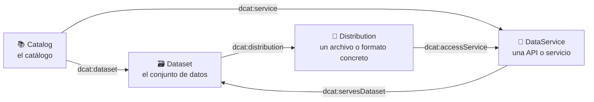
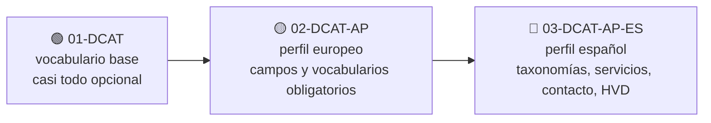
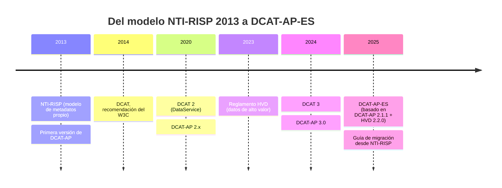
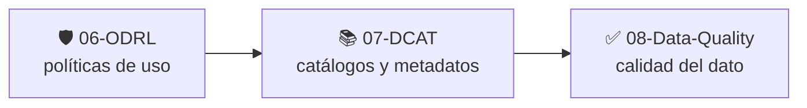

# 📚 07 · DCAT — Data Catalog Vocabulary

**Cómo describir catálogos de datos para que máquinas y personas puedan encontrarlos, entenderlos y reutilizarlos.**


> *Learning by building: empezamos con un dataset descrito de la forma más simple y lo vamos "endureciendo" nivel a nivel, hasta cumplir el perfil español.*

---

## 📑 Índice

1. [🧭 Cómo usar esta guía](#-cómo-usar-esta-guía)
2. [📖 ¿Qué es DCAT?](#-qué-es-dcat)
3. [🎯 ¿Para qué se usa?](#-para-qué-se-usa)
4. [🏷️ Metadatos: qué describimos y cómo](#️-metadatos-qué-describimos-y-cómo)
5. [🧱 El modelo mínimo](#-el-modelo-mínimo)
6. [🪜 Los tres niveles de esta carpeta](#-los-tres-niveles-de-esta-carpeta)
7. [🇪🇸 ¿Y la NTI-RISP?](#-y-la-nti-risp)
8. [🔗 Conexiones con el resto del laboratorio](#-conexiones-con-el-resto-del-laboratorio)
9. [🗂️ Estructura de la carpeta](#️-estructura-de-la-carpeta)
10. [⚠️ Errores frecuentes](#️-errores-frecuentes)
11. [📚 Recursos](#-recursos)
12. [➡️ Siguiente paso](#️-siguiente-paso)

---

## 🧭 Cómo usar esta guía

| Si eres… | Ruta recomendada |
| --- | --- |
| 🆕 **Nuevo en DCAT** | Lee este README entero y sigue las carpetas **en orden**: `01-DCAT` → `02-DCAT-AP` → `03-DCAT-AP-ES`. Cada una añade detalle sobre la anterior. |
| 🔁 **Vienes a repasar** | Ve a [🪜 Los tres niveles](#-los-tres-niveles-de-esta-carpeta) para la comparativa, y a la sección de [Errores frecuentes](#️-errores-frecuentes) de cada carpeta como lista de comprobación. |
| 🇪🇸 **Trabajas con datos públicos españoles** | Lee [🇪🇸 ¿Y la NTI-RISP?](#-y-la-nti-risp) y salta a `03-DCAT-AP-ES`, que incluye una migración paso a paso. |

> 💡 **Requisitos previos:** RDF, Turtle y JSON-LD (`01-RDF`, `06-JSON-LD` si lo tienes hecho), SHACL (`05-SHACL`) y una idea de ODRL (`06-ODRL`).

---

## 📖 ¿Qué es DCAT?

**DCAT (Data Catalog Vocabulary)** es un vocabulario RDF del **W3C** para describir **catálogos de datos**. Su versión actual es **DCAT 3**, recomendación del W3C desde 2024.

La idea clave:

> Un catálogo **no guarda los datos**: guarda **descripciones normalizadas** de los datos (qué son, quién los publica, cómo se accede, en qué formato, con qué licencia…).

Es como el **índice de una biblioteca**: no contiene los libros, pero permite saber qué hay, dónde está y en qué condiciones se puede usar.

---

## 🎯 ¿Para qué se usa?

| Uso | Descripción |
| --- | --- |
| 🔍 **Descubrimiento** | Buscar datasets por tema, palabra clave, publicador, cobertura geográfica o temporal. |
| 🌍 **Federación** | Un portal "cosecha" (*harvest*) los catálogos de otros y los muestra juntos sin transformaciones. Así funcionan datos.gob.es y data.europa.eu. |
| 🤝 **Interoperabilidad** | Al usar el mismo vocabulario, dos catálogos distintos se entienden entre sí. |
| 🏛️ **Gobierno del dato** | Saber qué datos existen, quién los mantiene y bajo qué condiciones. |
| 🚀 **Espacios de Datos** | El catálogo de un Espacio de Datos está basado en DCAT: cada dataset se anuncia con su descripción y sus políticas de uso (ODRL). |

---

## 🏷️ Metadatos: qué describimos y cómo

**Metadatos** son "datos sobre los datos". En DCAT cada tipo de metadato responde a una pregunta distinta:

| Tipo | Responde a… | Propiedades típicas |
| --- | --- | --- |
| 📝 **Descriptivos** | ¿Qué es? | `dct:title`, `dct:description`, `dcat:keyword`, `dcat:theme` |
| 🗺️ **De cobertura** | ¿De dónde y de cuándo? | `dct:spatial`, `dct:temporal`, `dcat:temporalResolution`, `dcat:spatialResolutionInMeters` |
| 🏢 **Administrativos** | ¿Quién lo publica y cada cuánto se actualiza? | `dct:publisher`, `dct:issued`, `dct:modified`, `dct:accrualPeriodicity`, `dcat:contactPoint` |
| ⚙️ **Técnicos** | ¿Cómo está y cómo se accede? | `dcat:distribution`, `dcat:accessURL`, `dcat:downloadURL`, `dct:format`, `dcat:mediaType`, `dcat:byteSize` |
| ⚖️ **Derechos y uso** | ¿En qué condiciones? | `dct:license`, `dct:rights`, `dct:accessRights`, `odrl:hasPolicy` |
| 🧬 **Procedencia y versiones** | ¿De dónde viene y cómo ha cambiado? | `dct:provenance`, `dct:source`, `prov:wasGeneratedBy`, `dcat:version`, `dct:isVersionOf` |
| ✅ **Calidad** | ¿Qué tan fiable es? | Se complementa con vocabularios como DQV (*Data Quality Vocabulary*, W3C) |

### 🔑 Texto libre vs. vocabulario controlado

Una misma información puede escribirse de dos maneras, y **la diferencia es enorme**:

```turtle
# ❌ Texto libre: ambiguo ("es", "ES", "Español", "castellano"…)
dct:language "es" .

# ✅ URI de un vocabulario controlado: inequívoco y federable
dct:language <http://publications.europa.eu/resource/authority/language/SPA> .
```

Los perfiles (DCAT-AP, DCAT-AP-ES) existen, en buena medida, para **fijar qué vocabularios controlados usar** y evitar que cada catálogo "invente" los suyos.

---

## 🧱 El modelo mínimo



| Clase | Qué representa | Ejemplo |
| --- | --- | --- |
| `dcat:Catalog` | El catálogo completo | El portal de datos abiertos de un ayuntamiento |
| `dcat:Dataset` | Un conjunto de datos **en abstracto** | "Calidad del aire" |
| `dcat:Distribution` | Una **forma concreta** de obtenerlo | El CSV de calidad del aire |
| `dcat:DataService` | Un **servicio** que da acceso a los datos | Una API REST de calidad del aire |

> 🧠 **Dataset ≠ Distribution.** El dataset es *la idea* ("calidad del aire"); la distribución es *el fichero* (CSV, JSON, SHP…). Un dataset puede tener varias distribuciones.

---

## 🪜 Los tres niveles de esta carpeta

Usamos **el mismo dataset** a lo largo de las tres carpetas (los datos de calidad del aire de un ayuntamiento, el mismo `ex:dataset-calidad-aire` de los ejemplos de [`06-ODRL`](../06-ODRL/)). Así se ve cómo va cambiando la descripción al pasar de un nivel a otro.



| | 🟢 `01-DCAT` | 🟡 `02-DCAT-AP` | 🔴 `03-DCAT-AP-ES` |
| --- | --- | --- | --- |
| **Qué es** | Vocabulario del W3C | Perfil europeo | Perfil español |
| **Quién lo define** | W3C | Comisión Europea | Iniciativa Aporta (datos.gob.es) |
| **Obligaciones** | Casi ninguna | Propiedades mínimas por clase | Las europeas + requisitos nacionales |
| **Vocabularios** | Libres | Listas europeas obligatorias (idiomas, temas…) | Europeas + taxonomías españolas (sectores, territorios, organismos) |
| **Servicios de datos** | Posibles | Descritos | Muy recomendados / obligatorios en HVD |
| **Punto de contacto** | Opcional | Recomendado | Estructurado con vCard; obligatorio en HVD |
| **Licencia** | Donde quieras | Dataset o distribución | **En la distribución** |
| **Federa con** | — | data.europa.eu | datos.gob.es **y** data.europa.eu |

---

## 🇪🇸 ¿Y la NTI-RISP?

La **NTI-RISP** (Norma Técnica de Interoperabilidad de Reutilización de Recursos de Información del Sector Público) es la norma española, publicada en **2013**, que fija cómo describir y publicar información pública reutilizable. Es más que un esquema de metadatos: define principios, pautas de catálogo y recomendaciones de identificadores persistentes.

Su **modelo de metadatos de 2013** es anterior incluso a DCAT-AP, y por eso usa taxonomías propias. **DCAT-AP-ES es la evolución de ese modelo**, alineada con Europa. Es el perfil que recogerá la **nueva versión de la NTI-RISP**.



> ⚠️ **Estado de la norma:** en las fuentes oficiales consultadas (otoño de 2025), la nueva NTI-RISP estaba **en tramitación**, con DCAT-AP-ES ya disponible y compatible con el federador de datos.gob.es. Se indicaba que entraría en vigor **el día siguiente a su publicación en el BOE**, con un **periodo de adaptación** para los publicadores. **Comprueba el estado actual** antes de afirmar que es obligatorio.

Por eso `03-DCAT-AP-ES` incluye un ejemplo **antes/después** (NTI-RISP 2013 → DCAT-AP-ES): para quien ya tenga un catálogo basado en la norma antigua es el camino real de migración.

---

## 🔗 Conexiones con el resto del laboratorio

| Carpeta | Conexión con DCAT |
| --- | --- |
| `01-RDF`, `02-RDFS`, `03-OWL` | DCAT es un vocabulario RDF; un catálogo es un grafo RDF. |
| `04-SPARQL` | Se consulta un catálogo con SPARQL (ver ejemplo abajo). |
| `05-SHACL` | Los perfiles DCAT-AP y DCAT-AP-ES publican **shapes SHACL** para validar catálogos. |
| `06-ODRL` | `odrl:hasPolicy` enlaza el recurso con su política de uso. En **DCAT-AP-ES** se usa en la `Distribution`; en el **Dataspace Protocol**, en el `Dataset`. |
| `08-Data-Quality` | La **calidad de los metadatos** (completitud, uso de vocabularios, accesibilidad de URLs) es una dimensión de calidad en sí misma. |
| `10-Data-Spaces`, `11-Eclipse-EDC` | El catálogo de un Espacio de Datos se construye sobre DCAT; un conector publica su catálogo con datasets y ofertas ODRL. |

### 🔎 Un SPARQL para abrir boca

*«¿Qué datasets tienen alguna distribución sin licencia?»*

```sparql
PREFIX dcat: <http://www.w3.org/ns/dcat#>
PREFIX dct:  <http://purl.org/dc/terms/>

SELECT DISTINCT ?dataset ?titulo
WHERE {
  ?dataset a dcat:Dataset ;
           dct:title ?titulo ;
           dcat:distribution ?dist .
  FILTER NOT EXISTS { ?dist dct:license ?licencia }
}
```

---

## 🗂️ Estructura de la carpeta

```
07-DCAT/
├── README.md                       # Este documento
│
├── 01-DCAT/                        # 🟢 Vocabulario base (W3C)
│   ├── README.md
│   └── ejemplo-dcat.ttl
│
├── 02-DCAT-AP/                     # 🟡 Perfil europeo
│   ├── README.md
│   └── ejemplo-dcat-ap.ttl
│
└── 03-DCAT-AP-ES/                  # 🔴 Perfil español
    ├── README.md
    ├── ejemplo-nti-risp-2013.ttl   # "Antes": catálogo con el modelo antiguo
    └── ejemplo-dcat-ap-es.ttl      # "Después": el mismo catálogo en DCAT-AP-ES
```

---

## ⚠️ Errores frecuentes

| ❌ Error | ✅ Cómo evitarlo |
| --- | --- |
| Confundir `Dataset` con `Distribution` | El dataset es la idea; la distribución, el fichero o la API concreta. |
| Poner `dcat:downloadURL` en el dataset | Las URLs de acceso y descarga van en la **distribución**. |
| Escribir idiomas, formatos o licencias como texto libre | Usa URIs de vocabularios controlados. |
| Usar `dc:` (Dublin Core Elements) en lugar de `dct:` (Dublin Core Terms) | `dc:` está obsoleto; usa `dct:`. |
| Pensar que un perfil "cambia" DCAT | Un perfil **restringe y completa** DCAT; no lo contradice. |
| No validar antes de federar | Valida con SHACL antes de publicar el catálogo. |

---

## 📚 Recursos

| Recurso | Enlace |
| --- | --- |
| 📘 DCAT 3 (W3C) | <https://www.w3.org/TR/vocab-dcat-3/> |
| 🇪🇺 DCAT-AP (SEMIC) | <https://semiceu.github.io/DCAT-AP/> |
| 🇪🇸 DCAT-AP-ES: repositorio oficial | <https://github.com/datosgobes/DCAT-AP-ES> |
| 🇪🇸 DCAT-AP-ES: documentación en línea | <https://datosgobes.github.io/DCAT-AP-ES/> |
| 🇪🇸 Guía para migrar a DCAT-AP-ES (datos.gob.es) | <https://datos.gob.es/sites/default/files/documentacion/files/guia_migracion-dcat-ap-es_es.pdf> |
| 🇪🇸 NTI-RISP: guía técnica | <https://datosgobes.github.io/NTI-RISP/> |
| 🌐 Portal de datos europeos | <https://data.europa.eu> |
| 🌐 Catálogo nacional de datos abiertos | <https://datos.gob.es> |

---

## ➡️ Siguiente paso

Ya sabes **cómo se describen y publican los datos** y las condiciones de uso de cada uno. Ahora toca preguntarse **qué tan buenos son** esos datos y esos metadatos:

👉 **`08-Data-Quality`** — modelos, métricas y metodologías de calidad (ISO/IEC 25012, 25024, 25040…), incluida la calidad de los propios metadatos.


