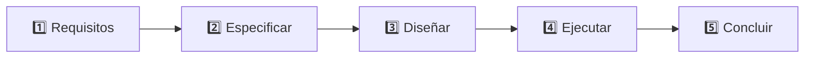

# 🧪 03 · Proceso ISO/IEC 25040

**Una evaluación completa, actividad por actividad, que termina en un informe.**



## 🎯 Qué aprendes
- A **separar** lo que se decide *antes* de medir (requisitos, medidas, umbrales) de lo que se hace *al medir*.
- A traducir una evaluación a **código reproducible** y a un **informe**.

## ▶️ Ejecutar (solo biblioteca estándar)

```bash
python evaluacion_25040.py
python evaluacion_25040.py --ahora 2026-10-06T10:00
```

## 📦 Qué hay
| Fichero | Papel |
| --- | --- |
| `requisitos.json` | **Actividad 1:** propósito, interesados, contexto, características priorizadas y umbrales. Edítalo y vuelve a ejecutar |
| `evaluacion_25040.py` | Recorre las cinco actividades |
| `informe_evaluacion.md` | **Actividad 5:** el informe generado (se sobrescribe en cada ejecución) |

## 🔍 Qué observar
- Los **umbrales** (95 %, 98 %…) están en `requisitos.json`, no en el código: son una decisión del evaluador, y quedan documentados.
- Con los datos de ejemplo, **4 de 6 medidas no cumplen** su criterio y la decisión para el contexto `informe_oficial` es **Medio**: «utilizable solo con aviso y revisión manual».
- Cambia `contexto` a `analisis_exploratorio` y compara la decisión: **mismos datos, distinta decisión**.

> 📌 La ISO/IEC 25040 tiene una edición de 2011 y otra revisada de 2024. Este laboratorio ilustra las cinco actividades; consulta la edición que aplique a tu caso.

## 🏋️ Ejercicios
1. 🟢 Cambia el contexto a `alerta_tiempo_real` y a `analisis_exploratorio`. ¿Qué cambia en la conclusión?
2. 🟡 Baja el umbral de `completitud_no2` a 0,90. ¿Qué medidas siguen sin cumplir?
3. 🔴 Añade la actividad «revisión por un segundo evaluador» como una sección más del informe.

➡️ Siguiente: [`04-UNE-0081`](../04-UNE-0081/) — la guía española.
