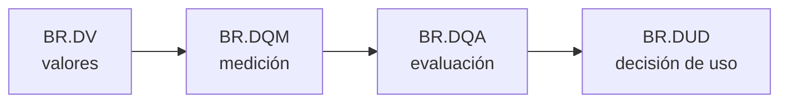

# 📜 05 · Reglas de negocio y decisiones (BR4DQ / DMN4DQ)

**Las reglas de calidad viven en un fichero legible (`reglas.json`) y se ejecutan sobre los datos en cuatro niveles.**



## 🎯 Qué aprendes
- Los **cuatro niveles** de reglas de DMN4DQ y cómo se encadenan.
- Que las reglas son **declarativas**: se leen, se discuten con el negocio y se versionan.
- Que la **decisión depende del contexto**: mismos datos, distinta conclusión.

## ▶️ Ejecutar (solo biblioteca estándar)

```bash
python motor_reglas.py
python motor_reglas.py --registros                 # qué filas fallan y por qué
python motor_reglas.py --ahora 2026-10-06T10:00    # ¡el contexto de alertas cambia de decisión!
```

## 📦 Qué hay
| Fichero | Contenido |
| --- | --- |
| `reglas.json` | Los cuatro niveles: `br_dv`, `br_dqm` y, por contexto, `br_dqa` + `br_dud` |
| `motor_reglas.py` | Evaluador de tablas de decisión (política *first hit*) |

> ⚠️ **No es un motor DMN real.** Es un evaluador mínimo para entender la idea. En un proyecto real usa DMN (la notación estándar de OMG) y un motor que la ejecute.

## 🔍 Qué observar

| Contexto | Nivel | Decisión |
| --- | --- | --- |
| `informe_oficial` | Medio | ⚠️ Utilizable solo con aviso y revisión manual |
| `analisis_exploratorio` | Alto | ✅ Utilizable para análisis |
| `alerta_tiempo_real` | Medio | ⚠️ Alertas solo con confirmación humana |
| `alerta_tiempo_real` con `--ahora 2026-10-06T10:00` | **Bajo** | ❌ No apto para alertas (la última lectura ya tiene 11 h) |

- **BR.DV** es a nivel de **registro**: `--registros` muestra las 9 filas que incumplen alguna regla (`DV1`: 5, `DV2`: 2, `DV3`: 2).
- La tabla BR.DQA se lee de arriba abajo y se aplica **la primera fila cuyas condiciones se cumplen**.
- Las reglas `DV1` y `DV2` son lo mismo que las **shapes SHACL** de `07-Integracion`, escritas en otro formato.

## 🏋️ Ejercicios
1. 🟢 Sube el umbral de `analisis_exploratorio` a 0,95 y comprueba cómo cambia el nivel.
2. 🟡 Añade una regla `DV4`: el PM10 debe estar entre 0 y 500.
3. 🟡 Crea un contexto nuevo, `investigacion`, con sus propios umbrales y decisiones.
4. 🔴 Reescribe `br_dqa` de `informe_oficial` como una **tabla de decisión DMN** (XML o la notación gráfica de tu herramienta).

➡️ Siguiente: [`06-DQV`](../06-DQV/) — cómo publicar el resultado.
