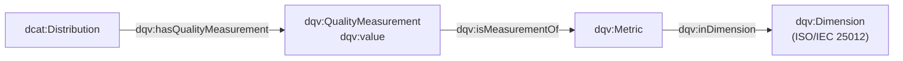

# 🏷️ 06 · DQV — Publicar la calidad como metadatos

**Las medidas dejan de ser números en una consola y pasan a ser RDF consultable, con su dimensión y su fecha.**



## 🎯 Qué aprendes
- La frase de una medición DQV: *«la métrica M, calculada sobre el recurso R, vale V»*.
- Cómo enlazar **métrica → dimensión → categoría** con el modelo de la carpeta 01.
- Cómo un consumidor puede **consultar** la calidad con SPARQL.

> ⚠️ DQV es una **Nota del W3C**, no una Recomendación, y no define qué es «calidad»: da la estructura; el significado lo aporta ISO/IEC 25012.

## ▶️ Ejecutar

```bash
python publicar_dqv.py       # requiere rdflib
```

## 📦 Qué hay
| Fichero | Contenido |
| --- | --- |
| `publicar_dqv.py` | Mide, construye el grafo DQV, lo guarda y lo consulta |
| `calidad_aire.dqv.ttl` | El resultado: 7 mediciones, sus métricas y el modelo de dimensiones |

## 🔍 Qué observar
- Cada medición lleva `prov:generatedAtTime`: **una medición sin fecha caduca sin que nadie lo sepa**.
- La consulta 2 responde lo que preguntaría un consumidor: *«¿qué mediciones no alcanzan el 95 %?»* → `validez_no2`, `precision_no2` y `completitud_no2`.
- La métrica `unicidad_clave` cuelga de la dimensión **Consistencia**: es el mapeo documentado de la unicidad.

## 🏋️ Ejercicios
1. 🟢 Abre `calidad_aire.dqv.ttl` y localiza la medición de completitud con su valor y su fecha.
2. 🟡 Cambia `--distribucion` a otra URI y comprueba que las mediciones se cuelgan de ella.
3. 🟡 Escribe una consulta SPARQL que devuelva solo las mediciones de la dimensión **Actualidad**.
4. 🔴 Añade `dqv:QualityPolicy` o `dqv:QualityAnnotation` para documentar el umbral exigido.

➡️ Siguiente: [`07-Integracion`](../07-Integracion/) — todo junto, dentro del catálogo.
