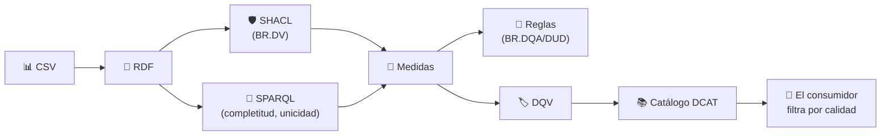

# 🔗 07 · Integración: SHACL + DQV + DCAT (+ ODRL)

**El flujo completo, de principio a fin: dato → RDF → validación → medida → decisión → metadato publicado → consulta.**



## 🎯 Qué aprendes
- Que **hay dos caminos para medir** (Python y RDF + SHACL + SPARQL) y que deben dar lo mismo: es una forma de **verificar tus medidas**.
- Cómo SHACL aporta el **numerador** de una medida (nodos con violaciones) y SPARQL, otras.
- Cómo el resultado **viaja con el dataset** dentro del catálogo.

## ▶️ Ejecutar

```bash
pip install rdflib pyshacl
python flujo_completo.py
python flujo_completo.py --ahora 2026-10-06T10:00
```

Si la carpeta `07-DCAT/` está **al lado** de `08-Data-Quality/` (como en el repositorio), el script carga el catálogo DCAT-AP-ES de ese laboratorio y cuelga de él las mediciones. Si no la encuentra, usa un catálogo mínimo.

## 📦 Qué hay
| Fichero | Contenido |
| --- | --- |
| `shapes/lectura.shacl.ttl` | Las reglas `DV1` y `DV2` como shapes SHACL |
| `flujo_completo.py` | Los seis pasos del flujo |
| `salida/catalogo_con_calidad.ttl` | El catálogo DCAT con las mediciones DQV colgadas de la distribución |

## 🔍 Salida clave

```
   medida                                      RDF   Python
   completitud (SPARQL: COUNT)               94.0%    94.0%   ✅ coincide
   unicidad (SPARQL: GROUP BY/HAVING)        96.0%    96.0%   ✅ coincide
   registros conformes (SHACL)               86.0%    86.0%   ✅ coincide
```

## 💡 Cosas que conviene notar
- **SHACL no ve los duplicados.** Una shape de propiedad no puede decir «no hay dos nodos con la misma estación y hora»: por eso `DV3` se comprueba con SPARQL. SHACL **valida**, no cubre todas las reglas.
- Cada fila se convierte en **su propio nodo** (`ex:lectura-001`…). Si usaras la clave (estación + hora) como identificador, los duplicados se **fundirían en silencio** y la unicidad pasaría a ser invisible: una lección sobre cómo el modelado puede ocultar defectos.
- Con `--ahora 2026-10-06T10:00`, la decisión de alertas pasa a **Bajo**: el flujo se puede re-ejecutar cada vez que cambian los datos o el momento.

## 🛡️ ¿Y ODRL?
La distribución del catálogo de `07-DCAT` ya lleva `odrl:hasPolicy`. Con las mediciones DQV colgadas de la **misma distribución**, el consumidor ve en un solo sitio: **qué es** (DCAT), **qué calidad tiene** (DQV) y **en qué condiciones puede usarlo** (ODRL).

## 🏋️ Ejercicios
1. 🟢 Ejecuta el flujo y abre `salida/catalogo_con_calidad.ttl`: localiza la distribución y sus mediciones.
2. 🟡 Añade a la shape una regla `DV4` (PM10 entre 0 y 500) y comprueba que el número de violaciones cambia.
3. 🟡 Cambia el filtro del paso 6 para listar solo mediciones **por debajo** de un umbral.
4. 🔴 Añade una medida de **accesibilidad** (¿responde la URL?) y publícala también en DQV.
5. 🧪 **Reto:** conecta el resultado con ODRL: escribe una política que **solo permita el uso** del dataset si `registros_validos ≥ 0,95`.

➡️ Siguiente carpeta del laboratorio: **`09-Data-Governance`**.
