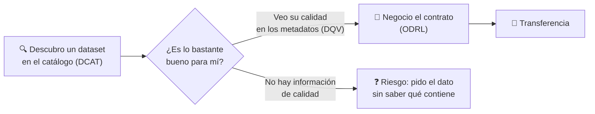
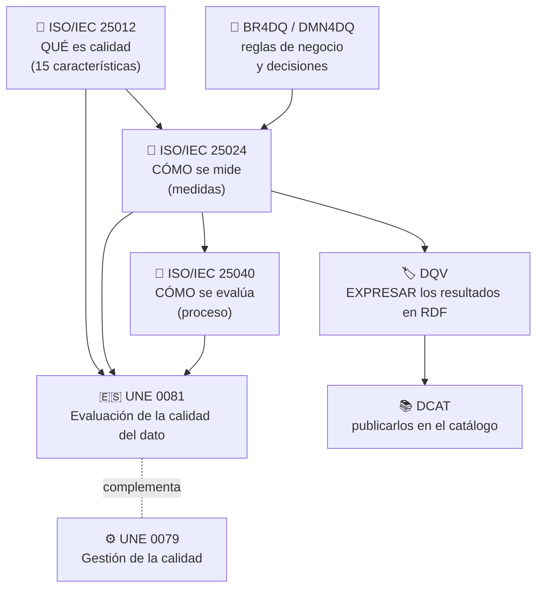
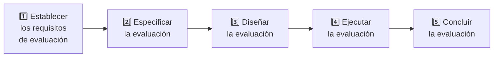
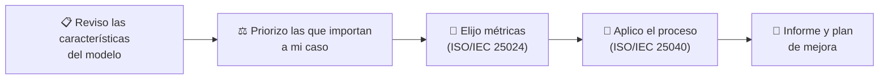
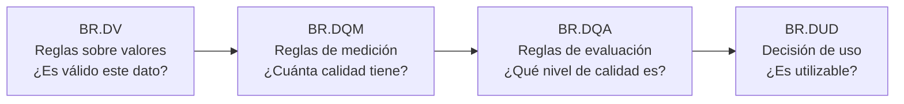
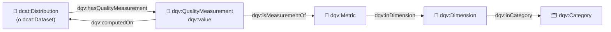
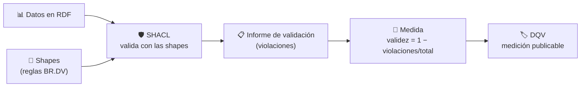
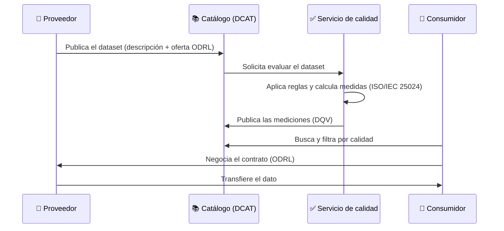
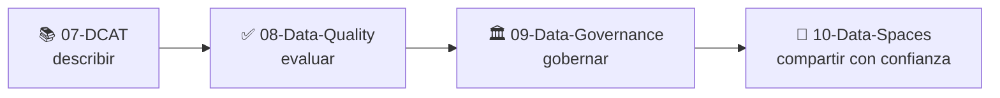

# ✅ 08 · Data Quality — Calidad del Dato

**Cómo saber si un dato es bueno *para lo que lo quiero usar*: qué es la calidad, cómo se define, cómo se mide, cómo se decide y cómo se publica.**


> *Learning by building: primero entendemos el modelo, luego medimos un dataset de verdad y, al final, publicamos el resultado en el catálogo.*

---

## 📑 Índice

- [✅ 08 · Data Quality — Calidad del Dato](#-08--data-quality--calidad-del-dato)
  - [📑 Índice](#-índice)
  - [🧭 Cómo usar esta guía](#-cómo-usar-esta-guía)
  - [📖 ¿Qué es la calidad del dato?](#-qué-es-la-calidad-del-dato)
    - [🔑 Tres ideas que conviene separar desde el principio](#-tres-ideas-que-conviene-separar-desde-el-principio)
    - [🏗️ Datos como producto vs. gestión del dato](#️-datos-como-producto-vs-gestión-del-dato)
  - [🚀 Por qué importa en Espacios de Datos](#-por-qué-importa-en-espacios-de-datos)
  - [🗺️ El mapa de normas y enfoques](#️-el-mapa-de-normas-y-enfoques)
  - [📐 ISO/IEC 25012: el modelo](#-isoiec-25012-el-modelo)
    - [📋 Las 15 características](#-las-15-características)
    - [🔎 ¿Y la unicidad, la validez o la integridad?](#-y-la-unicidad-la-validez-o-la-integridad)
  - [📏 ISO/IEC 25024: las medidas](#-isoiec-25024-las-medidas)
    - [🧮 La forma típica de una medida](#-la-forma-típica-de-una-medida)
  - [🧪 ISO/IEC 25040: el proceso de evaluación](#-isoiec-25040-el-proceso-de-evaluación)
  - [🇪🇸 UNE 0081: la guía española](#-une-0081-la-guía-española)
  - [📜 Reglas de negocio y decisiones: BR4DQ y DMN4DQ](#-reglas-de-negocio-y-decisiones-br4dq-y-dmn4dq)
    - [🧩 La idea](#-la-idea)
    - [🪜 Cuatro niveles de reglas](#-cuatro-niveles-de-reglas)
    - [📊 Una tabla de decisión (a la manera de DMN)](#-una-tabla-de-decisión-a-la-manera-de-dmn)
  - [🛠️ Tu primera medición](#️-tu-primera-medición)
    - [🔍 Qué observar](#-qué-observar)
  - [🏷️ Publicar la calidad: DQV](#️-publicar-la-calidad-dqv)
    - [🧱 Las piezas](#-las-piezas)
    - [🧪 Ejemplo: la medición enlazada con el catálogo de `07-DCAT`](#-ejemplo-la-medición-enlazada-con-el-catálogo-de-07-dcat)
  - [🛡️ SHACL como motor de validación](#️-shacl-como-motor-de-validación)
  - [📚 La calidad de los metadatos](#-la-calidad-de-los-metadatos)
  - [🔄 La calidad en el ciclo de un Espacio de Datos](#-la-calidad-en-el-ciclo-de-un-espacio-de-datos)
  - [🗂️ Estructura de la carpeta](#️-estructura-de-la-carpeta)
  - [⚠️ Errores frecuentes](#️-errores-frecuentes)
  - [🧰 Casos de uso](#-casos-de-uso)
  - [🧠 Chuleta de repaso](#-chuleta-de-repaso)
    - [✔️ Lista de comprobación antes de dar una evaluación por buena](#️-lista-de-comprobación-antes-de-dar-una-evaluación-por-buena)
  - [🏋️ Ejercicios](#️-ejercicios)
  - [📚 Recursos](#-recursos)
  - [➡️ Siguiente paso](#️-siguiente-paso)

---

## 🧭 Cómo usar esta guía

| Si eres… | Ruta recomendada |
| --- | --- |
| 🆕 **Nuevo en calidad del dato** | Lee en orden las secciones 2 → 11. Al llegar a [Tu primera medición](#️-tu-primera-medición), copia el script y ejecútalo: es la forma más rápida de que los conceptos dejen de ser abstractos. |
| 🔁 **Vienes a repasar** | Ve a la [🧠 Chuleta de repaso](#-chuleta-de-repaso), al [mapa de normas](#️-el-mapa-de-normas-y-enfoques) y a la tabla de las [15 características](#-isoiec-25012-el-modelo). |
| 🏛️ **Trabajas con datos públicos españoles** | Combina la [guía UNE 0081](#-une-0081-la-guía-española) con la [calidad de los metadatos](#-la-calidad-de-los-metadatos) y el perfil DCAT-AP-ES de `07-DCAT`. |

> 💡 **Requisitos previos:** conviene haber pasado por `05-SHACL` (validación), `06-ODRL` (condiciones de uso) y `07-DCAT` (catálogos y metadatos). La calidad es el hilo que une las tres cosas.

---

## 📖 ¿Qué es la calidad del dato?

> **Un dato tiene calidad cuando es adecuado para el uso que se le quiere dar.**

No existe "el dato perfecto" en abstracto. La misma tabla de calidad del aire puede ser:

| Uso | ¿Es suficientemente bueno? |
| --- | --- |
| 📰 Un gráfico para un reportaje | ✅ Sí, aunque falten algunas horas |
| ⚖️ Un informe oficial de cumplimiento normativo | ❌ No, si faltan lecturas o hay valores sin validar |
| 🚨 Una alerta en tiempo real | ❌ No, si el dato tiene 48 horas de retraso |

Por eso la calidad es **contextual**: se define respecto a unos **requisitos** y se comprueba con **medidas**.

### 🔑 Tres ideas que conviene separar desde el principio

| Idea | Pregunta que responde | Ejemplo |
| --- | --- | --- |
| 🎯 **Modelo de calidad** | ¿Qué propiedades tiene un "buen dato"? | Completitud, exactitud, actualidad… |
| 📏 **Medida / métrica** | ¿Cuánto vale esa propiedad en *este* dataset? | El 97,3 % de las lecturas tiene valor |
| ⚖️ **Criterio de decisión** | ¿Es eso suficiente para *mi* uso? | «Con ≥ 95 % me sirve para un informe» |

> ⚠️ **Los tres son distintos.** Los estándares te dan el primero y buena parte del segundo; el tercero lo decides tú según tu contexto (las normas, de hecho, no fijan umbrales).

### 🏗️ Datos como producto vs. gestión del dato

| Enfoque | Qué mira | Referencia en esta carpeta |
| --- | --- | --- |
| 📦 **Calidad del dato (como producto)** | El dataset o la base de datos en sí | ISO/IEC 25012 / 25024 / 25040, UNE 0081 |
| ⚙️ **Gestión de la calidad del dato** | Los procesos de la organización que producen y mantienen los datos | UNE 0079 y `09-Data-Governance` |

---

## 🚀 Por qué importa en Espacios de Datos

En un Espacio de Datos el consumidor **no conoce al proveedor ni puede ir a su mesa a preguntar**. Antes de negociar un contrato necesita poder responder *«¿me sirve este dato?»* con la información del propio catálogo:



La calidad es, por tanto, parte de la **confianza** del espacio: junto con las condiciones de uso (ODRL) y la descripción (DCAT), forma el tercer pilar de lo que un consumidor necesita saber antes de decidir.

---

## 🗺️ El mapa de normas y enfoques

Hay muchas siglas. Este mapa las ordena según **la pregunta que responde cada una**:



| Estándar / enfoque | Pregunta que responde | Tipo | Qué te llevas |
| --- | --- | --- | --- |
| **ISO/IEC 25012** | ¿Qué características tiene un dato de calidad? | Modelo | Un vocabulario común de 15 características |
| **ISO/IEC 25024** | ¿Cómo se mide cada característica? | Medidas | Un conjunto básico de medidas y la guía para definir las propias |
| **ISO/IEC 25040** | ¿Cómo organizo una evaluación? | Proceso | Cinco actividades, de los requisitos a las conclusiones |
| **UNE 0081** | ¿Cómo se aplica todo lo anterior a un dataset, en España? | Especificación nacional | Modelo + métricas + proceso, adaptados a datos |
| **BR4DQ / DMN4DQ** | ¿Cómo expreso mis reglas y decido si el dato es usable? | Metodología | Reglas de negocio jerárquicas y tablas de decisión |
| **DQV** | ¿Cómo publico el resultado como datos enlazados? | Vocabulario RDF | Mediciones colgadas del catálogo DCAT |
| **SHACL** | ¿Cómo compruebo automáticamente las reglas sobre un grafo? | Lenguaje de validación | Las restricciones se convierten en medidas |

---

## 📐 ISO/IEC 25012: el modelo

La **ISO/IEC 25012** (2008) define un modelo de calidad para **datos estructurados dentro de un sistema informático**. Forma parte de la familia **SQuaRE** (ISO/IEC 25000) y sirve para establecer requisitos de calidad, definir medidas o planificar evaluaciones.

Define **15 características** y las mira desde dos puntos de vista:

| Perspectiva | Significado |
| --- | --- |
| 🧬 **Inherente** | La calidad depende **del dato en sí** (su valor, su significado). |
| 🖥️ **Dependiente del sistema** | La calidad depende **del entorno técnico** donde se almacena y se accede (hardware, software, red). |

### 📋 Las 15 características

Cada una se ilustra con el dataset de calidad del aire de los ejemplos de `06-ODRL` y `07-DCAT`:

| # | Característica | Pregunta | Ejemplo con calidad del aire |
| --- | --- | --- | --- |
| **🧬 Solo inherentes** | | | |
| 1 | **Exactitud** (*Accuracy*) | ¿Representa el valor real? | El NO₂ registrado coincide con lo que midió la estación |
| 2 | **Completitud** (*Completeness*) | ¿Están todos los valores esperados? | No faltan lecturas horarias |
| 3 | **Consistencia** (*Consistency*) | ¿Se contradice o es coherente? | PM2,5 nunca supera a PM10 |
| 4 | **Credibilidad** (*Credibility*) | ¿Es creíble para quien lo usa? | Procede de una estación acreditada |
| 5 | **Actualidad** (*Currentness*) | ¿Tiene la edad adecuada? | La última lectura tiene menos de 24 h |
| **🧬🖥️ Inherentes y dependientes del sistema** | | | |
| 6 | **Accesibilidad** (*Accessibility*) | ¿Puede acceder quien debe? | La URL de descarga funciona y el formato es abierto |
| 7 | **Conformidad** (*Compliance*) | ¿Cumple normas y estándares? | Fechas en ISO 8601, unidades µg/m³ |
| 8 | **Confidencialidad** (*Confidentiality*) | ¿Solo accede quien tiene derecho? | (Datos abiertos: poco relevante; en datos personales, crítica) |
| 9 | **Eficiencia** (*Efficiency*) | ¿Se procesa con prestaciones adecuadas? | Tamaño y formato permiten análisis ágil |
| 10 | **Precisión** (*Precision*) | ¿Tiene el nivel de detalle necesario? | Un decimal, no redondeado a la decena |
| 11 | **Trazabilidad** (*Traceability*) | ¿Se sabe quién hizo qué y de dónde viene? | Se sabe qué sensor y calibración generó cada lectura |
| 12 | **Comprensibilidad** (*Understandability*) | ¿Se entiende? | Cabeceras claras, unidades y diccionario de datos |
| **🖥️ Solo dependientes del sistema** | | | |
| 13 | **Disponibilidad** (*Availability*) | ¿Está disponible cuando se necesita? | La API responde cuando se consulta |
| 14 | **Portabilidad** (*Portability*) | ¿Se puede mover entre sistemas? | CSV/JSON estándar, no un formato propietario |
| 15 | **Recuperabilidad** (*Recoverability*) | ¿Se mantiene tras un fallo? | Existen copias de seguridad |

> 🧠 **Para recordarlo:** 5 inherentes + 7 mixtas + 3 del sistema = 15.

### 🔎 ¿Y la unicidad, la validez o la integridad?

Son términos muy usados en la práctica (y en muchas herramientas de *data profiling*), pero **no son características con nombre propio en ISO/IEC 25012**. Lo habitual es proyectarlas sobre el modelo:

| Término habitual | Se suele ubicar en… | Idea |
| --- | --- | --- |
| **Validez** | Exactitud (sintáctica) / Conformidad | El valor respeta su dominio y formato |
| **Unicidad** (ausencia de duplicados) | Consistencia | No hay registros repetidos |
| **Integridad referencial** | Consistencia | Las referencias apuntan a algo que existe |

> ⚠️ Es un **mapeo habitual, no una equivalencia literal** del estándar. Si tu evaluación debe ser formal, documenta explícitamente qué característica de la 25012 cubre cada métrica.

---

## 📏 ISO/IEC 25024: las medidas

La **ISO/IEC 25012** dice *qué* características existen; la **ISO/IEC 25024** (2015) dice **cómo medirlas**. Contiene:

| Contenido | Para qué sirve |
| --- | --- |
| 📐 Un **conjunto básico de medidas** por característica | No partir de cero |
| 🎯 Un conjunto de **entidades objetivo** sobre las que se aplican las medidas durante el ciclo de vida del dato | Saber *a qué* se mide (un campo, un registro, un dataset…) |
| 🧮 Una explicación de **cómo aplicar** las medidas | Replicabilidad |
| 🧭 Una **guía para definir medidas propias** | Adaptarlas a tu contexto |

### 🧮 La forma típica de una medida

Casi todas las medidas son **ratios** entre lo que cumple y el total:

```
         nº de elementos que cumplen la condición
medida = ────────────────────────────────────────      (valor entre 0 y 1)
                 nº total de elementos considerados
```

| Característica | Medida de ejemplo | Fórmula |
| --- | --- | --- |
| Completitud | Ratio de valores presentes | `valores no nulos / valores esperados` |
| Exactitud (sintáctica) | Ratio de valores dentro de su dominio | `valores en rango / total` |
| Consistencia | Ratio de registros coherentes entre sí | `registros con PM2,5 ≤ PM10 / total` |
| Actualidad | ¿Dentro del periodo de vigencia? | `lecturas recientes / total` |
| Trazabilidad | Ratio de datos con origen registrado | `datos con procedencia / total` |

> 🔑 **La norma no define umbrales.** Dice cómo medir, pero **no qué valor es "aceptable"**: eso depende del sistema y de las necesidades de los usuarios. Ese es el papel del criterio de decisión, que se formaliza con reglas de negocio (ver [BR4DQ y DMN4DQ](#-reglas-de-negocio-y-decisiones-br4dq-y-dmn4dq)).

---

## 🧪 ISO/IEC 25040: el proceso de evaluación

La **ISO/IEC 25040** describe **el proceso** para evaluar calidad (nació para producto software y es la base que la guía española aplica a los datos). Tiene **cinco actividades**:



| Actividad | Qué haces | Ejemplo con calidad del aire |
| --- | --- | --- |
| 1️⃣ **Establecer los requisitos** | Fijas el propósito, los interesados, el modelo de calidad y el rigor | «Quiero saber si el dataset sirve para un informe oficial» |
| 2️⃣ **Especificar** | Eliges medidas y defines criterios de decisión | Completitud, validez y actualidad; umbral del 95 % |
| 3️⃣ **Diseñar** | Planificas la evaluación y los recursos | Quién, con qué herramienta, sobre qué muestra |
| 4️⃣ **Ejecutar** | Mides y aplicas los criterios | Corres el script de medición |
| 5️⃣ **Concluir** | Revisas resultados y documentas | Informe: «cumple / no cumple, y por qué» |

> 📌 La norma tiene una edición de 2011 y otra revisada de 2024; consulta cuál aplica en tu contexto.

---

## 🇪🇸 UNE 0081: la guía española

La especificación **UNE 0081:2023, «Evaluación de la calidad del dato»**, es el puente entre las normas ISO y la práctica en España. Se centra en **los datos como producto** (conjuntos de datos o bases de datos) y **complementa a la UNE 0079** (Gestión de la calidad del dato), que se centra en los **procesos de gestión**.

| Qué hace UNE 0081 | Basada en |
| --- | --- |
| Define un **modelo de calidad del dato** con características y métricas aplicables | ISO/IEC 25012 e ISO/IEC 25024 |
| Clasifica las características en **inherentes, dependientes del sistema o de ambas** | ISO/IEC 25012 |
| Propone **métricas** para medir las propiedades de cada característica (entendidas como «subcaracterísticas») | ISO/IEC 25024 |
| Define el **proceso de evaluación** de un conjunto de datos concreto | ISO/IEC 25040 |
| Permite evaluar la calidad, planificar su mejora e incluso **certificarla formalmente** | — |

> 🏛️ Se impulsó con apoyo de la **Oficina del Dato** y, junto con otras especificaciones UNE de la misma familia, está pensada para cualquier organización.



> 🔗 **Conexión con `07-DCAT`:** el perfil DCAT-AP-ES y la UNE 0081 son dos piezas del mismo ecosistema español: una dice **cómo describir** los datos; la otra, **cómo evaluar si son buenos**.

---

## 📜 Reglas de negocio y decisiones: BR4DQ y DMN4DQ

Las normas ISO dicen qué medir, pero **¿cómo expreso mis reglas de calidad de forma que las entiendan las personas y las ejecuten las máquinas?** Ahí entra el enfoque de **reglas de negocio para la calidad del dato** (**BR4DQ**) y su concreción con el estándar de decisiones de OMG, **DMN4DQ**.

### 🧩 La idea

> En la práctica es más fácil describir **cuándo un registro tiene calidad suficiente** que calcular un indicador abstracto. Las reglas de negocio expresan esa descripción.

**DMN4DQ** (Valencia-Parra, Parody, Varela-Vaca, Caballero y Gómez-López) es una metodología que genera **recomendaciones automáticas sobre si un dato es utilizable**, según su nivel de calidad **y el contexto**. Se apoya en **DMN** (*Decision Model and Notation*), la notación estándar de OMG para describir reglas de decisión con forma «si… entonces…».

### 🪜 Cuatro niveles de reglas



| Nivel | Significado | Ejemplo con calidad del aire |
| --- | --- | --- |
| **BR.DV** (*Data Values*) | Validan los valores de los atributos | NO₂ entre 0 y 1000 µg/m³ **y** PM2,5 ≤ PM10 |
| **BR.DQM** (*Quality Measurement*) | Indican cómo calcular las medidas | Validez = registros válidos / total |
| **BR.DQA** (*Quality Assessment*) | Evalúan el nivel de calidad a partir de las medidas | Validez ≥ 98 % **y** completitud ≥ 95 % → nivel *Alto* |
| **BR.DUD** (*Data Usability Decision*) | Deciden si el dato es utilizable | Nivel *Alto* → usable para informes oficiales |

### 📊 Una tabla de decisión (a la manera de DMN)

**BR.DQA — nivel de calidad** *(umbrales ilustrativos: los fijas tú)*

| Validez | Completitud | → Nivel |
| --- | --- | --- |
| ≥ 98 % | ≥ 95 % | **Alto** |
| ≥ 90 % | ≥ 80 % | **Medio** |
| cualquier otro caso | | **Bajo** |

**BR.DUD — decisión de uso**

| Nivel | → Decisión |
| --- | --- |
| Alto | ✅ Utilizable para informes oficiales |
| Medio | ⚠️ Utilizable para análisis, con aviso |
| Bajo | ❌ No utilizable |

> 🔑 **Por qué es interesante:** las reglas son **declarativas** (se leen y se discuten con el negocio), **dependen del contexto** (el mismo dato puede ser *Alto* para un uso y *Bajo* para otro) y se **ejecutan automáticamente** con motores DMN existentes.

> 🧠 **Conexión con SHACL:** BR.DV equivale a lo que en `05-SHACL` expresabas como shapes (rangos, cardinalidades, patrones). SHACL valida *el grafo*; DMN decide *qué hacer con el resultado*.

---

## 🛠️ Tu primera medición

Teoría aplicada: un script de **biblioteca estándar** (sin instalar nada) que mide cinco aspectos de un dataset de calidad del aire con **defectos puestos a propósito**, y expresa el resultado en DQV.

```python
"""Tu primera medición de calidad del dato (solo biblioteca estándar)."""
import csv, io
from datetime import datetime, timedelta

# Datos de ejemplo: mediciones horarias de calidad del aire (¡con defectos a propósito!)
CSV = """estacion,fecha_hora,no2,pm10,pm25
E01,2026-10-05T08:00:00,41.2,25.0,12.0
E01,2026-10-05T09:00:00,,27.5,13.1
E01,2026-10-05T10:00:00,-5.0,30.0,14.0
E01,2026-10-05T11:00:00,47.9,22.0,23.5
E02,2026-10-05T08:00:00,38.4,21.0,10.2
E02,2026-10-05T09:00:00,39.9,22.3,11.0
E02,2026-10-05T09:00:00,39.9,22.3,11.0
E02,2026-10-05T10:00:00,44.0,24.0,12.5
"""
ahora = datetime(2026, 10, 5, 12, 0)             # "ahora" fijo para que sea reproducible
filas = list(csv.DictReader(io.StringIO(CSV)))
n = len(filas)

completitud = sum(1 for f in filas if f["no2"] != "") / n                   # ISO 25012: Completeness
validez     = sum(1 for f in filas if f["no2"] != "" and 0 <= float(f["no2"]) <= 1000) / n
consistencia = sum(1 for f in filas if float(f["pm25"]) <= float(f["pm10"])) / n   # PM2.5 ⊂ PM10
claves = [(f["estacion"], f["fecha_hora"]) for f in filas]
unicidad    = len(set(claves)) / len(claves)
ultima      = max(datetime.fromisoformat(f["fecha_hora"]) for f in filas)
actual      = (ahora - ultima) <= timedelta(hours=24)                         # ISO 25012: Currentness

print(f"Completitud  NO2 : {completitud:.2%}")
print(f"Validez      NO2 : {validez:.2%}")
print(f"Consistencia PM  : {consistencia:.2%}")
print(f"Unicidad (clave) : {unicidad:.2%}")
print(f"Actualidad       : {'✅ <24 h' if actual else '❌ desfasado'}")

# Resultado expresado en DQV (RDF), listo para colgar del catálogo DCAT
print(f'''
@prefix dqv: <http://www.w3.org/ns/dqv#> .
@prefix xsd: <http://www.w3.org/2001/XMLSchema#> .
@prefix ex:  <http://example.org/> .

ex:medicion-completitud-no2
    a dqv:QualityMeasurement ;
    dqv:computedOn ex:distribucion-calidad-aire-csv ;
    dqv:isMeasurementOf ex:metrica-ratio-valores-presentes ;
    dqv:value "{completitud:.4f}"^^xsd:decimal .''')
```

**Salida esperada:**

```
Completitud  NO2 : 87.50%
Validez      NO2 : 75.00%
Consistencia PM  : 87.50%
Unicidad (clave) : 87.50%
Actualidad       : ✅ <24 h
```

### 🔍 Qué observar

| Medida | Por qué sale así | Característica ISO/IEC 25012 |
| --- | --- | --- |
| Completitud 87,5 % | Una lectura de NO₂ está vacía (1 de 8) | Completitud |
| Validez 75 % | Una vacía **y** un valor negativo (-5,0): 2 de 8 no cumplen | Exactitud sintáctica / Conformidad |
| Consistencia 87,5 % | En una fila PM2,5 (23,5) supera a PM10 (22,0): físicamente imposible | Consistencia |
| Unicidad 87,5 % | Una lectura está duplicada (misma estación y hora) | Consistencia (ver [mapeo](#-y-la-unicidad-la-validez-o-la-integridad)) |
| Actualidad ✅ | La última lectura tiene 2 h de antigüedad | Actualidad |

> 💡 **Fíjate:** con ese 75 % de validez, ¿es el dataset utilizable? **Depende del criterio de decisión**. Con la tabla BR.DQA de arriba (≥ 98 % / ≥ 90 %), el nivel sería **Bajo**.

---

## 🏷️ Publicar la calidad: DQV

Medir no basta: en un Espacio de Datos el resultado tiene que **viajar con el dataset**. Para eso existe **DQV** (*Data Quality Vocabulary*), un vocabulario RDF pensado como **extensión de DCAT** para describir la calidad de los datos.

> ⚠️ **Dos matices importantes:**
> - DQV es una **Nota del W3C** (Working Group Note), no una Recomendación.
> - Tal y como dice su propia documentación, **no define qué es «calidad»**: te da la estructura para publicar mediciones, y el significado lo aportan modelos como ISO/IEC 25012.

### 🧱 Las piezas



| Clase | Qué representa | Mapeo con ISO/IEC 25012 |
| --- | --- | --- |
| `dqv:Category` | Un grupo de dimensiones | *Inherente* / *Dependiente del sistema* |
| `dqv:Dimension` | Una dimensión de calidad | Cada una de las 15 características |
| `dqv:Metric` | Un estándar para medir una dimensión | Una medida de ISO/IEC 25024 |
| `dqv:QualityMeasurement` | Una observación: asigna un valor a una métrica sobre un recurso | El resultado de tu medición |

> 🧠 **Truco para recordarlo:** una **medición** dice *«la métrica M, calculada sobre el recurso R, vale V»*. Esa frase son tres propiedades: `isMeasurementOf`, `computedOn` y `value`.

### 🧪 Ejemplo: la medición enlazada con el catálogo de `07-DCAT`

```turtle
@prefix dqv:  <http://www.w3.org/ns/dqv#> .
@prefix dcat: <http://www.w3.org/ns/dcat#> .
@prefix skos: <http://www.w3.org/2004/02/skos/core#> .
@prefix xsd:  <http://www.w3.org/2001/XMLSchema#> .
@prefix ex:   <http://example.org/> .

# 🗂️ Categoría y dimensión (tomadas del modelo ISO/IEC 25012)
ex:categoria-inherente
    a dqv:Category , skos:Concept ;
    skos:prefLabel "Inherent data quality (ISO/IEC 25012)"@en .

ex:dimension-completitud
    a dqv:Dimension , skos:Concept ;
    skos:prefLabel "Completeness (ISO/IEC 25012)"@en ;
    dqv:inCategory ex:categoria-inherente .

# 📐 La métrica
ex:metrica-ratio-valores-presentes
    a dqv:Metric ;
    skos:definition "Proporción de valores presentes sobre los esperados."@es ;
    dqv:expectedDataType xsd:decimal ;
    dqv:inDimension ex:dimension-completitud .

# 📏 La medición, calculada sobre la distribución del catálogo
ex:medicion-completitud-no2
    a dqv:QualityMeasurement ;
    dqv:computedOn ex:distribucion-calidad-aire-csv ;
    dqv:isMeasurementOf ex:metrica-ratio-valores-presentes ;
    dqv:value "0.8750"^^xsd:decimal .

# 📚 Y desde el catálogo: la distribución "anuncia" su medición
ex:distribucion-calidad-aire-csv
    a dcat:Distribution ;
    dqv:hasQualityMeasurement ex:medicion-completitud-no2 .
```

> 🔗 Con esto, un consumidor puede consultar el catálogo con SPARQL (`04-SPARQL`) y **filtrar los datasets por calidad antes de negociar**.

---

## 🛡️ SHACL como motor de validación

En `05-SHACL` aprendiste a validar un grafo. Cada *shape* es, en el fondo, **una regla de calidad** (BR.DV), y **el número de violaciones** es la materia prima de una medida.

```turtle
@prefix sh:  <http://www.w3.org/ns/shacl#> .
@prefix xsd: <http://www.w3.org/2001/XMLSchema#> .
@prefix ex:  <http://example.org/> .

ex:LecturaShape
    a sh:NodeShape ;
    sh:targetClass ex:Lectura ;

    # Validez: el NO2 debe existir y estar en su dominio
    sh:property [
        sh:path ex:no2 ;
        sh:minCount 1 ;                       # Completitud
        sh:datatype xsd:decimal ;             # Conformidad
        sh:minInclusive 0 ;                   # Exactitud sintáctica
        sh:maxInclusive 1000 ;
    ] ;

    # Unicidad de la clave (estación + hora): se comprueba con una consulta o una SPARQL constraint
    sh:property [
        sh:path ex:fechaHora ;
        sh:minCount 1 ;
        sh:datatype xsd:dateTime ;
    ] .
```



| SHACL aporta… | Calidad del dato lo traduce en… |
| --- | --- |
| `sh:minCount 1` | Medida de **completitud** |
| `sh:datatype`, `sh:pattern` | Medida de **conformidad** |
| `sh:minInclusive`, `sh:maxInclusive` | Medida de **exactitud sintáctica** |
| Informe con N violaciones | El numerador (o su complemento) de un **ratio** |

> ⚠️ **Matiz honesto:** SHACL **valida**, pero **no decide** si el dato es utilizable ni calcula ratios por sí solo. Hay que construir esa capa (por ejemplo, con reglas DMN o con código).

---

## 📚 La calidad de los metadatos

La calidad no solo aplica a los datos: **los metadatos del catálogo también tienen calidad**, y un dataset bien descrito se encuentra, se entiende y se reutiliza mejor.

| Característica ISO/IEC 25012 | Aplicada a un registro DCAT |
| --- | --- |
| **Completitud** | ¿Están las propiedades obligatorias y recomendadas del perfil? |
| **Conformidad** | ¿Se usan las URIs de los vocabularios controlados exigidos? |
| **Accesibilidad** | ¿Funcionan las URLs de acceso y de descarga? |
| **Actualidad** | ¿Se ha actualizado el registro (`dct:modified`) con la frecuencia declarada? |
| **Comprensibilidad** | ¿Hay título, descripción e idioma claros? |
| **Trazabilidad** | ¿Se indica el publicador y el punto de contacto? |

> 🔗 **Ya lo has hecho sin saberlo:** el laboratorio de `07-DCAT` (`dcat_lab.py`) es, en esencia, **una medición de calidad de metadatos**: cada regla es una consulta SPARQL que comprueba completitud o conformidad, y cada hallazgo es una «violación».

A escala europea, el portal **data.europa.eu** evalúa la calidad de los metadatos con su *Metadata Quality Assessment* (MQA): una serie de indicadores agrupados en **cinco dimensiones derivadas de los principios FAIR** (encontrabilidad, accesibilidad, interoperabilidad, reutilización y contextualidad). Existen además implementaciones abiertas, como `ckan-mqa`, que almacenan los resultados de esas comprobaciones **en DQV**: justo el puente entre esta carpeta y `07-DCAT`.

---

## 🔄 La calidad en el ciclo de un Espacio de Datos

Una idea de arquitectura útil para imaginar cómo encaja todo: un **servicio de calidad** que evalúa los datos y **publica el resultado como metadatos del catálogo**.



| Decisión de diseño | Pregunta que plantea |
| --- | --- |
| 📍 **¿Dónde viven los resultados?** | En los metadatos del catálogo (DQV) o en un informe aparte |
| 🔒 **¿Se guardan los datos evaluados?** | Evaluar sin conservar los datos reduce el riesgo, pero obliga a diseñar el servicio para ello |
| 🧾 **¿Hay trazabilidad?** | Quién evaluó, cuándo y con qué reglas, para que el resultado sea auditable |
| 📏 **¿Qué medidas se ofrecen?** | Las del modelo (ISO/IEC 25012) más las que el contexto requiera |

---

## 🗂️ Estructura de la carpeta

> 🚧 La carpeta se irá completando siguiendo el lema del laboratorio: **cada concepto, con su experimento**.

```
08-Data-Quality/
├── README.md                    # Este documento
│
├── 01-Modelo-ISO-25012/         # 🚧 Las 15 características con ejemplos sobre un mismo dataset
├── 02-Medidas-ISO-25024/        # 🚧 Medidas y ratios: cálculo con Python (y SPARQL)
├── 03-Proceso-ISO-25040/        # 🚧 Una evaluación completa, actividad por actividad
├── 04-UNE-0081/                 # 🚧 Aplicar la guía española a un dataset real
├── 05-Reglas-DMN4DQ/            # 🚧 Reglas de negocio y tablas de decisión
├── 06-DQV/                      # 🚧 Publicar mediciones en RDF y consultarlas desde el catálogo
└── 07-Integracion/              # 🚧 SHACL + DCAT + ODRL + DQV en un mismo flujo
```

---

## ⚠️ Errores frecuentes

| ❌ Error | ✅ Cómo evitarlo |
| --- | --- |
| Hablar de «calidad» sin decir **para qué uso** | Define siempre el contexto y los requisitos antes de medir. |
| Confundir **medir** con **decidir** | Una medida da un número; el criterio de decisión (el umbral) lo fijas tú. |
| Esperar que la norma diga qué valor es «bueno» | ISO/IEC 25024 no define umbrales: dependen del sistema y de los usuarios. |
| Tratar «validez», «unicidad» o «integridad» como características de la ISO/IEC 25012 | No tienen nombre propio en el modelo: documenta a qué característica las asocias. |
| Medir solo la calidad inherente | Las características dependientes del sistema (disponibilidad, portabilidad…) también cuentan. |
| Calcular una única «nota global» sin explicar su composición | Publica las medidas por característica; la agregación es una decisión de contexto. |
| Publicar la medición sin decir **sobre qué recurso** y **con qué métrica** | Una medición DQV necesita `computedOn`, `isMeasurementOf` y `value`. |
| Olvidar la **fecha** de la evaluación | La calidad cambia con el tiempo: una medición sin fecha caduca sin que nadie lo sepa. |
| Pensar que DQV es una Recomendación del W3C | Es una Nota del W3C: úsala, pero no la presentes como estándar cerrado. |
| Dar por bueno un dataset porque «valida con SHACL» | SHACL comprueba reglas que alguien escribió; si faltan reglas, faltan comprobaciones. |

---

## 🧰 Casos de uso

| Caso | Características que más importan |
| --- | --- |
| 🏛️ **Publicar datos abiertos** | Completitud, conformidad, comprensibilidad, accesibilidad |
| 🔬 **Datos para investigación** | Exactitud, trazabilidad, credibilidad, precisión |
| 🚨 **Alertas en tiempo real** | Actualidad, disponibilidad, exactitud |
| ⚖️ **Informes normativos** | Conformidad, completitud, trazabilidad |
| 🏥 **Datos sensibles (salud)** | Confidencialidad, exactitud, consistencia |
| 🏭 **Intercambio entre empresas** | Consistencia, conformidad, portabilidad, disponibilidad |
| 🤖 **Entrenar modelos de IA** | Exactitud, completitud, consistencia, ausencia de sesgos (contexto) |
| 🚀 **Catálogo de un Espacio de Datos** | Todas las anteriores, **publicadas como metadatos** (DQV) |

---

## 🧠 Chuleta de repaso

```
CALIDAD = aptitud para el USO  →  siempre depende del contexto

MODELO     ISO/IEC 25012   15 características
   🧬 inherentes (5):  exactitud · completitud · consistencia · credibilidad · actualidad
   🧬🖥️ mixtas (7):    accesibilidad · conformidad · confidencialidad · eficiencia ·
                       precisión · trazabilidad · comprensibilidad
   🖥️ del sistema (3): disponibilidad · portabilidad · recuperabilidad

MEDIDAS    ISO/IEC 25024   ratios (cumplen / total); NO define umbrales
PROCESO    ISO/IEC 25040   1 requisitos → 2 especificar → 3 diseñar → 4 ejecutar → 5 concluir
ESPAÑA     UNE 0081        modelo + métricas + proceso para datos (UNE 0079 = gestión)

REGLAS     BR.DV → BR.DQM → BR.DQA → BR.DUD   (valores → medición → evaluación → decisión)

PUBLICAR   DQV: medición = métrica + recurso medido + valor
           (isMeasurementOf · computedOn · value)  →  colgada del catálogo DCAT

OJO        validez / unicidad / integridad ≠ características de la 25012 (se mapean)
```

### ✔️ Lista de comprobación antes de dar una evaluación por buena

- [ ] ¿Está definido el **uso** para el que se evalúa?
- [ ] ¿Cada métrica está asociada a una **característica** del modelo?
- [ ] ¿Están explícitos los **criterios de decisión** (umbrales)?
- [ ] ¿Se midió también alguna característica **dependiente del sistema**?
- [ ] ¿Consta la **fecha** y la **versión de los datos** evaluados?
- [ ] ¿Se puede **reproducir** la medición (reglas y código versionados)?
- [ ] ¿El resultado está **publicado** donde lo verá el consumidor (catálogo)?

---

## 🏋️ Ejercicios

> *Learning by building:* la calidad se aprende midiendo.

1. 🟢 **Básico.** Ejecuta el script de [Tu primera medición](#️-tu-primera-medición) y explica con tus palabras por qué la validez sale al 75 %.
2. 🟢 **Básico.** Clasifica las 15 características en inherentes, mixtas y del sistema **sin mirar** la tabla.
3. 🟡 **Intermedio.** Añade al script una medida de **precisión** (por ejemplo, el porcentaje de lecturas con al menos un decimal) y justifica a qué característica de la 25012 corresponde.
4. 🟡 **Intermedio.** Convierte la tabla BR.DQA/BR.DUD en código: una función que reciba validez y completitud y devuelva la decisión de uso.
5. 🟡 **Intermedio.** Escribe una consulta SPARQL que liste las distribuciones del catálogo **sin ninguna medición de calidad** (`FILTER NOT EXISTS`).
6. 🔴 **Avanzado.** Carga las lecturas como RDF, valídalas con la shape SHACL de este README y calcula la validez a partir del número de violaciones.
7. 🔴 **Avanzado.** Genera con `rdflib` la medición DQV de **todas** las medidas del script y enlázala a la distribución del catálogo de `07-DCAT`.
8. 🧪 **Reto.** Diseña la evaluación completa del dataset siguiendo las **cinco actividades** de la ISO/IEC 25040 y documéntala como si fuese una evaluación UNE 0081.

---

## 📚 Recursos

| Recurso | Enlace |
| --- | --- |
| 📘 ISO/IEC 25012:2008 — Modelo de calidad del dato | <https://webstore.iec.ch/publication/11246> |
| 📗 ISO/IEC 25024:2015 — Medición de la calidad del dato | <https://www.iso.org/standard/35749.html> |
| 📙 ISO/IEC 25040 — Proceso de evaluación | <https://iso25000.com/index.php/en/iso-25000-standards/iso-25040> |
| 🌐 Portal de la familia ISO/IEC 25000 | <https://iso25000.com> |
| 🇪🇸 UNE 0081:2023 — explicación en datos.gob.es | <https://datos.gob.es/es/blog/especificacion-une-0081-guia-de-evaluacion-de-la-calidad-de-datos> |
| 🇪🇸 Aplicación práctica de la UNE 0081 | <https://datos.gob.es/es/blog/aplicacion-de-la-especificacion-une-00812023-para-la-evaluacion-de-calidad-de-datos> |
| 🏷️ Data Quality Vocabulary (W3C Note) | <https://www.w3.org/TR/vocab-dqv/> |
| 🏷️ DQV: fichero RDF del vocabulario | <https://www.w3.org/ns/dqv.ttl> |
| 📜 DMN4DQ: *When data quality meets DMN* (Decision Support Systems, 2020) | <https://doi.org/10.1016/j.dss.2020.113450> |
| 📜 *DMN for Data Quality Measurement and Assessment* (BPM Workshops 2019) | <https://link.springer.com/doi/10.1007/978-3-030-37453-2_30> |
| 📜 BR4DQ | <https://www.sciencedirect.com/science/article/pii/S0306437922000485> |
| 🇪🇺 Portal de datos europeos (valoración de metadatos, MQA) | <https://data.europa.eu> |
| 🛠️ `ckan-mqa`: MQA con resultados en DQV (implementación abierta) | <https://github.com/mjanez/ckan-mqa> |

---

## ➡️ Siguiente paso

Ya sabes **qué es un dato de calidad, cómo se mide y cómo se publica**. La pregunta que sigue es organizativa: **¿quién se responsabiliza de que los datos mantengan esa calidad en el tiempo?** Eso es gobierno del dato: roles, políticas, procesos y responsabilidades.

👉 **`09-Data-Governance`** — gobierno del dato: roles (propietario, custodio, *steward*), políticas, procesos y cómo se relaciona con la gestión de la calidad (UNE 0079).


