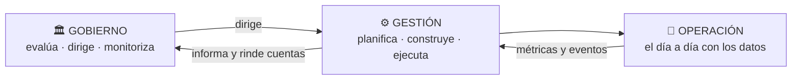
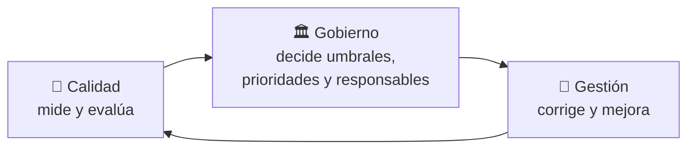
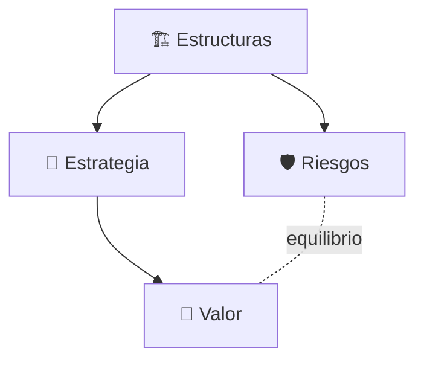
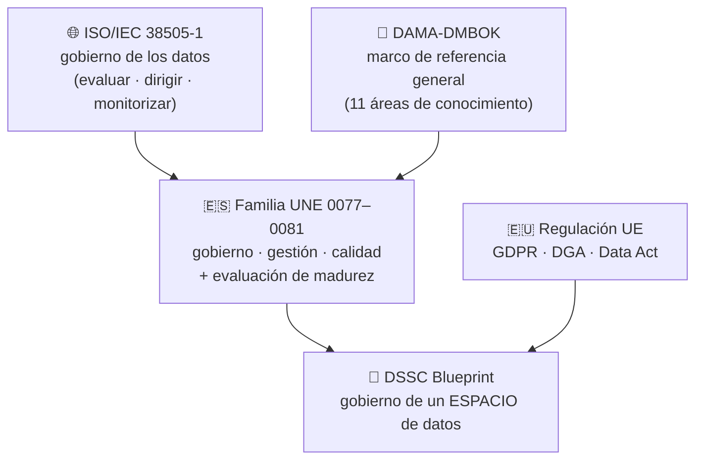
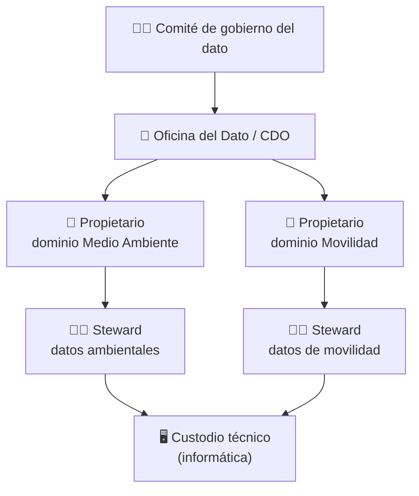
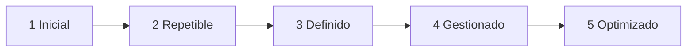
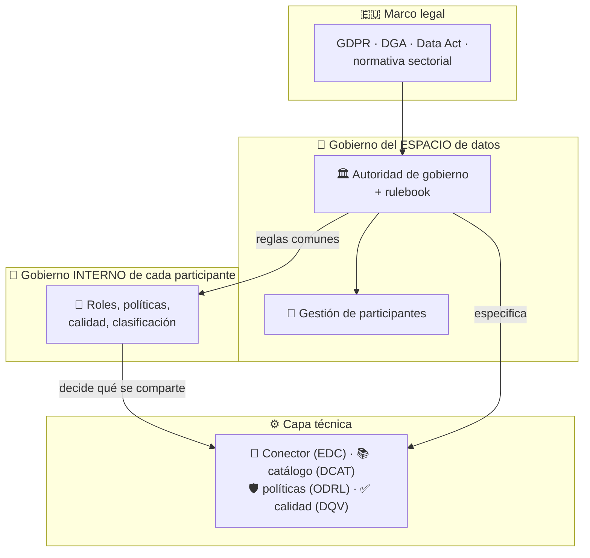
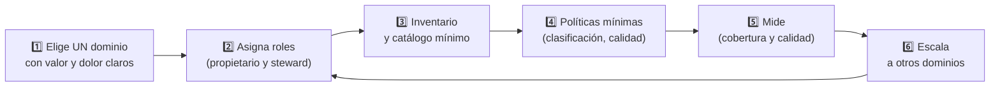
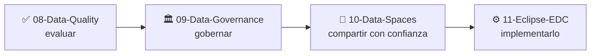

# 🏛️ 09 · Data Governance — Gobierno del Dato

**Quién decide qué se hace con los datos, bajo qué reglas y quién responde de ello: la capa que convierte datos sueltos en un activo de confianza.**


> *Learning by building: el gobierno del dato suele explicarse con diapositivas de organigramas. Aquí lo convertimos en metadatos, políticas y reglas que se pueden consultar y validar.*

---

## 📑 Índice

1. [🧭 Cómo usar esta guía](#-cómo-usar-esta-guía)
2. [📖 ¿Qué es el gobierno del dato?](#-qué-es-el-gobierno-del-dato)
3. [🚀 Por qué importa](#-por-qué-importa)
4. [🎯 Los cuatro objetivos del gobierno](#-los-cuatro-objetivos-del-gobierno)
5. [🧩 El mapa de marcos y normas](#-el-mapa-de-marcos-y-normas)
6. [👥 Roles y responsabilidades](#-roles-y-responsabilidades)
7. [📋 Qué se gobierna: políticas, estándares y procesos](#-qué-se-gobierna-políticas-estándares-y-procesos)
8. [🔗 Gobierno legible por máquinas](#-gobierno-legible-por-máquinas)
9. [📊 Medir el gobierno: cobertura y madurez](#-medir-el-gobierno-cobertura-y-madurez)
10. [🤝 Gobierno en Espacios de Datos](#-gobierno-en-espacios-de-datos)
11. [🇪🇺 Marco regulatorio europeo](#-marco-regulatorio-europeo)
12. [🪜 Cómo empezar: un plan realista](#-cómo-empezar-un-plan-realista)
13. [🗂️ Estructura de la carpeta](#️-estructura-de-la-carpeta)
14. [⚠️ Errores frecuentes](#️-errores-frecuentes)
15. [🧰 Casos de uso](#-casos-de-uso)
16. [🧠 Chuleta de repaso](#-chuleta-de-repaso)
17. [🏋️ Ejercicios](#️-ejercicios)
18. [📚 Recursos](#-recursos)
19. [➡️ Siguiente paso](#️-siguiente-paso)

---

## 🧭 Cómo usar esta guía

| Si eres… | Ruta recomendada |
| --- | --- |
| 🆕 **Nuevo en gobierno del dato** | Lee las secciones 2 → 8 en orden. Al llegar a [Gobierno legible por máquinas](#-gobierno-legible-por-máquinas), copia los ejemplos y pruébalos: es donde la teoría deja de ser un organigrama. |
| 🔁 **Vienes a repasar** | Ve a la [🧠 Chuleta de repaso](#-chuleta-de-repaso), al [mapa de marcos](#-el-mapa-de-marcos-y-normas) y a la tabla de [roles](#-roles-y-responsabilidades). |
| 🇪🇸 **Trabajas en el sector público español** | Combina el [mapa de marcos](#-el-mapa-de-marcos-y-normas) (familia UNE 0077–0081) con [Gobierno en Espacios de Datos](#-gobierno-en-espacios-de-datos) y el [marco regulatorio](#-marco-regulatorio-europeo). |

> 💡 **Requisitos previos:** conviene haber pasado por `06-ODRL` (políticas de uso), `07-DCAT` (catálogos y metadatos) y `08-Data-Quality` (medir la calidad). El gobierno del dato es lo que **da sentido y responsables** a todo lo anterior.

---

## 📖 ¿Qué es el gobierno del dato?

> **El gobierno del dato es el conjunto de decisiones, responsabilidades y reglas que determinan cómo se usan los datos de una organización (o de un espacio de datos) para que aporten valor sin generar riesgos.**

No es una herramienta ni un proyecto con fecha de fin: es **una función permanente**, igual que el gobierno corporativo lo es para una empresa.

### 🔑 Gobernar, gestionar y operar no son lo mismo

| Nivel | Pregunta | Quién | Ejemplo con calidad del aire |
| --- | --- | --- | --- |
| 🏛️ **Gobernar** | ¿Qué queremos y quién decide? | Dirección, comité de datos | «Los datos ambientales se publican como datos abiertos y con calidad mínima del 95 %» |
| ⚙️ **Gestionar** | ¿Cómo lo hacemos realidad? | Responsables de datos, equipos | Definir el proceso de validación, el catálogo y el calendario de publicación |
| 🔧 **Operar** | ¿Quién lo ejecuta cada día? | Equipos técnicos | Cargar las lecturas, ejecutar las reglas, publicar el CSV |

Es la misma distinción que existe entre el **consejo de administración** (fija el rumbo y supervisa) y la **dirección** (ejecuta). En el estándar internacional de gobierno de datos, ISO/IEC 38505-1, que aplica a los datos el modelo de ISO/IEC 38500, el gobierno consiste en **evaluar, dirigir y monitorizar**.



> 🧠 **En España** esta distinción está recogida en la propia familia de normas: la **UNE 0077** es de *gobierno*, la **UNE 0078** de *gestión* y la **UNE 0079** de *gestión de la calidad*. Están pensadas para aplicarse **de forma conjunta**.

---

## 🚀 Por qué importa

Sin gobierno, los problemas se repiten, y casi nunca son técnicos:

| Síntoma | Causa de gobierno |
| --- | --- |
| «¿De quién es este dataset?» — nadie responde | No hay **propietario** asignado |
| Dos informes dan cifras distintas para lo mismo | No hay **definiciones comunes** (glosario) ni fuente de referencia |
| El dato es malo y todos lo saben, pero nadie lo arregla | No hay **responsable** de la calidad ni proceso de resolución |
| Se publica algo que no debía publicarse | No hay **clasificación** ni **aprobación** previa |
| Hay datos que nadie usa y nadie se atreve a borrar | No hay **política de ciclo de vida** |
| Cada equipo monta su propia solución | No hay **estrategia** ni estándares compartidos |

### 🔗 Relación con la calidad (carpeta 08)

> **La calidad se mide; el gobierno decide quién la arregla, con qué prioridad y a qué coste.**

Medir que la completitud es del 94 % (carpeta 08) no mejora nada por sí solo. Hace falta alguien con **autoridad y responsabilidad** para actuar: eso es gobierno.



---

## 🎯 Los cuatro objetivos del gobierno

La especificación **UNE 0077:2023** organiza el gobierno del dato en cuatro procesos. Son una forma útil de recordar para qué sirve:

| Proceso | Qué persigue | Preguntas que responde |
| --- | --- | --- |
| 🧭 **Estrategia del dato** | Alinear los datos con los objetivos de la organización | ¿Para qué queremos los datos? ¿Qué datos son críticos? |
| 🏗️ **Estructuras organizativas** | Definir quién hace qué en el gobierno, la gestión y el uso | ¿Qué roles hay? ¿Quién decide? ¿Quién responde? |
| 🛡️ **Optimización de riesgos** | Identificar y reducir los riesgos asociados al dato | ¿Qué puede salir mal (legal, seguridad, reputación, calidad)? |
| 💎 **Optimización del valor** | Obtener el máximo beneficio de los datos | ¿Qué uso genera más valor? ¿Cómo se mide? |



> ⚖️ **El equilibrio es la clave:** el gobierno no es solo «controlar» (riesgos) ni solo «aprovechar» (valor). Un gobierno que solo frena produce **datos escondidos**; uno que solo promueve el uso produce **incidentes**.

---

## 🧩 El mapa de marcos y normas

Hay muchos marcos y siglas. Este mapa los ordena según **la pregunta que responde cada uno**:



| Marco | Pregunta que responde | Ámbito | Qué te llevas |
| --- | --- | --- | --- |
| **DAMA-DMBOK** | ¿Qué áreas componen la gestión de datos y cómo se relacionan? | Cualquier organización | Un vocabulario común: el gobierno del dato está en el centro de 11 áreas (calidad, metadatos, seguridad, arquitectura…) |
| **ISO/IEC 38505-1** | ¿Cómo gobierna la dirección el uso de los datos? | Organizaciones | El modelo *evaluar–dirigir–monitorizar* aplicado a los datos |
| **UNE 0077** | ¿Qué procesos exige un buen gobierno del dato? | España | Estrategia, estructuras, riesgos, valor |
| **UNE 0078** | ¿Cómo se gestiona el dato día a día? | España | Procesos de gestión (ver tabla abajo) |
| **UNE 0079** | ¿Cómo se gestiona la calidad del dato? | España | Planificación, aseguramiento, control y mejora de la calidad |
| **UNE 0080** | ¿En qué grado están implantados los procesos anteriores? | España | Guía y proceso de **evaluación de madurez** |
| **UNE 0081** | ¿Qué calidad tiene un conjunto de datos concreto? | España | Evaluación de calidad (ver `08-Data-Quality`) |
| **DSSC Blueprint** | ¿Cómo se gobierna un espacio de datos con muchos participantes? | Espacios de datos | Autoridad de gobierno, *rulebook*, gestión de participantes |

### 🇪🇸 La familia UNE del dato, de un vistazo

Impulsada con el patrocinio de la **Oficina del Dato** (Secretaría de Estado de Digitalización e Inteligencia Artificial):

| Especificación | Cubre | Procesos (resumen) |
| --- | --- | --- |
| **UNE 0077:2023** Gobierno del dato | Qué se decide y quién | Estrategia · estructuras organizativas · riesgos · valor |
| **UNE 0078:2023** Gestión del dato | Cómo se gestiona | Procesamiento · requisitos · configuración · seguridad · arquitectura y diseño · **compartición, intermediación e integración** · dato maestro · ciclo de vida · análisis |
| **UNE 0079:2023** Gestión de la calidad del dato | Cómo se mantiene la calidad | Planificación · aseguramiento · control y monitorización · mejora |
| **UNE 0080:2023** Evaluación de gobierno, gestión y calidad | Grado de madurez | Guía y proceso de evaluación (certificable) |
| **UNE 0081:2023** Evaluación de la calidad del dato | Calidad de un dataset | Modelo y métricas (ISO/IEC 25012, 25024, 25040) |

> 🔗 Fíjate en el proceso de **compartición, intermediación e integración del dato** de la UNE 0078: es el punto de contacto de la norma con los Espacios de Datos.

> 📝 La UNE 0077 también sirve para algo muy concreto: establecer **mecanismos aprobados que respalden la apertura y publicación de datos abiertos** (quién autoriza qué se publica).

---

## 👥 Roles y responsabilidades

El gobierno del dato **no funciona sin personas con nombre y apellidos (o, al menos, con cargo)**. Los nombres de los roles varían entre marcos; lo importante es que **cada responsabilidad tenga un responsable**.

| Rol | Responsabilidad típica | Ejemplo con calidad del aire |
| --- | --- | --- |
| 🏢 **Propietario del dato** (*data owner*) | Es **responsable último**: decide quién puede usar el dato y para qué, y asume el riesgo | La dirección de Medio Ambiente |
| 🧑‍💼 **Responsable de dominio** (*data steward*) | Cuida el dato **en el día a día**: definiciones, calidad, resolución de incidencias | El equipo de datos ambientales |
| 🖥️ **Custodio técnico** (*data custodian*) | Gestiona **la infraestructura**: almacenamiento, copias, seguridad técnica, accesos | El servicio de informática |
| ✍️ **Productor** (*data producer*) | Genera o captura el dato | Las estaciones de medida |
| 🛒 **Consumidor** (*data consumer*) | Usa el dato bajo las reglas establecidas | Una empresa que analiza la movilidad |
| 🎩 **Responsable de datos** (*CDO* u Oficina del Dato) | Lidera la estrategia y la función de gobierno | La Oficina del Dato municipal |
| 🧑‍⚖️ **Comité de gobierno del dato** | Toma las decisiones transversales y resuelve conflictos | Dirección, TI, jurídico, áreas de negocio |
| 🛡️ **Delegado de protección de datos** (DPD/DPO) | Asesora y supervisa el cumplimiento de la normativa de datos personales | — (si hay datos personales) |



### 📋 Una matriz RACI para una decisión concreta

*Decisión: «publicar el dataset de calidad del aire como dato abierto».*
**R** = Realiza · **A** = Responde (decide) · **C** = Consultado · **I** = Informado

| Actividad | Propietario | Steward | Custodio | Oficina del Dato | Comité | Jurídico/DPD |
| --- | :---: | :---: | :---: | :---: | :---: | :---: |
| Proponer la publicación | **A** | **R** | I | C | I | C |
| Clasificar el dato (público/interno…) | **A** | R | I | C | I | C |
| Validar su calidad mínima | A | **R** | C | I | I | — |
| Preparar el catálogo (DCAT) y la licencia | A | **R** | C | C | I | C |
| Publicar técnicamente | I | A | **R** | I | — | — |
| Resolver un conflicto de criterios | C | C | — | R | **A** | C |

> ⚠️ **Regla de oro de la RACI:** en cada fila debe haber **una sola «A»**. Si hay dos, nadie decide.

---

## 📋 Qué se gobierna: políticas, estándares y procesos

Gobernar se concreta en **artefactos**: documentos y registros que hacen explícitas las reglas.

| Artefacto | Qué contiene | Ejemplo con calidad del aire | ¿Dónde vive en el laboratorio? |
| --- | --- | --- | --- |
| 📜 **Política** | Principios y obligaciones de alto nivel | «Todo dataset publicado tendrá propietario, clasificación y calidad evaluada» | Texto + `06-ODRL` |
| 📏 **Estándar** | Cómo se cumple la política | Perfil DCAT-AP-ES para metadatos; ISO/IEC 25012 para calidad | `07-DCAT`, `08-Data-Quality` |
| 🔄 **Proceso** | Pasos y responsables | Proceso de aprobación de publicación (matriz RACI) | Sección de [roles](#-roles-y-responsabilidades) |
| 📖 **Glosario** | Definiciones únicas de los términos de negocio | «NO₂: concentración horaria de dióxido de nitrógeno en µg/m³» | SKOS |
| 📚 **Catálogo** | Inventario de datos con su descripción | El catálogo DCAT del ayuntamiento | `07-DCAT` |
| 🏷️ **Clasificación** | Niveles de sensibilidad | Público · Interno · Confidencial | SKOS / `dct:accessRights` |
| 🧬 **Linaje** | De dónde viene un dato y qué transformaciones sufrió | Estación → validación → CSV publicado | PROV-O |
| ⏳ **Ciclo de vida** | Cuánto se conserva y cuándo se revisa o elimina | «Se conserva 10 años; revisión anual» | Metadato propio |
| 📏 **Métricas** | Indicadores de calidad y de gobierno | Completitud ≥ 95 %; 100 % de datasets con propietario | `08-Data-Quality` (DQV) |

---

## 🔗 Gobierno legible por máquinas

Aquí está la propuesta del laboratorio: **no basta con tener las políticas en un PDF**. Si las reglas, los responsables y la clasificación son **datos enlazados**, se pueden **consultar, validar y medir**.

| Responsabilidad de gobierno | Vocabulario | Qué aporta |
| --- | --- | --- |
| Quién publica y a quién preguntar | `dct:publisher`, `dcat:contactPoint` (DCAT) | Responsables visibles en el catálogo |
| Quién es propietario, steward o custodio | `prov:qualifiedAttribution` + `dcat:hadRole` | **Roles** asociados a cada dataset |
| Qué se puede hacer con el dato | **ODRL** | Permisos, prohibiciones y obligaciones |
| Nivel de sensibilidad y acceso | `dct:accessRights`, SKOS | Clasificación |
| Cómo se llama y qué significa cada cosa | **SKOS** | Glosario y esquemas de clasificación |
| De dónde viene el dato | **PROV-O** | Linaje |
| Qué calidad tiene | **DQV** | Mediciones publicadas |
| ¿Cumple las reglas de gobierno? | **SHACL** | Validación automática |

### 🧪 Ejemplo: un dataset con su gobierno descrito

Los roles se asignan a **unidades o cargos** (no a personas concretas): así el registro sobrevive a los cambios de plantilla y no expone datos personales.

```turtle
@prefix dcat: <http://www.w3.org/ns/dcat#> .
@prefix dct:  <http://purl.org/dc/terms/> .
@prefix prov: <http://www.w3.org/ns/prov#> .
@prefix skos: <http://www.w3.org/2004/02/skos/core#> .
@prefix odrl: <http://www.w3.org/ns/odrl/2/> .
@prefix xsd:  <http://www.w3.org/2001/XMLSchema#> .
@prefix ex:   <http://example.org/> .
@prefix gov:  <http://example.org/gobierno#> .

# 🎭 Roles de gobierno (vocabulario propio, publicado como SKOS)
gov:rol-propietario a skos:Concept ; skos:prefLabel "Propietario del dato"@es .
gov:rol-steward     a skos:Concept ; skos:prefLabel "Responsable de dominio (steward)"@es .
gov:rol-custodio    a skos:Concept ; skos:prefLabel "Custodio técnico"@es .

# 🏷️ Esquema de clasificación de la información
gov:esquema-clasificacion a skos:ConceptScheme ; skos:prefLabel "Clasificación de la información"@es .
gov:publico      a skos:Concept ; skos:inScheme gov:esquema-clasificacion ; skos:prefLabel "Público"@es .
gov:confidencial a skos:Concept ; skos:inScheme gov:esquema-clasificacion ; skos:prefLabel "Confidencial"@es .

# 🗃️ El dataset, con su gobierno visible
ex:dataset-calidad-aire
    a dcat:Dataset ;
    dct:title "Calidad del aire"@es ;
    dct:publisher ex:ayuntamiento ;
    dct:accessRights <http://publications.europa.eu/resource/authority/access-right/PUBLIC> ;
    gov:nivelClasificacion gov:publico ;
    gov:proximaRevision "2027-10-01"^^xsd:date ;

    prov:qualifiedAttribution
        [ a prov:Attribution ; prov:agent ex:direccion-medio-ambiente ; dcat:hadRole gov:rol-propietario ] ,
        [ a prov:Attribution ; prov:agent ex:oficina-del-dato          ; dcat:hadRole gov:rol-steward ] ,
        [ a prov:Attribution ; prov:agent ex:servicio-informatica      ; dcat:hadRole gov:rol-custodio ] ;

    odrl:hasPolicy ex:oferta-calidad-aire .
```

> 🔗 Las mediciones de calidad (DQV, carpeta 08) y la política de uso (ODRL, carpeta 06) se enlazan al **mismo dataset**: un único punto donde ver *qué es, quién responde, qué calidad tiene y en qué condiciones se puede usar*.

### ✅ Y ahora, ¿se cumple el gobierno? (SHACL)

Una **shape** puede comprobar que *todo dataset tiene propietario, steward y clasificación*. Es el equivalente, para el gobierno, de lo que hiciste con la calidad:

```turtle
@prefix sh:   <http://www.w3.org/ns/shacl#> .
@prefix dcat: <http://www.w3.org/ns/dcat#> .
@prefix prov: <http://www.w3.org/ns/prov#> .
@prefix gov:  <http://example.org/gobierno#> .

gov:DatasetGobernadoShape
    a sh:NodeShape ;
    sh:targetClass dcat:Dataset ;

    sh:property [
        sh:path gov:nivelClasificacion ;
        sh:minCount 1 ; sh:maxCount 1 ;
        sh:message "Falta el nivel de clasificación del dataset" ;
    ] ;

    # Al menos UN propietario…
    sh:property [
        sh:path prov:qualifiedAttribution ;
        sh:qualifiedValueShape [
            sh:property [ sh:path dcat:hadRole ; sh:hasValue gov:rol-propietario ]
        ] ;
        sh:qualifiedMinCount 1 ;
        sh:message "Falta el propietario del dato" ;
    ] ;

    # …y al menos UN steward
    sh:property [
        sh:path prov:qualifiedAttribution ;
        sh:qualifiedValueShape [
            sh:property [ sh:path dcat:hadRole ; sh:hasValue gov:rol-steward ]
        ] ;
        sh:qualifiedMinCount 1 ;
        sh:message "Falta el responsable de dominio (steward)" ;
    ] .
```

> 🧠 **Fíjate en el cambio de enfoque:** en `08-Data-Quality` SHACL validaba **los datos**; aquí valida **los metadatos de gobierno**. La misma herramienta, otra capa.

---

## 📊 Medir el gobierno: cobertura y madurez

Lo que no se mide no se gobierna. Hay dos formas complementarias de medirlo.

### 📏 1) Cobertura: ¿cuánto de lo que tenemos está gobernado?

Indicadores sencillos, calculables sobre el catálogo:

| Indicador | Fórmula | Meta típica |
| --- | --- | --- |
| Datasets con propietario | `con propietario / total` | 100 % |
| Datasets con steward | `con steward / total` | 100 % |
| Datasets clasificados | `con clasificación / total` | 100 % |
| Datasets con calidad evaluada | `con medición DQV / total` | creciente |
| Datasets con revisión vigente | `revisión posterior a hoy / total` | ≥ 90 % |
| Elementos críticos con reglas de calidad | `críticos con regla / críticos` | 100 % |

Con el catálogo de `07-DCAT` y los metadatos de arriba, la cobertura es **una consulta SPARQL**:

```sparql
PREFIX dcat: <http://www.w3.org/ns/dcat#>
PREFIX prov: <http://www.w3.org/ns/prov#>
PREFIX gov:  <http://example.org/gobierno#>

SELECT ?total ?conPropietario (?conPropietario / ?total AS ?cobertura) WHERE {
  { SELECT (COUNT(?d) AS ?total) WHERE { ?d a dcat:Dataset } }
  { SELECT (COUNT(DISTINCT ?d) AS ?conPropietario) WHERE {
      ?d a dcat:Dataset ;
         prov:qualifiedAttribution/dcat:hadRole gov:rol-propietario } }
}
```

> 🔗 Esto es **calidad de metadatos** (carpeta 08) aplicada al gobierno: completitud de los metadatos de gobierno.

### 🪜 2) Madurez: ¿en qué grado están implantados los procesos?

La **UNE 0080** ofrece una guía y un proceso de evaluación de madurez de los procesos de gobierno, gestión y calidad del dato. Como ilustración **genérica** (no es el modelo de la UNE 0080), una escala habitual de cinco niveles:

| Nivel | Nombre | Cómo se ve |
| --- | --- | --- |
| 1 | **Inicial** | Cada persona hace lo que puede; no hay responsables |
| 2 | **Repetible** | Algunas prácticas se repiten, pero dependen de personas concretas |
| 3 | **Definido** | Roles, políticas y procesos documentados y aprobados |
| 4 | **Gestionado** | Se miden indicadores y se actúa sobre ellos |
| 5 | **Optimizado** | Mejora continua basada en datos |



> 🎯 **No hace falta llegar al nivel 5 en todo.** Se trata de que el nivel sea **adecuado al riesgo y al valor** de cada dominio de datos.

---

## 🤝 Gobierno en Espacios de Datos

En una organización, la dirección **decide** y el resto aplica. En un espacio de datos hay **muchos participantes independientes** que **no se subordinan** entre sí. Por eso el gobierno de un espacio de datos es otro problema.

### 📖 Los conceptos clave (según el Data Spaces Support Centre, DSSC)

| Concepto | Qué es |
| --- | --- |
| **Marco de gobierno** (*governance framework*) | Conjunto de reglas y políticas internas aplicables a **todos los participantes** del espacio |
| **Gobierno del espacio de datos** | Los procesos para **desarrollar, mantener y hacer cumplir** ese marco |
| **Rulebook** | La documentación del marco de gobierno **para uso operativo** (ejemplos: los *rulebooks* de IDSA o de SITRA) |
| **Autoridad de gobierno del espacio de datos** (*DSGA*) | El participante responsable de crear, operar, mantener y hacer cumplir el marco, **sin sustituir a las autoridades públicas** que hacen cumplir la ley |
| **Participante** | Quien se compromete con el marco de gobierno de un espacio concreto |

Las versiones recientes del **DSSC Blueprint** agrupan lo esencial en dos bloques de gobierno:

| Bloque | Qué resuelve |
| --- | --- |
| 🏗️ **Forma organizativa y autoridad de gobierno** | Qué forma legal toma el espacio, cómo se constituye la autoridad, cómo se decide y se resuelven conflictos |
| 🚪 **Gestión de participantes** | Alta y baja de participantes, roles, políticas de acceso y reglas |

> 📌 Un instrumento habitual es el **acuerdo de adhesión** (*accession agreement*): el contrato por el que un nuevo participante se compromete con el marco de gobierno al incorporarse.

### 🔀 Dos niveles de gobierno que conviven



| Nivel | Quién decide | Sobre qué |
| --- | --- | --- |
| **Del espacio** | La autoridad de gobierno, con los participantes | Reglas comunes: quién entra, qué vocabularios y formatos se usan, qué políticas de uso son válidas, cómo se resuelven conflictos |
| **De cada participante** | El propio participante (su propietario del dato) | Qué datos ofrece, a quién y con qué condiciones |

> 🧠 **La idea clave:** el espacio de datos **no gobierna los datos de los participantes**; gobierna **las reglas del juego**. Cada participante sigue siendo soberano sobre lo suyo (de ahí el concepto de **soberanía del dato**), y por eso necesita **su propio gobierno interno**.

### 🔗 Dónde encaja cada pieza del laboratorio

| Pieza | Papel en el gobierno del espacio |
| --- | --- |
| **ODRL** (`06`) | Expresa las políticas de uso que el marco de gobierno permite |
| **DCAT** (`07`) | Describe lo que se ofrece, con responsables y condiciones visibles |
| **DQV / calidad** (`08`) | Da al consumidor información para decidir antes de negociar |
| **SHACL** (`05`) | Comprueba que los participantes cumplen las reglas de forma automática (conformidad con el rulebook) |
| **Conector EDC** (`11`) | Aplica las políticas en tiempo de ejecución |

---

## 🇪🇺 Marco regulatorio europeo

El gobierno del dato no se define solo por buenas prácticas: hay **normas que obligan**. Resumen de las más relevantes para este laboratorio:

| Norma | De qué trata | Estado |
| --- | --- | --- |
| **RGPD** (Reglamento 2016/679) | Protección de **datos personales** | Aplicable desde 2018 |
| **Data Governance Act (DGA)** (Reglamento 2022/868) | Reutilización de ciertos datos protegidos del sector público; servicios de **intermediación de datos**; **altruismo de datos**; Comité Europeo de Innovación en materia de Datos | Aplicable desde el **24 de septiembre de 2023** |
| **Data Act** (Reglamento 2023/2854) | Acceso y uso de los datos generados por productos conectados y servicios relacionados; cambio de proveedor de nube | Aplicable desde septiembre de 2025 |
| **Directiva de datos abiertos** (2019/1024) | Reutilización de la información del sector público; datos de alto valor | Transpuesta a los Estados miembros |

### 🔄 Un marco en movimiento: el «Digital Omnibus»

> ⚠️ **Estado a vigilar.** En noviembre de 2025 la Comisión presentó el paquete **Digital Omnibus**, que propone, entre otras cosas, **derogar** el Data Governance Act, el Reglamento de libre circulación de datos no personales y la Directiva de datos abiertos, e **integrar sus disposiciones en el Data Act**. En esa propuesta, el régimen de **notificación obligatoria** de los servicios de intermediación de datos pasaría a ser un **registro voluntario**.
>
> Según las fuentes consultadas en septiembre de 2026, **el procedimiento legislativo seguía abierto**. Hasta que se apruebe, el DGA sigue siendo la norma aplicable. **Comprueba el estado actual** antes de citar estas normas en un documento formal.

### 🧩 Cómo se relaciona con el gobierno en un espacio de datos

| Norma | Impacto en un espacio de datos |
| --- | --- |
| RGPD | Obliga a base legal, minimización y derechos de las personas **antes** de compartir datos personales |
| DGA | Marca el marco de los **intermediarios** y del **altruismo de datos**: algunas figuras del espacio (como la autoridad o ciertos servicios) pueden entrar en su ámbito |
| Data Act | Define derechos de acceso a datos de productos conectados, y condiciones **contractuales** de compartición |
| Directiva de datos abiertos | Es la base de la publicación de datos públicos y de los **datos de alto valor** (ver DCAT-AP-ES en `07`) |

> ⚖️ **Nota:** este apartado es **divulgativo**, no asesoramiento jurídico. Para decisiones con efectos legales, consulta a un profesional del derecho y a las fuentes oficiales (EUR-Lex y el BOE).

---

## 🪜 Cómo empezar: un plan realista

El error más común es querer **gobernar todo a la vez**. La estrategia que funciona es **empezar pequeño y crecer**:



### 🗓️ Un primer ciclo de 90 días (ejemplo)

| Periodo | Objetivo | Entregable |
| --- | --- | --- |
| **Días 1–30** | Elegir el dominio, nombrar propietario y steward, hacer inventario | Lista de datasets con responsable |
| **Días 31–60** | Clasificar, definir calidad mínima, crear glosario básico | Política de 1–2 páginas + glosario |
| **Días 61–90** | Publicar en catálogo, medir cobertura y calidad, revisar | Catálogo (DCAT) + primer informe de cobertura |

> 🎯 **Criterio de éxito del primer ciclo:** que *una persona nueva* pueda responder, en menos de un minuto y sin preguntar a nadie, **de quién es un dato, qué significa y si puede usarlo.**

---

## 🗂️ Estructura de la carpeta

> 🚧 La carpeta se irá completando siguiendo el lema del laboratorio: **cada concepto, con su experimento**.

```
09-Data-Governance/
├── README.md                         # Este documento
│
├── 01-Roles-y-RACI/                  # 🚧 Roles de gobierno y matriz RACI como datos
├── 02-Politicas-y-Clasificacion/     # 🚧 Esquema de clasificación (SKOS) y políticas (ODRL)
├── 03-Catalogo-y-Glosario/           # 🚧 Catálogo DCAT con gobierno + glosario SKOS
├── 04-Linaje-PROV/                   # 🚧 Trazar de dónde viene un dato
├── 05-Cobertura-de-Gobierno/         # 🚧 SHACL + SPARQL: ¿cuánto está gobernado?
└── 06-Gobierno-de-Espacios-de-Datos/ # 🚧 Rulebook y gestión de participantes
```

---

## ⚠️ Errores frecuentes

| ❌ Error | ✅ Cómo evitarlo |
| --- | --- |
| Pensar que el gobierno del dato **es una herramienta** (un catálogo, un software) | La herramienta apoya; el gobierno son **decisiones y responsabilidades**. |
| Confundir **gobernar** con **gestionar** | Gobernar decide y supervisa; gestionar ejecuta. Mézclalos y nadie rinde cuentas. |
| Tratarlo como **un proyecto** con fecha de fin | Es una **función permanente**, como el control financiero. |
| Roles sin **autoridad real** | Un propietario que no puede decidir es un título, no un rol. |
| Asignar roles a **personas** en lugar de cargos o unidades | Las personas cambian; los registros deben sobrevivir a la rotación. |
| Una matriz RACI con **dos «A»** en la misma fila | Cada decisión tiene **un único** responsable final. |
| Querer **gobernar todo** desde el primer día | Empieza por un dominio con valor y dolor claros. |
| Gobierno que **solo frena** | Mide también el **valor** que se genera; si no, los datos se esconden. |
| Políticas escritas pero **sin medir su cumplimiento** | Define indicadores (cobertura, calidad) y revísalos periódicamente. |
| Olvidar el **glosario** | Sin definiciones comunes, los datos «cuadran» en la tabla y no en el negocio. |
| Confundir el gobierno **del espacio** con el gobierno **del dato de cada participante** | Son dos niveles: reglas comunes del espacio y soberanía de cada participante. |
| Citar normas **sin comprobar su estado** | La regulación europea está en revisión (Digital Omnibus): verifica antes de citar. |

---

## 🧰 Casos de uso

| Caso | Qué aporta el gobierno |
| --- | --- |
| 🏛️ **Publicar datos abiertos** | Quién aprueba la publicación, con qué clasificación, licencia y calidad mínima |
| 🏥 **Datos sensibles (salud)** | Clasificación, base legal, accesos mínimos y trazabilidad |
| 🏭 **Compartir datos entre empresas** | Reglas de uso claras, responsables y resolución de conflictos |
| 🤖 **Entrenar modelos de IA** | Procedencia, calidad y derechos de uso de los datos de entrenamiento |
| 📊 **Un único «cuadro de mando»** | Definiciones comunes y fuente de verdad por indicador |
| 🚀 **Entrar en un Espacio de Datos** | Gobierno interno suficiente para asumir las reglas del espacio |
| 🔍 **Auditoría o inspección** | Evidencias: roles, políticas, linaje y calidad documentados |

---

## 🧠 Chuleta de repaso

```
GOBERNAR  = decidir y supervisar   (evaluar · dirigir · monitorizar)
GESTIONAR = planificar y ejecutar
OPERAR    = el día a día

LOS 4 OBJETIVOS (UNE 0077):  estrategia · estructuras · riesgos · valor

FAMILIA UNE:  0077 gobierno · 0078 gestión · 0079 gestión de la calidad
              0080 madurez · 0081 evaluación de la calidad de un dataset

ROLES:   propietario (decide y responde) · steward (cuida el día a día)
         custodio (infraestructura) · productor · consumidor
         comité + Oficina del Dato / CDO  ·  DPD si hay datos personales

ARTEFACTOS:  política · estándar · proceso · glosario · catálogo
             clasificación · linaje · ciclo de vida · métricas

GOBIERNO COMO DATOS:  roles (prov:qualifiedAttribution + dcat:hadRole)
                      políticas (ODRL) · glosario/clasificación (SKOS)
                      linaje (PROV-O) · calidad (DQV) · validación (SHACL)

ESPACIO DE DATOS:  autoridad de gobierno + rulebook + gestión de participantes
                   → gobierna las REGLAS COMUNES, no los datos de cada participante

REGULACIÓN:  RGPD · DGA (en revisión por el Digital Omnibus) · Data Act
```

### ✔️ Lista de comprobación: ¿está gobernado este dataset?

- [ ] ¿Tiene **propietario** identificado?
- [ ] ¿Tiene **steward**?
- [ ] ¿Está **clasificado**?
- [ ] ¿Está en el **catálogo**, con descripción y contacto?
- [ ] ¿Sus términos de negocio están en el **glosario**?
- [ ] ¿Tiene **política de uso** (ODRL o licencia)?
- [ ] ¿Se mide su **calidad** y se publica?
- [ ] ¿Se sabe de **dónde viene** (linaje)?
- [ ] ¿Tiene **fecha de revisión** y ciclo de vida?

---

## 🏋️ Ejercicios

> *Learning by building:* el gobierno se entiende construyéndolo, aunque sea a pequeña escala.

1. 🟢 **Básico.** Escribe, para el dataset de calidad del aire, quién sería propietario, steward y custodio, y justifica por qué.
2. 🟢 **Básico.** Completa la matriz RACI para la decisión «**dar acceso** a un tercero al dataset» asegurando una sola «A» por fila.
3. 🟡 **Intermedio.** Copia el Turtle de este README y añade un **segundo dataset** con un steward pero **sin propietario**. Valídalos con la shape SHACL y explica el mensaje.
4. 🟡 **Intermedio.** Añade una cuarta propiedad a la shape: todo dataset debe tener `gov:proximaRevision`.
5. 🟡 **Intermedio.** Ejecuta la consulta de cobertura sobre tres datasets con distintos huecos y calcula a mano el resultado esperado.
6. 🔴 **Avanzado.** Modela el linaje del dataset con PROV-O: *estación → validación → CSV publicado* (`prov:wasDerivedFrom`, `prov:wasGeneratedBy`).
7. 🔴 **Avanzado.** Escribe una **política ODRL** que solo permita el uso del dataset si su clasificación es «Público».
8. 🧪 **Reto.** Diseña el **rulebook mínimo** (una página) de un espacio de datos de calidad ambiental: quién puede entrar, qué formatos y vocabularios se exigen y cómo se resuelven los conflictos.

---

## 📚 Recursos

| Recurso | Enlace |
| --- | --- |
| 🇪🇸 Especificaciones UNE de gobierno, gestión y calidad del dato (datos.gob.es) | <https://datos.gob.es/es/blog/especificaciones-une-gobierno-gestion-y-calidad-del-dato> |
| 🇪🇸 Las claves de las especificaciones UNE sobre el dato | <https://datos.gob.es/es/blog/las-claves-de-las-especificaciones-une-sobre-el-dato> |
| 🇪🇸 Aplica en tu organización las especificaciones UNE sobre datos | <https://datos.gob.es/ca/blog/proposito-de-ano-nuevo-aplica-en-tu-organizacion-las-especificaciones-une-sobre-datos> |
| 🚀 Data Spaces Support Centre (DSSC) y Blueprint | <https://dssc.eu> |
| 🚀 DSSC Blueprint: bloques de gobierno | <https://blueprint.dssc.eu> |
| 🧰 iSHARE: plantilla de gobierno de un espacio de datos | <https://template.ishare.eu/governance> |
| 🇪🇺 Data Governance Act (Reglamento 2022/868) | <https://eur-lex.europa.eu/eli/reg/2022/868/oj> |
| 🇪🇺 Data Act (Reglamento 2023/2854) | <https://eur-lex.europa.eu/eli/reg/2023/2854/oj> |
| 🇪🇺 Digital Omnibus: opinión conjunta EDPB-EDPS (febrero de 2026) | <https://www.edpb.europa.eu/news/news/2026/digital-omnibus-edpb-and-edps-support-simplification-and-competitiveness-while_en> |
| 🇪🇸 Digital Omnibus: la visión de las autoridades de protección de datos (datos.gob.es) | <https://datos.gob.es/en/blog/proposal-digital-omnibus-regulation-vision-european-data-protection-authorities> |
| 📘 DAMA-DMBOK (marco de referencia) | <https://www.dama.org> |
| 🛡️ Vocabularios usados en este README | <https://www.w3.org/TR/prov-o/> · <https://www.w3.org/TR/vocab-dcat-3/> · <https://www.w3.org/TR/skos-reference/> |

---

## ➡️ Siguiente paso

Ya sabes **quién decide, quién responde y cómo se hace visible y medible el gobierno**. Ahora toca ver cómo todo esto se combina para que **organizaciones independientes compartan datos con confianza**:

👉 **`10-Data-Spaces`** — qué es un espacio de datos, su arquitectura, el Dataspace Protocol y cómo encajan el catálogo (DCAT), las políticas (ODRL), la calidad y el gobierno que has visto en las carpetas anteriores.


