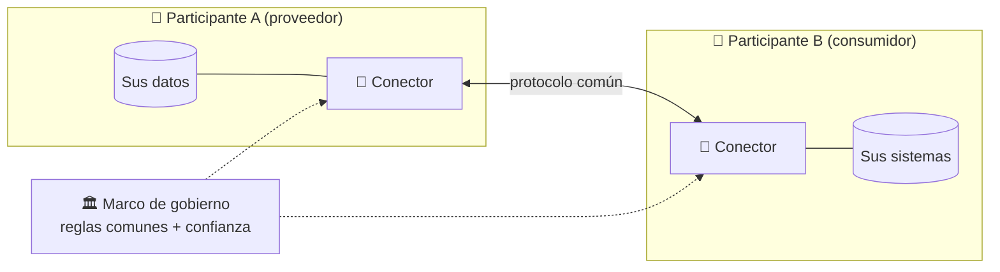
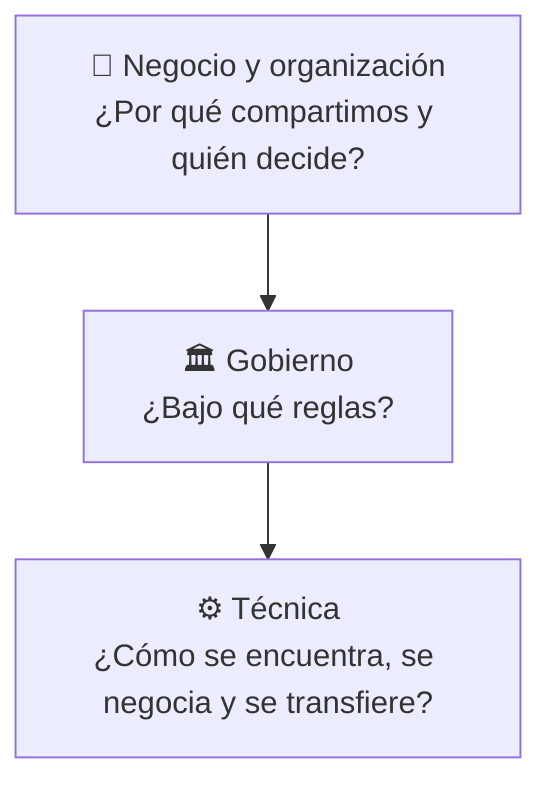
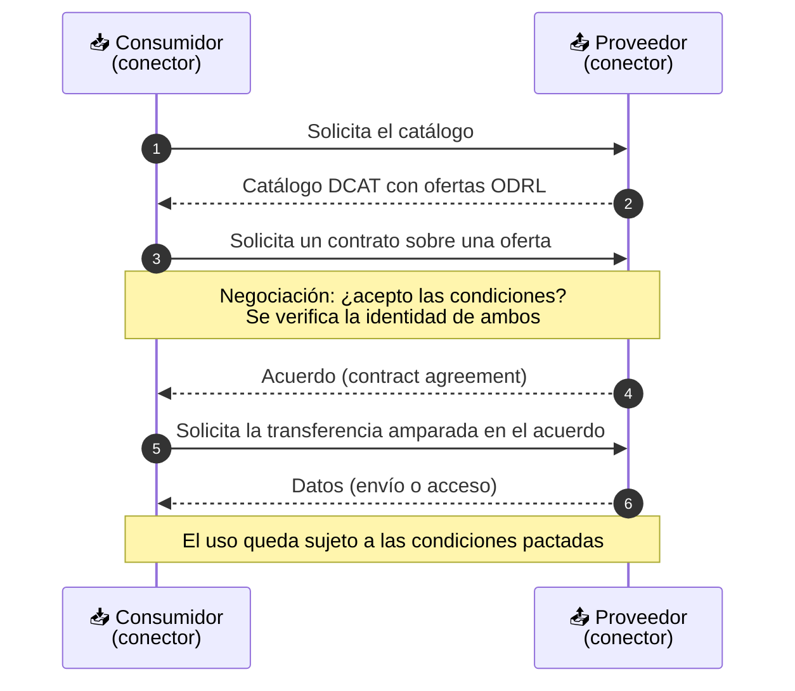
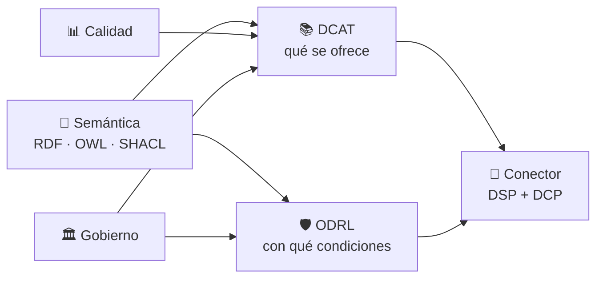
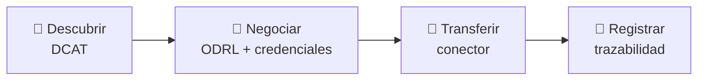

# 🌐 10 · Data Spaces — Espacios de Datos

**Compartir datos entre organizaciones que no se fían del todo entre sí, sin que nadie ceda el control de lo suyo: la capa donde semántica, calidad y gobierno se juntan.**


> *Learning by building: un espacio de datos suena a arquitectura enorme. Aquí lo descomponemos en piezas que ya conoces (RDF, DCAT, ODRL, SHACL, calidad, gobierno) y vemos qué añade cada una.*

---

## 📑 Índice

1. [🧭 Cómo usar esta guía](#-cómo-usar-esta-guía)
2. [📖 ¿Qué es un espacio de datos?](#-qué-es-un-espacio-de-datos)
3. [🙅 Qué NO es un espacio de datos](#-qué-no-es-un-espacio-de-datos)
4. [🎯 Los cuatro principios](#-los-cuatro-principios)
5. [👥 Participantes y roles](#-participantes-y-roles)
6. [🏗️ Anatomía: tres capas, tres preguntas](#️-anatomía-tres-capas-tres-preguntas)
7. [🧱 El DSSC Blueprint: los bloques de construcción](#-el-dssc-blueprint-los-bloques-de-construcción)
8. [🔄 El ciclo de vida de un intercambio](#-el-ciclo-de-vida-de-un-intercambio)
9. [📡 El Dataspace Protocol (DSP)](#-el-dataspace-protocol-dsp)
10. [🔐 Confianza: identidad y credenciales](#-confianza-identidad-y-credenciales)
11. [🔗 Dónde encaja cada pieza del laboratorio](#-dónde-encaja-cada-pieza-del-laboratorio)
12. [🧪 Un ejemplo en Turtle: la oferta de un participante](#-un-ejemplo-en-turtle-la-oferta-de-un-participante)
13. [🗺️ El ecosistema: iniciativas y quién hace qué](#️-el-ecosistema-iniciativas-y-quién-hace-qué)
14. [🇪🇺 Espacios europeos comunes y normativa](#-espacios-europeos-comunes-y-normativa)
15. [🗂️ Estructura de la carpeta](#️-estructura-de-la-carpeta)
16. [⚠️ Errores frecuentes](#️-errores-frecuentes)
17. [🧰 Casos de uso](#-casos-de-uso)
18. [🧠 Chuleta de repaso](#-chuleta-de-repaso)
19. [🏋️ Ejercicios](#️-ejercicios)
20. [📚 Recursos](#-recursos)
21. [➡️ Siguiente paso](#️-siguiente-paso)

---

## 🧭 Cómo usar esta guía

| Si eres… | Ruta recomendada |
| --- | --- |
| 🆕 **Nuevo en espacios de datos** | Lee las secciones 2 → 11 en orden. Después prueba el [ejemplo en Turtle](#-un-ejemplo-en-turtle-la-oferta-de-un-participante) y los [ejercicios](#️-ejercicios). |
| 🔁 **Vienes a repasar** | Ve a la [🧠 Chuleta de repaso](#-chuleta-de-repaso), al [ciclo de vida](#-el-ciclo-de-vida-de-un-intercambio) y a la tabla de [piezas del laboratorio](#-dónde-encaja-cada-pieza-del-laboratorio). |
| 🇪🇸 **Trabajas en el sector público** | Mira los [espacios europeos comunes](#-espacios-europeos-comunes-y-normativa) y el [ecosistema](#️-el-ecosistema-iniciativas-y-quién-hace-qué) (incluida Simpl). |

> 💡 **Requisitos previos:** conviene haber pasado por `06-ODRL` (políticas), `07-DCAT` (catálogos), `08-Data-Quality` y `09-Data-Governance`. Un espacio de datos es, en gran parte, **esas cuatro cosas funcionando juntas entre organizaciones distintas**.

> ⚠️ **Un campo que se mueve rápido.** Versiones de especificaciones, estados de normas y programas europeos cambian con frecuencia. Las cifras y estados de este README están **fechados a octubre de 2026**; antes de apoyarte en uno, consulta la fuente enlazada en [Recursos](#-recursos).

---

## 📖 ¿Qué es un espacio de datos?

Un **espacio de datos** (*data space*) es un entorno **descentralizado** donde varias organizaciones **comparten e intercambian datos con confianza**, bajo **reglas comunes** y manteniendo cada una **el control de sus propios datos**.

No es un producto que se compra: es la combinación de:

| Ingrediente | Qué aporta |
| --- | --- |
| 🤝 **Un marco de gobierno** | Reglas acordadas entre los participantes (el *rulebook* que viste en `09`) |
| 📚 **Interoperabilidad** | Formatos, vocabularios y protocolos comunes para entenderse |
| 🔐 **Confianza y soberanía** | Saber con quién hablas y garantizar que se respetan las condiciones de uso |
| 💎 **Creación de valor** | Catálogos, servicios y modelos de negocio que hacen que compartir merezca la pena |

> 🧠 **La frase para recordar:** *un espacio de datos no almacena tus datos; pone de acuerdo a quienes los tienen.* Los datos se quedan donde están y viajan **solo cuando hay un acuerdo**.



---

## 🙅 Qué NO es un espacio de datos

| ❌ No es… | ✅ Por qué |
| --- | --- |
| Un **data lake** o almacén central | Los datos **no se copian a un sitio común**; cada participante conserva los suyos |
| Una **plataforma** de un único operador | Nadie «manda» sobre el resto; hay gobierno compartido |
| Un **marketplace** | Puede incluir uno, pero el espacio es más amplio: también hay datos que no se venden (uso interno, sectorial, público) |
| Una **API** o un **conector** | Son piezas técnicas; sin gobierno ni confianza no hay espacio |
| **Datos abiertos** | Los abiertos son una parte posible; lo característico es el **intercambio con condiciones** |

---

## 🎯 Los cuatro principios

| Principio | Significa |
| --- | --- |
| 🛡️ **Soberanía del dato** | Quien tiene el dato decide **quién lo usa, para qué y bajo qué condiciones** |
| 🤝 **Confianza** | Los participantes pueden **verificar** la identidad y el cumplimiento de los demás sin depender de un único árbitro |
| 🔌 **Interoperabilidad** | Se pueden entender entre ellos aunque usen **sistemas distintos** (semántica, formatos, protocolos) |
| 🌐 **Descentralización** | No hay un punto único de control ni de fallo |

Y un quinto que lo conecta con el resto del laboratorio: **calidad y transparencia** (el consumidor decide mejor si conoce el origen y la calidad de lo que ofrecen).

---

## 👥 Participantes y roles

| Rol | Qué hace |
| --- | --- |
| 📤 **Proveedor de datos** (*data provider*) | Ofrece datos o servicios bajo unas condiciones |
| 📥 **Consumidor de datos** (*data consumer*) | Los solicita y se compromete a cumplir las condiciones |
| 🏛️ **Autoridad de gobierno** (*DSGA*) | Crea, mantiene y hace cumplir el marco de gobierno (ver `09`) |
| 🪪 **Emisor de credenciales** | Certifica atributos de los participantes (pertenencia al espacio, cumplimiento…) |
| 📚 **Servicio de catálogo** | Publica o federa las ofertas para que se puedan descubrir |
| 🧩 **Proveedor de servicios** | Ofrece servicios de valor añadido (calidad, anonimización, analítica, intermediación) |

> 📌 Una misma organización puede ser **proveedor y consumidor a la vez**. Los roles describen **lo que hace en una transacción**, no lo que «es».

---

## 🏗️ Anatomía: tres capas, tres preguntas



| Capa | Pregunta | Ejemplos |
| --- | --- | --- |
| 🏢 **Negocio** | ¿Qué valor hay y para quién? | Casos de uso, modelo de negocio, sostenibilidad |
| 🏛️ **Gobierno** | ¿Quién entra, con qué reglas, quién arbitra? | Rulebook, acuerdo de adhesión, autoridad de gobierno |
| ⚙️ **Técnica** | ¿Cómo se descubre, negocia y transfiere? | Catálogo (DCAT), políticas (ODRL), conector, protocolo, identidad |

> 🧠 **Error clásico:** empezar por la capa técnica («montemos un conector»). Sin las dos primeras, el conector funciona… y no sirve para nada.

---

## 🧱 El DSSC Blueprint: los bloques de construcción

El **Data Spaces Support Centre (DSSC)** publica el **Blueprint**: una guía de referencia, organizada en **bloques de construcción** (*building blocks*) de tres tipos, que cubre el camino desde la idea hasta un espacio operativo. Una publicación del TNO de febrero de 2026 lo presenta como el blueprint europeo en su versión final, junto con una *toolbox* de servicios, plantillas y lienzos.

| Tipo de bloque | De qué trata (resumen) |
| --- | --- |
| 🏢 **Negocio y organización** | Casos de uso, modelos de negocio, gobierno, forma legal, gestión de participantes |
| 🔌 **Interoperabilidad de datos** | Modelos de datos, formatos, intercambio, trazabilidad |
| 🔐 **Soberanía y confianza** | Identidad, marco de confianza, políticas de acceso y uso |
| 💎 **Creación de valor** | Descripción de ofertas, publicación y descubrimiento, servicios de valor añadido, marketplaces |

> 📝 Los **nombres exactos** de los bloques y su agrupación han cambiado entre versiones del Blueprint. La tabla es un resumen conceptual; para el listado vigente consulta <https://blueprint.dssc.eu>.

---

## 🔄 El ciclo de vida de un intercambio



| Fase | Qué ocurre | Pieza del laboratorio |
| --- | --- | --- |
| 1️⃣ **Descubrimiento** | El consumidor encuentra la oferta | `07-DCAT` |
| 2️⃣ **Negociación** | Se acuerdan las condiciones de uso | `06-ODRL` |
| 3️⃣ **Transferencia** | Los datos se envían o se accede a ellos | `11-Eclipse-EDC` |
| 4️⃣ **Seguimiento** | Trazabilidad, calidad, cumplimiento | `08` y `09` |

---

## 📡 El Dataspace Protocol (DSP)

El **Dataspace Protocol** es la especificación que define **cómo hablan dos conectores** para las tres fases técnicas del ciclo anterior. Lo desarrolló IDSA (grupo de arquitectura) y lo gestiona el **Eclipse Dataspace Working Group**.

| Protocolo | Para qué sirve |
| --- | --- |
| 📚 **Catálogo** | Solicitar y publicar el catálogo de ofertas (DCAT) |
| 🤝 **Negociación de contrato** | Proponer, aceptar y cerrar un acuerdo sobre una oferta (ODRL) |
| 🚚 **Proceso de transferencia** | Iniciar, suspender, completar o terminar la transferencia |

Las negociaciones y transferencias son **máquinas de estados** (solicitado → ofrecido → acordado → … ; solicitado → iniciado → completado…). Los nombres exactos de estados y mensajes dependen de la versión: consulta la especificación.

**Estado de la estandarización** (fuentes de IDSA y Eclipse, a fecha de octubre de 2026):

- La versión **2025-1** se planteó como la versión final para presentar a ISO, con un TCK (kit de compatibilidad) y una implementación de referencia.
- En diciembre de 2025 la Eclipse Foundation anunció las versiones **1.0.0** del *Dataspace Protocol* y del *Decentralized Claims Protocol*, y su intención de presentarlos a **ISO/IEC JTC 1 por el proceso PAS** (el anuncio habla de una presentación futura, no de una aprobación).
- Aparte, **ISO/IEC 20151** («Dataspace concepts and characteristics») define qué hace que un espacio sea un espacio de datos; IDSA lo describía a principios de 2026 como «cerca de completarse».

> ⚠️ Verifica el estado actual en la fuente antes de citarlo como norma publicada.

---

## 🔐 Confianza: identidad y credenciales

En un espacio descentralizado no hay un «login central». Para saber **con quién se habla** se usan **credenciales verificables**: afirmaciones firmadas que un participante presenta y la otra parte comprueba.

| Pieza | Papel |
| --- | --- |
| 🪪 **Credenciales verificables** | «Esta organización es miembro del espacio», «cumple tal certificación» |
| 🆔 **Identificadores descentralizados (DID)** | Identidad del participante sin depender de un registro único |
| 🏛️ **Emisores** | Quien certifica los atributos (p. ej., la autoridad de gobierno) |
| 📜 **Políticas** | Exigen credenciales: «solo participantes con credencial X» |

- El **Decentralized Claims Protocol (DCP)** de Eclipse es una capa superpuesta para **verificar credenciales** soportando varios emisores y sin depender de un verificador de terceros.
- **Gaia-X** aporta un marco de confianza y cumplimiento automatizable. Su documento de arquitectura **25.11** incluye la integración de marcos de confianza externos, el onboarding y offboarding automatizados, y un capítulo sobre formatos de credenciales, protocolos, carteras y DID.

> 🧠 **Conexión con `09`:** la **credencial de adhesión** es la versión técnica del *acuerdo de adhesión*: demuestra que el participante aceptó el rulebook.

---

## 🔗 Dónde encaja cada pieza del laboratorio

| Pieza | Carpeta | Papel en el espacio de datos |
| --- | --- | --- |
| 🧬 **RDF / RDFS / OWL** | `01`–`03` | Modelo de datos y semántica compartida |
| 🔎 **SPARQL** | `04` | Consultar catálogos y metadatos federados |
| ✅ **SHACL** | `05` | Comprobar que ofertas y participantes cumplen las reglas |
| 🧾 **JSON-LD** | `06` (ODRL) y DSP | Formato en el que viajan los mensajes del protocolo |
| 🛡️ **ODRL** | `06` | Condiciones de uso de cada oferta y del acuerdo |
| 📚 **DCAT** | `07` | Catálogo: qué se ofrece y cómo se describe |
| 📊 **Calidad (DQV)** | `08` | Información para decidir antes de negociar |
| 🏛️ **Gobierno** | `09` | Rulebook, autoridad, adhesión, roles internos |
| 🔌 **Eclipse EDC** | `11` | Implementación de conector que aplica todo lo anterior |



---

## 🧪 Un ejemplo en Turtle: la oferta de un participante

Un proveedor publica en su catálogo **un dataset con una oferta ODRL**: puede usarse solo para investigación y con el deber de informar del uso. Es lo que un conector serviría al responder a una petición de catálogo.

```turtle
@prefix dcat: <http://www.w3.org/ns/dcat#> .
@prefix dct:  <http://purl.org/dc/terms/> .
@prefix odrl: <http://www.w3.org/ns/odrl/2/> .
@prefix dqv:  <http://www.w3.org/ns/dqv#> .
@prefix ex:   <http://example.org/> .

# 📚 Catálogo del participante proveedor
ex:catalogo-ayuntamiento
    a dcat:Catalog ;
    dct:title "Catálogo del Ayuntamiento en el espacio de datos"@es ;
    dct:publisher ex:ayuntamiento ;
    dcat:dataset ex:dataset-calidad-aire .

# 🗃️ El dataset, con su oferta y su calidad visibles
ex:dataset-calidad-aire
    a dcat:Dataset ;
    dct:title "Calidad del aire"@es ;
    dct:publisher ex:ayuntamiento ;
    odrl:hasPolicy ex:oferta-investigacion ;
    dcat:distribution ex:distribucion-api .

ex:distribucion-api
    a dcat:Distribution ;
    dcat:accessService ex:servicio-datos ;
    dqv:hasQualityMeasurement ex:medicion-completitud .

# 🔌 Cómo se accede: el servicio de datos del participante
ex:servicio-datos
    a dcat:DataService ;
    dcat:endpointURL <http://example.org/api/calidad-aire> .

# 🛡️ La oferta: uso solo para investigación, con deber de informar
ex:oferta-investigacion
    a odrl:Offer ;
    odrl:uid ex:oferta-investigacion ;
    odrl:profile <http://example.org/perfil-espacio-ambiental> ;
    odrl:assigner ex:ayuntamiento ;
    odrl:permission [
        odrl:action odrl:use ;
        odrl:constraint [
            odrl:leftOperand odrl:purpose ;
            odrl:operator odrl:eq ;
            odrl:rightOperand "investigacion"
        ] ;
        odrl:duty [ odrl:action odrl:inform ]
    ] .

ex:medicion-completitud
    a dqv:QualityMeasurement ;
    dqv:value 0.97 .
```

> 📌 **Cosas a notar**
> - La **oferta** es un `odrl:Offer`, no un `Policy` genérico: aún **no hay un acuerdo**, solo una propuesta. Cuando el consumidor la acepta, se convierte en un `odrl:Agreement` con `assignee` (ver `06`).
> - La **calidad** va en la distribución: el consumidor la ve **antes** de negociar.
> - `dcat:accessService` describe el **punto de acceso**, pero los datos no se entregan hasta que existe un acuerdo.
> - `odrl:profile` apunta a un **perfil propio**: un perfil de espacio de datos define qué operandos y acciones se pueden usar y cómo se evalúan.
> - **Sobre el formato:** el *Dataspace Protocol* transporta estos mensajes serializados en **JSON-LD**; el Turtle es el mismo grafo en otra sintaxis.

### 🔎 Y se puede consultar con SPARQL

```sparql
PREFIX dcat: <http://www.w3.org/ns/dcat#>
PREFIX dct:  <http://purl.org/dc/terms/>
PREFIX odrl: <http://www.w3.org/ns/odrl/2/>
PREFIX dqv:  <http://www.w3.org/ns/dqv#>

# Ofertas cuyo uso exige el deber de informar y que publican calidad
SELECT ?dataset ?titulo ?valor WHERE {
  ?dataset a dcat:Dataset ; dct:title ?titulo ;
           odrl:hasPolicy/odrl:permission/odrl:duty/odrl:action odrl:inform ;
           dcat:distribution/dqv:hasQualityMeasurement/dqv:value ?valor .
}
```

---

## 🗺️ El ecosistema: iniciativas y quién hace qué

| Iniciativa | Qué aporta | Más información |
| --- | --- | --- |
| 🧭 **DSSC** (Data Spaces Support Centre) | Blueprint, toolbox, glosario y apoyo a los espacios europeos | <https://dssc.eu> |
| 🏭 **IDSA** (International Data Spaces Association) | Arquitectura de referencia y el *Dataspace Protocol* | <https://internationaldataspaces.org> |
| 🔌 **Eclipse Dataspace WG** | Proyectos abiertos: protocolo DSP, protocolo DCP y el conector **EDC** | <https://newsroom.eclipse.org/node/43194> |
| ☁️ **Gaia-X** | Marco de confianza, cumplimiento y arquitectura de federación | <https://docs.gaia-x.eu> |
| 🇪🇺 **Simpl** (Comisión Europea) | *Middleware* de código abierto para los espacios de datos europeos: Simpl-Open, Simpl-Labs, Simpl-Live | <https://digital-strategy.ec.europa.eu/en/policies/simpl> |
| 🏛️ **iSHARE, FIWARE, Sitra** | Marcos de confianza, tecnologías abiertas y plantillas de gobierno | Ver [`09` Recursos](../09-Data-Governance/README.md#-recursos) |
| 🚗 **Catena-X, Mobility Data Space** | Ejemplos sectoriales (automoción y movilidad) | Sitios de cada iniciativa |

> 🧠 **No compiten en el mismo nivel:** DSSC *orienta*, IDSA y Eclipse *especifican e implementan protocolos*, Gaia-X *especifica confianza*, Simpl *proporciona una pila* para los espacios europeos. Un espacio real combina varias.

> ⚠️ Los **programas europeos** (alcance y estado de Simpl, financiación…) cambian: la página oficial de Simpl no daba, en la revisión de este README, una versión actual, así que consulta su estado antes de planificar sobre ella.

---

## 🇪🇺 Espacios europeos comunes y normativa

La Estrategia Europea de Datos promueve **espacios comunes europeos de datos** sectoriales. Fuentes oficiales y divulgativas citan, entre otros, los de **salud, medio ambiente, energía, agricultura, movilidad, finanzas y administración pública**.

| Espacio | Nota |
| --- | --- |
| 🏥 **Salud (EHDS)** | Es un Reglamento europeo, publicado en el DOUE el 5 de marzo de 2025 y en vigor desde el 26 de marzo de 2025; se aplica de forma progresiva |
| 🌿 **Medio ambiente, 🚗 movilidad, ⚡ energía, 🌾 agricultura, 💶 finanzas, 🏛️ administración** | Cada uno con su iniciativa, ritmo y marco; consulta la fuente de cada uno |

Sobre la **normativa transversal** (GDPR, DGA, Data Act, Digital Omnibus) y su estado, consulta la sección [Marco regulatorio europeo de `09`](../09-Data-Governance/README.md#-marco-regulatorio-europeo): el Digital Omnibus propone derogar el DGA e integrarlo en el Data Act y su tramitación seguía abierta, así que **verifica el estado antes de citarlo**.

---

## 🗂️ Estructura de la carpeta

> 🚧 La carpeta se irá completando siguiendo el lema del laboratorio: **cada concepto, con su experimento**.

```
10-Data-Spaces/
├── README.md                          # Este documento
│
├── 01-Mini-Espacio-Simulado/          # 🚧 Dos "conectores" en Python que negocian y transfieren (sin red)
├── 02-Catalogo-Federado/              # 🚧 Varios catálogos DCAT consultados con una sola SPARQL
├── 03-Oferta-y-Acuerdo/               # 🚧 De odrl:Offer a odrl:Agreement
├── 04-Confianza-y-Credenciales/       # 🚧 Credenciales de adhesión simuladas
└── 05-Rulebook-y-Conformidad/         # 🚧 Validar participantes y ofertas con SHACL
```

---

## ⚠️ Errores frecuentes

| ❌ Error | ✅ Cómo evitarlo |
| --- | --- |
| Pensar que un espacio de datos **es un conector** (EDC, etc.) | El conector es la pieza técnica; sin gobierno, confianza y casos de uso no hay espacio |
| Empezar por la tecnología | Empieza por el **caso de uso** y el **valor** para cada parte; luego gobierno; luego tecnología |
| Imaginar un **repositorio central** de datos | Los datos se quedan en el participante; lo que se comparte son **ofertas y acuerdos** |
| Confundir **oferta** y **acuerdo** | La oferta es una propuesta; el acuerdo tiene partes identificadas y se cierra en la negociación |
| Asumir que ODRL **hace cumplir** las políticas | ODRL **describe**; el cumplimiento lo hace el conector, la confianza y el marco legal |
| Usar operandos propios sin un **perfil** | Define y publica un perfil, o los demás no sabrán evaluar tus restricciones |
| Olvidar la **calidad** en el catálogo | El consumidor no puede decidir bien sin saber el estado del dato |
| Dar por cerrado el estado de **normas y protocolos** | Verifica versión y estado en la fuente: el campo evoluciona rápido |

---

## 🧰 Casos de uso

| Sector | Idea | Piezas clave |
| --- | --- | --- |
| 🌿 **Calidad ambiental** | Ayuntamientos y universidad comparten mediciones del aire para estudios | DCAT + calidad (DQV) + ODRL «solo investigación» |
| 🚗 **Movilidad** | Un consorcio de transporte y empresas intercambian datos de tráfico | Catálogo federado, acuerdos con deberes, trazabilidad |
| 🏭 **Industria** | Cadena de suministro compartiendo datos de trazabilidad sin exponer secretos | Credenciales verificables, políticas por participante |
| 🏥 **Salud** | Reutilización de datos con garantías (anonimización, finalidad) | Marco legal, servicios de anonimización, políticas estrictas |
| 🏛️ **Sector público** | Administraciones que comparten datos entre sí y con terceros | Rulebook, DCAT-AP-ES, clasificación, linaje |

---

## 🧠 Chuleta de repaso

| Concepto | En una línea |
| --- | --- |
| **Espacio de datos** | Entorno descentralizado de intercambio con reglas comunes y soberanía de cada parte |
| **Soberanía** | El dueño decide quién usa su dato, para qué y cómo |
| **Rulebook** | Marco de gobierno operativo del espacio |
| **DSGA** | Autoridad que crea, mantiene y hace cumplir el marco |
| **Conector** | Software de cada participante que descubre, negocia y transfiere |
| **DSP** | Protocolo para catálogo, negociación y transferencia entre conectores |
| **DCP** | Protocolo para verificar credenciales entre participantes |
| **Oferta → acuerdo** | Propuesta con condiciones → contrato cerrado con partes identificadas |
| **Credencial verificable** | Afirmación firmada que otra parte puede comprobar |
| **Blueprint (DSSC)** | Guía de bloques de construcción de negocio, gobierno y técnica |



---

## 🏋️ Ejercicios

> *Learning by building:* un espacio de datos se entiende montándolo, aunque sea de juguete.

1. 🟢 **Básico.** Explica con tus palabras la diferencia entre un espacio de datos y un *data lake*. Da dos consecuencias prácticas.
2. 🟢 **Básico.** Para el dataset de calidad del aire, identifica quién es proveedor, quién consumidor y quién sería la autoridad de gobierno.
3. 🟡 **Intermedio.** Copia el Turtle de este README, cárgalo con `rdflib` y ejecuta la consulta SPARQL. Añade un segundo dataset **sin oferta** y comprueba que desaparece del resultado.
4. 🟡 **Intermedio.** Convierte la `odrl:Offer` en un `odrl:Agreement`: añade `assignee` y razona qué cambia.
5. 🟡 **Intermedio.** Escribe una shape SHACL que exija que todo dataset publicado en el espacio tenga **oferta** y **medición de calidad**.
6. 🔴 **Avanzado.** Dibuja (mermaid) la **máquina de estados** de una negociación de contrato con la especificación DSP delante y compara con tu intuición.
7. 🔴 **Avanzado.** Define un **perfil ODRL** mínimo para tu espacio: qué acciones y operandos admite y cuál sería el significado de `purpose`.
8. 🧪 **Reto.** Diseña un espacio de datos de calidad ambiental con **tres participantes**: rulebook de una página, catálogo, ofertas y credencial de adhesión, y razona qué pasa si uno incumple.

---

## 📚 Recursos

| Recurso | Enlace |
| --- | --- |
| 🧭 DSSC y Blueprint | <https://dssc.eu> · <https://blueprint.dssc.eu> |
| 📰 TNO: el nuevo blueprint para compartir datos de forma fiable (feb. 2026) | <https://www.tno.nl/en/newsroom/2026/02/new-blueprint-helps-organisations-share/> |
| 📡 Dataspace Protocol (documentación de IDSA) | <https://docs.internationaldataspaces.org/dataspace-protocol> |
| 📡 IDSA: Dataspace Protocol 2025-1 camino de ISO | <https://internationaldataspaces.org/dataspace-protocol-2025-1-on-track-for-iso-submission/> |
| 🔌 Eclipse: protocolos DSP y DCP hacia ISO/IEC (dic. 2025) | <https://newsroom.eclipse.org/node/43194> |
| 📏 IDSA: ISO/IEC 20151 en 2026 | <https://internationaldataspaces.org/standardization-in-data-spaces-where-iso-iec-20151-stands-in-2026/> |
| 📏 ISO/IEC 20151 (ficha en ISO) | <https://www.iso.org/standard/86589.html> |
| ☁️ Gaia-X: documento de arquitectura 25.11 (cambios) | <https://docs.gaia-x.eu/technical-committee/architecture-document/25.11/changelog/> |
| 🇪🇺 Simpl (Comisión Europea) | <https://digital-strategy.ec.europa.eu/en/policies/simpl> |
| 🇪🇺 Espacios comunes europeos de datos (CNPD Luxemburgo) | <https://cnpd.public.lu/en/dossiers-thematiques/dga/dga-presentation/esapace-europeens.html> |
| 🏛️ Gobierno de espacios de datos (iSHARE) | <https://template.ishare.eu/governance> |
| 🛡️ Vocabularios | <https://www.w3.org/TR/odrl-model/> · <https://www.w3.org/TR/vocab-dcat-3/> · <https://www.w3.org/TR/vocab-dqv/> |

---

## ➡️ Siguiente paso

Ya sabes **qué es** un espacio de datos y cómo encajan las piezas. Ahora toca ver una **implementación real**:

👉 [`11-Eclipse-EDC`](../11-Eclipse-EDC/) — el conector de Eclipse: levantar dos participantes, publicar un activo con su política, negociar un contrato y transferir datos.

> 🔭 Los endpoints, formatos y versiones exactos dependen de la versión de EDC y del protocolo: la documentación oficial manda.
