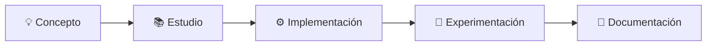

<div align="center">

# 🧪 DataSpace & DataQuality Learning Lab

**Laboratorio de aprendizaje y experimentación sobre Espacios de Datos, Calidad del Dato y Gobierno del Dato**


*Learning by building. Comprender los conceptos, implementarlos y conectarlos.*

</div>

---

## 📖 Sobre este repositorio

Este repositorio recopila, implementa y documenta los **conceptos, tecnologías, estándares y metodologías** estudiados durante mi proceso de aprendizaje en torno a los **Espacios de Datos**, la **Calidad del Dato** y el **Gobierno del Dato**.

Más que una colección de teoría, es un espacio de trabajo donde cada idea se acompaña de **ejemplos prácticos y pequeños experimentos** que ayudan a entender cómo se aplican estas tecnologías en escenarios reales.

## 📑 Tabla de contenidos

- [🎯 Objetivos](#-objetivos)
- [🗂️ Estructura del repositorio](#️-estructura-del-repositorio)
- [🧩 Tecnologías y estándares](#-tecnologías-y-estándares)
- [🔬 Enfoque de trabajo](#-enfoque-de-trabajo)
- [🗺️ Hoja de ruta](#️-hoja-de-ruta)
- [🚀 Evolución](#-evolución)

---

## 🎯 Objetivos

- 🏛️ Comprender los **fundamentos de los Espacios de Datos** y su arquitectura.
- 🔗 Estudiar los principios de **interoperabilidad semántica y técnica**.
- 🏷️ Explorar **tecnologías y estándares** relacionados con datos y metadatos.
- ✅ Estudiar y aplicar **metodologías de Calidad del Dato**.
- 🛡️ Experimentar con **Gobierno del Dato** y mecanismos de gobernanza.
- 🧱 Construir **ejemplos prácticos** que conecten los diferentes conceptos.
- 📝 Documentar el conocimiento adquirido de forma **reproducible**.

---

## 🗂️ Estructura del repositorio

El repositorio se organiza progresivamente en diferentes áreas temáticas. Cada carpeta contiene ejemplos, experimentos y documentación relacionada con la tecnología o concepto estudiado.

```text
DataSpace-and-DataQuality-learning-lab/
│
├── 01-RDF/                 # Modelo de datos basado en grafos
├── 02-RDFS/                # Esquemas y vocabularios básicos
├── 03-OWL/                 # Ontologías y razonamiento
├── 04-SPARQL/              # Consulta de grafos RDF
├── 05-SHACL/               # Validación de datos mediante shapes
├── 06-JSON-LD/             # Datos enlazados sobre JSON
├── 07-DCAT/                # Catálogos de datos y metadatos
├── 08-Data-Quality/        # Modelos, métricas y metodologías de calidad
├── 09-Data-Governance/     # Gobierno y gobernanza del dato
├── 10-Data-Spaces/         # Arquitectura y principios de los Espacios de Datos
├── 11-Eclipse-EDC/         # Eclipse Dataspace Components
└── README.md
```

---

## 🧩 Tecnologías y estándares

### 🌐 Web Semántica y datos enlazados

| Tecnología | Descripción |
|:-----------|:------------|
| **RDF** | Resource Description Framework |
| **RDFS** | RDF Schema |
| **OWL** | Web Ontology Language |
| **SPARQL** | Lenguaje de consulta para RDF |
| **SHACL** | Shapes Constraint Language |
| **JSON-LD** | JSON for Linked Data |
| **DCAT** | Data Catalog Vocabulary |

### 🛠️ Infraestructura y herramientas

| Tecnología | Descripción |
|:-----------|:------------|
| **Eclipse Dataspace Components (EDC)** | Componentes para construir conectores de Espacios de Datos |
| **REST APIs** | Interfaces de comunicación entre servicios |
| **Docker** | Contenedores para entornos reproducibles |

### 📏 Calidad y Gobierno del Dato

| Estándar / Modelo | Ámbito |
|:------------------|:-------|
| **ISO/IEC 25012** | Modelo de calidad de datos |
| **ISO/IEC 25024** | Medición de la calidad de datos |
| **ISO/IEC 25040** | Proceso de evaluación de la calidad |
| **BR4DQ** | Business Rules for Data Quality |
| **DMN4DQ** | Decision Model and Notation para Calidad del Dato |

Además, se estudiarán otros conceptos y modelos relacionados con *Data Quality* y *Data Governance*.

---

## 🔬 Enfoque de trabajo

El aprendizaje sigue un enfoque **principalmente práctico**. Siempre que es posible, cada concepto se acompaña de una implementación o experimento:



> El objetivo no es únicamente recopilar teoría, sino comprender **cómo se utilizan estas tecnologías de forma conjunta** para construir soluciones **interoperables y confiables** basadas en datos.

---

## 🗺️ Hoja de ruta

| # | Área | Estado |
|:-:|:-----|:------:|
| 01 | RDF | 🚧 |
| 02 | RDFS | 🚧 |
| 03 | OWL | 🚧 |
| 04 | SPARQL | 🔜 |
| 05 | SHACL | 🔜 |
| 06 | JSON-LD | 🔜 |
| 07 | DCAT | 🔜 |
| 08 | Data Quality | 🔜 |
| 09 | Data Governance | 🔜 |
| 10 | Data Spaces | 🔜 |
| 11 | Eclipse EDC | 🔜 |

> Leyenda: 🔜 Planificado · 🚧 En progreso · ✅ Completado

---

## 🚀 Evolución

Este repositorio está concebido como un **laboratorio de aprendizaje en evolución**. Los contenidos, ejemplos y proyectos se irán incorporando progresivamente a medida que avance el estudio de los diferentes conceptos y tecnologías.
